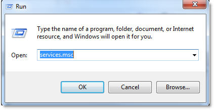
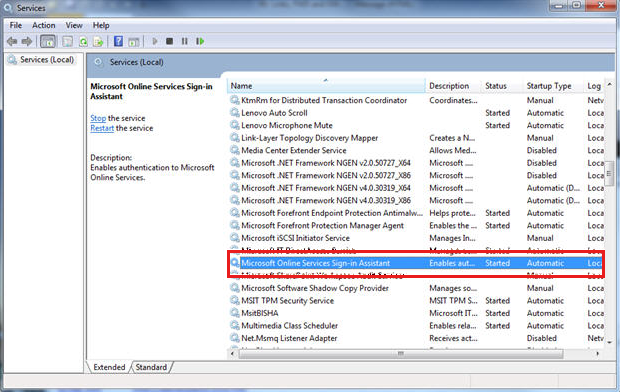
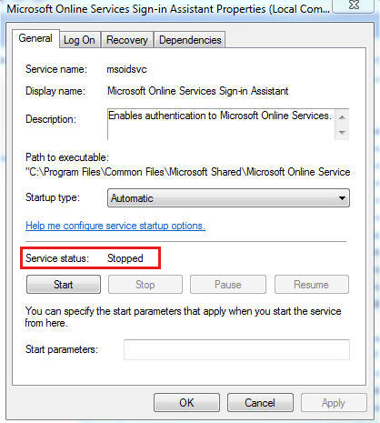
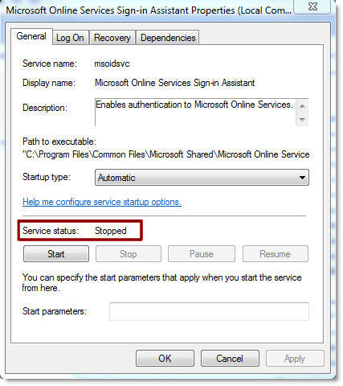

# You receive a "There was a problem that caused parts of the Microsoft Online Services Sign-in Assistant to be disabled" error

[!INCLUDE [Branding name note](../../../includes/branding-name-note.md)]

## Problem

You experience sign-in issues in a Microsoft cloud service such as Office 365, Microsoft Azure, or Microsoft Intune. Specifically, you see a pop-up dialog box that contains the following error message:

> There was a problem that caused parts of the Microsoft Online Services Sign-in Assistant to be disabled. The problem may have been caused by a program that was recently installed.

## Cause

This problem occurs when the Microsoft Online Services Sign-in Assistant detects that an issue occurred in the Microsoft Online Services Sign-in Assistant service. In this situation, the connection to the service is ended. 

## Solution 

To restart the Microsoft Online Services Sign-in Assistant service, follow these steps:

1. Click **Start**, and then click **Run**.
2. In the **Open** box, type **services.msc**, and then press Enter.

      
3. In the list of services, locate and then double-click the Microsoft Online Services Sign-in Assistant service.

   

4. Stop the service. To do this, click Stop, and then wait until the service stops. The Service status should be displayed as Stopped.

      
5. Start the service. To do this, click Start, and then wait until the service starts. The Service status should be displayed as Started.

      
6. Verify that the issue is resolved and the pop-up dialog box is no longer displayed.   
7. If you continue to see the pop-dialog box, restart the computer, and then verify that the issue is resolved.

Did this fix the problem?

- Check whether the problem is fixed.
  - If the problem is fixed, you are finished with these steps.    
  - If the problem is not fixed, go to the [Microsoft Community](https://answers.microsoft.com/), the [Azure Active Directory Forums](https://social.msdn.microsoft.com/forums/azure/home?forum=windowsazuread) website, or [contact support](https://support.microsoft.com/contactus).   
   
- We would appreciate your feedback. To provide feedback or to report any issues with this solution, please send us an [email](mailto:fixit4me@microsoft.com?subject=kb) message.   

## More Information 

For more information about related technical issues, see the following Microsoft Knowledge Base article: 

[2637629](https://support.microsoft.com/help/2637629) How to troubleshoot non-browser apps that can't sign in to Office 365, Azure, or Intune

Still need help? Go to [Microsoft Community](https://answers.microsoft.com/) or the [Azure Active Directory Forums](https://social.msdn.microsoft.com/forums/azure/home?forum=windowsazuread) website.