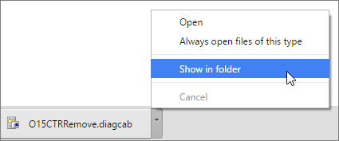
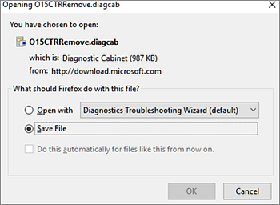
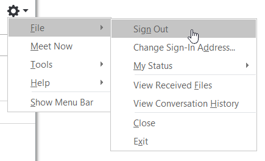
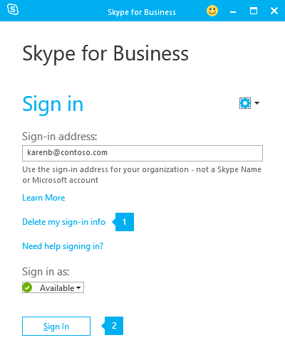
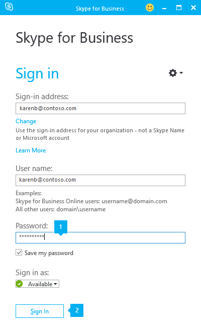

# Troubleshoot issues for Office 365 admins

Sometimes, things just aren't working. Here's some help for fixing administrative problems with Office 365.
  
 **If you need immediate help, [contact support](https://docs.microsoft.com/office365/admin/contact-support-for-business-products)** to help resolve your technical issues.
  
## Troubleshoot Office installation issues

Do you [need to install](https://support.office.com/article/4414eaaf-0478-48be-9c42-23adc4716658.aspx) Office apps for yourself, or are the Office apps not installing for you or your users? Get [help for your users](https://support.office.com/article/35ff2def-e0b2-4dac-9784-4cf212c1f6c2.aspx), or expand an option below to get help for admins.
  
### I'm an admin and don't have an option to install Office, Project, or Visio

When you first sign up for Office 365 for business and you try to install Office (or Project or Visio if you've also signed up for a plan that includes those applications), you might see a message that says you can't install Office because you don't have a license. This could happen because of a delay between your initial sign in and Office 365 for business setting up your environment. Try signing out of Office 365 and then signing back in. 
  
It could also happen because you haven't assigned a license to yourself or your users. Do the following to check your licenses.
  
 **Check that you have a license**
  
1. If you're not already signed in, go to [https://admin.microsoft.com](https://admin.microsoft.com) and sign in with your work or school account.

    > [!NOTE]
    > If you're unable to sign in with your work or school account, you may be signing in to the wrong Office 365 service, see [Where to sign in to Office 365 for business](https://support.office.com/article/e9eb7d51-5430-4929-91ab-6157c5a050b4).
  
2. Select your account icon in the upper-right, and then choose **My account**.
  
3. In the left navigation, select **Subscriptions**.

   You'll see the services that you're licensed to use, such as the latest desktop version of Office, Project, Visio, SharePoint Online or OneDrive for Business, and Exchange Online. If you don't see **The latest desktop version of Office** in the list (or **Project** or **Visio** if you bought plans with those applications), see [Assign licenses to users in Office 365 for business](https://docs.microsoft.com/office365/admin/subscriptions-and-billing/assign-licenses-to-users).
    
Not all Office 365 plans come with Office. If your organization has a plan that doesn't include the latest desktop version of Office, as the admin, you can [switch to a different Office 365 plan or subscription](https://docs.microsoft.com/office365/admin/subscriptions-and-billing/switch-to-a-different-plan). 
  
If you're not sure what plan you have, follow the steps in [What subscription do I have?](https://docs.microsoft.com/office365/admin/admin-overview/what-subscription-do-i-have) For a comparison of plans, see the [small business plans comparison](https://products.office.com/business/compare-office-365-for-business-plans) or [enterprise plans comparison](https://products.office.com/en-us/business/compare-more-office-365-for-business-plans).
  
### I recently switched plans and now get messages I can't use Office

When you install Office it's automatically linked to your Office 365 plan. This means if you recently switched plans you'll need to uninstall and then reinstall Office to associate it with your updated subscription. Use this easy fix tool and then follow the steps to reinstall Office.
  
1. Select this easy fix button to uninstall Office. 

2. For the remaining steps showing how to save and use the easy fix, follow the steps for your browser:
    
    **Edge or Internet Explorer**
    
    1. At the bottom of the browser window, select **Open** to open the **O15CTRRemove.diagcab** file.

        

        If the file doesn't open automatically, select **Save** \> **Open Folder**, and then double-click the file (it should start with "**O15CTRRemove**") to run the easy fix tool.
    
    2. The Uninstall Microsoft Office wizard launches. Select **Next** and follow the prompts. 
    
    3. When you see the **Uninstallation successful** screen, follow the prompt to restart your computer for the changes to take effect. Select **Next**.
    
    4. Restart your computer and then try installing Office again.
    
    **Chrome**
    
    1. In the lower-lower left corner select the **o15CTRRemove** file and from the drop-down list, choose **Show in folder**.

         Double-click the download, **o15CTRRemove** to run the easy fix tool.
    
    2. The Uninstall Microsoft Office wizard launches. Select **Next** and follow the prompts. 
    
    3. When you see the **Uninstallation successful** screen, follow the prompt to restart your computer for the changes to take effect. Select **Next**.
    
    4. Restart your computer and then try installing Office again.
    
    **Firefox**
    
    1. Select **Save File**, and then **OK**.

           In the upper-right browser window, select **Show all downloads**. In the Library, select **Downloads** \> **O15CTRRemove.diagcab**, and then select the folder icon. Double-click the **O15CTRRemove.diagcab**.
    
    2. The Uninstall Microsoft Office wizard launches. Select **Next** and follow the prompts. 
    
    3. When you see the **Uninstallation successful** screen, follow the prompt to restart your computer for the changes to take effect. Select **Next**.
    
    4. Restart your computer and then try installing Office again.
    
 **Install Office**
  
To reinstall newer versions of Office, follow the steps in [Download and install or reinstall Office on your PC or Mac](https://support.office.com/article/4414eaaf-0478-48be-9c42-23adc4716658?wt.mc_id=SCL_DemsToken_262f265f-4c5e-4c46-852f-2a3890829d34).
  
To reinstall Office 2016 or Office 2013, see [Download and install or reinstall Office 2016 or Office 2013](https://support.office.com/article/download-and-install-or-reinstall-office-2016-or-office-2013-7c695b06-6d1a-4917-809c-98ce43f86479).
  
### I have a different problem

For a detailed troubleshooting instructions, and to help your users troubleshoot potential issues, see [Troubleshoot Office installation issues in Office 365 for business](https://support.office.com/article/fbbf663b-1e76-46d2-a417-0aa78ed2fb9a).
  
## Troubleshoot problems with email

Email not working? Can't connect or not getting through? Expand an option below to find out how to diagnose and fix problems.
  
### Trace where messages are getting stuck

If you're an Office 365 Midsize Business, Office 365 Business, or Office 365 Enterprise admin, you access and run the message trace tool through the Exchange admin center. To get there, do the following:
  
1. Sign in to Office 365 for business with your work or school account. 
    
2. Go to the <a href="https://go.microsoft.com/fwlink/p/?linkid=2059104" target="_blank">Exchange admin center</a>.
  
3. Under **mail flow**, go to **message trace**.
    
If you're an Office 365 Small Business admin, do the following to find message trace:
  
1. Go to the <a href="https://go.microsoft.com/fwlink/p/?linkid=2077149" target="_blank">Security & Compliance admin center</a>.
  

2. In the left navigation, select **Mail flow** \> **Message trace**.

    

  
### Get help when email messages will send but can't be delivered

When Office 365 can't deliver email you sent, you'll receive an email notification called a [non-delivery report](https://docs.microsoft.com/en-us/exchange/mail-flow-best-practices/non-delivery-reports-in-exchange-online/non-delivery-reports-in-exchange-online). Find your error code for specific help with getting your email delivered:
  
|||
|:-----|:-----|
|[ Code 4.4.7 ](https://docs.microsoft.com/en-us/exchange/mail-flow-best-practices/non-delivery-reports-in-exchange-online/fix-error-code-550-4-4-7-in-exchange-online)   |[Code 5.7.12 ](https://docs.microsoft.com/en-us/exchange/mail-flow-best-practices/non-delivery-reports-in-exchange-online/fix-error-code-5-7-12-in-exchange-online)   |
|[Code 5.1.10 ](https://docs.microsoft.com/en-us/exchange/mail-flow-best-practices/non-delivery-reports-in-exchange-online/fix-error-code-550-5-1-10-in-exchange-online)   |[Code 5.7.124](https://docs.microsoft.com/en-us/exchange/mail-flow-best-practices/non-delivery-reports-in-exchange-online/fix-error-code-5-7-124-in-exchange-online)   |
|[Codes 5.1.1 through 5.1.20](https://docs.microsoft.com/en-us/exchange/mail-flow-best-practices/non-delivery-reports-in-exchange-online/fix-error-code-550-5-1-1-through-5-1-20-in-exchange-online)   |[Code 5.7.133](https://docs.microsoft.com/en-us/exchange/mail-flow-best-practices/non-delivery-reports-in-exchange-online/fix-error-code-5-7-133-in-exchange-online)   |
|[Code 5.4.1](https://docs.microsoft.com/en-us/exchange/mail-flow-best-practices/non-delivery-reports-in-exchange-online/fix-error-code-550-5-4-1-in-exchange-online)   |[Code 5.7.134](https://docs.microsoft.com/en-us/exchange/mail-flow-best-practices/non-delivery-reports-in-exchange-online/fix-error-code-5-7-134-in-exchange-online)   |
|[Codes 5.4.6 through 5.4.20](https://docs.microsoft.com/en-us/exchange/mail-flow-best-practices/non-delivery-reports-in-exchange-online/fix-error-code-5-4-6-through-5-4-20-in-exchange-online)   |[Codes 5.7.13 or 5.7.135](https://docs.microsoft.com/en-us/exchange/mail-flow-best-practices/non-delivery-reports-in-exchange-online/fix-error-code-5-7-13-or-5-7-135-in-exchange-online)   |
|[Code 5.6.11 ](https://docs.microsoft.com/en-us/exchange/mail-flow-best-practices/non-delivery-reports-in-exchange-online/fix-error-code-550-5-6-11-in-exchange-online)   |[Code 5.7.136](https://docs.microsoft.com/en-us/exchange/mail-flow-best-practices/non-delivery-reports-in-exchange-online/fix-error-code-5-7-136-in-exchange-online)   |
|[Code 5.7.1 ](https://docs.microsoft.com/en-us/exchange/mail-flow-best-practices/non-delivery-reports-in-exchange-online/fix-error-code-550-5-7-1-in-exchange-online)   |[Codes 451 5.7.500-699 (ASxxx)](https://docs.microsoft.com/en-us/exchange/mail-flow-best-practices/non-delivery-reports-in-exchange-online/fix-error-code-451-4-7-500-699-asxxx-in-exchange-online)   |
   
## Get more help with email issues

For more troubleshooting information, see [Troubleshoot email issues](troubleshoot-email-issues.md), [My messages won't send](https://support.office.com/article/97748418-bbd5-4743-a05b-581f22a466dd.aspx) and [Fix Outlook account problems in Office 365](https://go.microsoft.com/fwlink/p/?LinkId=724310) (English only). 
  
## Troubleshoot problems with Skype for Business Online

Problems with signing in or passwords for Lync? You're not alone. Expand an option below to get help.
  
### Check for common causes of Lync sign-in errors

Most Lync sign-in issues can be traced to a small number of causes, and many of these are easy to correct. The table below lists some common causes of sign-in errors and some steps you or the users can take to resolve them.
  
|**Possible Cause**|**Resolution**|
|:-----|:-----|
|During sign-in, a dialog box appears that contains the following phrase: **Lync cannot verify that the server is trusted for your sign-in address. Connect anyway?**   |Verify that the domain name in the dialog box is a trusted server in your organization—for example, **domainName.contoso.com**. Ask the user to select the **Always trust this server** check box, and then select **Connect**.     Enterprise customers can prevent this message from appearing when a user signs in for the first time by modifying the Windows registry on each user's computer. For details, see [Modify TrustModelData registry keys](https://docs.microsoft.com/en-us/SkypeForBusiness/set-up-skype-for-business-online/troubleshooting-sign-in-errors-for-admins#modify-trustmodeldata-registry).    |
|Mistyped sign-in address, user name, or password    | 1. Confirm that the user's sign-in name and password are correct.    2. Verify that the user's sign-in name is formatted as follows: **bobk@contoso.com**. This may be different from the format you use to sign in to your organization's network.      Ask the user to try signing in to Lync again.    |
|Forgotten password    |Reset the user's password and notify him or her of the new temporary password.    |
|Not licensed to use Lync Online    |Confirm that the user is registered as a Lync user. If not, register the user, and then ask him or her to sign in to Lync again.    |
|Wrong version of Lync installed    |This issue is usually associated with an error message that contains the following phrase: **the authentication service may be incompatible with this version of the program**.     Ask the user to uninstall and reinstall Lync from the Office 365 Portal.    |
|Problem acquiring a personal certificate that is required to sign in    |If the user's sign address has recently changed, they may need to delete cached sign-in data. Ask users to sign out, select the Delete my sign-in info link on the sign-in screen, and then try again.    |
|You set up a custom domain name, and the changes may not have finished propagating through the system.    |First, ensure that you have modified the Domain Name Service (DNS) records to reflect the change. For details, see [Update DNS Service (SRV) Records](https://docs.microsoft.com/en-us/SkypeForBusiness/set-up-skype-for-business-online/troubleshooting-sign-in-errors-for-admins#update-dns-service).     If you have already made the necessary DNS changes, advise the user to try logging in later. DNS changes can take up to 72 hours to be reflected throughout the system.    |
|System clock out of sync with server clock    |Ensure that your network domain controller is synchronizing with a reliable external time source. For details, see the Microsoft Knowledge Base article 816042, [How to configure an authoritative time server in Windows Server](http://go.microsoft.com/fwlink/p/?linkid=3052&amp;kbid=816042).    |
   
### Can't enter your password?

Sometimes, the password box doesn't appear on the Skype for Business sign-in screen. If you're signing in for the first time, the password box won't appear until you enter your sign-in address and select **Sign in**. 
  
If you changed your password, the password box might not appear until you delete your old sign-in info. Here's how:
  
1. In the Skype for Business main window, select the **Options** button   and select **File** \> **Sign Out**.

    
  
2. Select **Delete my sign-in info**, select **Yes**, and then select **Sign In**.

    
  
3. Under **Password**, enter your password, and select **Sign In**. 
  
### Get more help with Skype for Business Online issues

For more troubleshooting information, see [Troubleshooting Skype for Business Online sign-in errors for administrators](https://docs.microsoft.com/en-us/SkypeForBusiness/set-up-skype-for-business-online/troubleshooting-sign-in-errors-for-admins), [Need help signing in to Skype for Business?](https://support.office.com/article/448b8ea7-5b33-444a-afd4-175fc9930d05), and [Troubleshoot problems with Skype for Business Online](https://docs.microsoft.com/en-us/SkypeForBusiness/set-up-skype-for-business-online/troubleshoot-problems-with-skype-for-business-online).

> [!NOTE]
> If you're using Office 365 operated by 21Vianet in China, please [contact the 21Vianet support team](https://docs.microsoft.com/office365/admin/contact-support-for-business-products).

## See also

[Message trace in the Security & Compliance Center](https://docs.microsoft.com/en-us/office365/securitycompliance/message-trace-scc?redirectSourcePath=%252farticle%252f3e64f99d-ac33-4aba-91c5-9cb4ca476803)

[Troubleshoot Office 365 mail flow](https://docs.microsoft.com/en-us/exchange/mail-flow-best-practices/troubleshoot-mail-flow)

