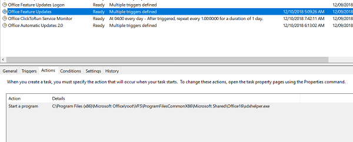
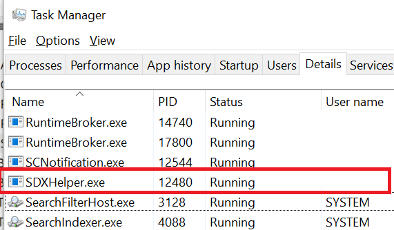

# Description of the Office Feature Updates task

[!INCLUDE [Branding name note](../../../includes/branding-name-note.md)]

## Summary

Starting in Microsoft Office ProPlus build 16.0.11220.*xxxxx* or a later build, there are two new tasks:

- Office Feature Updates
- Office Feature Updates Logon

The **Office Feature Updates** task calls the "SDXHelper.exe" process in the background. You can view this process in Task Manager during the execution. This task runs in user context and polls Office services in the background. It doesn't cause any Office performance issues during startup.

- This task runs for every user for all Office ProPlus Channels. However, it downloads feature updates based on your defined policies.

  For example, Semi Annual Channel (SAC) users are expected to receive updates on a six-month cadence. Therefore, this task doesn't schedule downloads of feature updates to run every few hours.

- This task makes sure that Office installations can check for feature updates.

## Frequently asked questions (FAQ)

**Q1: Does this feature apply for Semi Annual Channel (SAC) users?**

**A1:** The Office Feature Updates task runs every four hours. It may run for users in SAC. However, it doesn't download any feature updates for these users.

**Q2: What are the pros and cons of disabling this task permanently? Is this recommended?**

**A2:** For Office 365 customers, we recommend that they do not disable the Office Feature Updates task. This task makes sure that their Office features download the latest updates when the updates are available. In the future, more features will be updated through this task.

**Q3: Is this task dependant on the Office Automatic Updates 2.0 task (or vice versa) for Office feature updates?**

**A3:** No.

**Q4: Does the update polling occur on a metered network connection? If yes, is there a way to turn this off?**

**A4:** On low-cost networks, we don't run any update polling.

> [!NOTE]
> This task doesn't apply to Office 2019 or Office 2016 (perpetual products).