# Troubleshooting Data Loss prevention (DLP) policy tips

[!INCLUDE [Branding name note](../../../includes/branding-name-note.md)]

## Summary

The detection and protection of data is among the most important tasks that any business has today. As more and more organizations move their services to the cloud to store data, solutions to protect data flow and access are becoming increasingly important.

Microsoft Office 365 provides Data Loss prevention (DLP) services to help organizations comply with business standards and industry regulations. This behavior protects sensitive information and prevents its unintended disclosure.

This article describes how to troubleshoot some issues that occur if DLP policy tips are not working as expected.

## Common scenarios for troubleshooting DLP policy tips

There are several reasons why DLP policy tips do not work as expected after you configure an Office 365 DLP policy:

- There are policy configuration errors.
- Policy configurations are not supported (client only).
- All policy conditions are not met.
- MailTips are not enabled (client only).
- Policy tips are configured in both Exchange admin center and Security and Compliance Center.
- The client doesn't support MailTips (Mac only).
- The file-system configuration is not supported (PDFs on Windows 7 only).
- There is invalid test data.

## How to edit a DLP policy in the Security and Compliance Center

1. In the **Security and Compliance Center**, locate **Data loss prevention** in the navigation pane.
1. Select the policy that requires editing, and then select **Edit policy** or **Edit** in the window that opens.

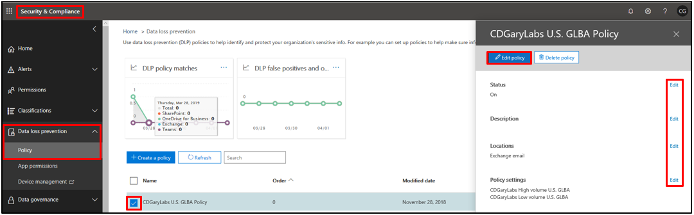

## Policy configuration errors

Policy is configured by using User notifications, but the status of the policy doesn't match the settings in the rule (Figure 1). A policy configuration error may also occur if the policy is configured by using two or more rules that detect the same sensitive data types that have the same **Instance count** and **Match accuracy** values (Figure 2). This kind of setup is unnecessary and problematic. Only one rule is required.

### Troubleshooting tip

For these scenarios, create only one rule, and use detecting parameters that are based on the same sensitive data types.

**Figure 1:** Policy configuration by using **User notifications**

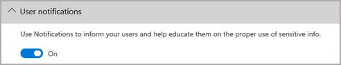

Policy status

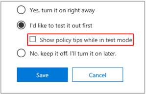

**Figure 2:** Multiple rules configured to have the same detection based on Sensitive info types that share **Instance count** and **Match accuracy** values.

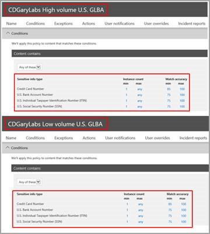

## Policy configurations are not supported (Outlook 2013 and later clients only)

A policy is configured by using conditions and actions that are currently not supported in Outlook 2013 or later clients.

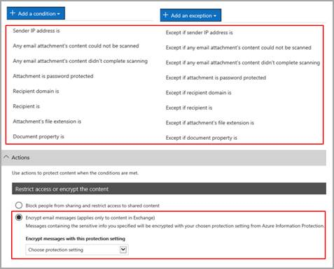

> [!NOTE]
> All these conditions and actions work in Outlook. They will match content and enforce protective actions on content. However, policy tips are not yet supported.

### Troubleshooting tip

In Outlook, test conditions and actions that are supported in Outlook. Content matching and enforcement will still work.

## All policy conditions are not met

This reason primarily occurs if policy tips are not working as expected in SharePoint Online and OneDrive for Business because there's an external sharing condition that's configured in a policy.

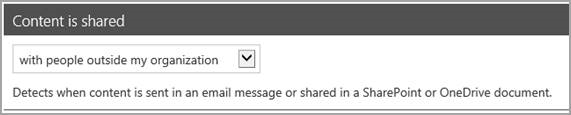

> [!NOTE]
> Currently, content is not indexed as shared externally until an external party that's located outside the organization accesses the content for the first time.

## MailTips are not enabled (Outlook 2013 and later clients only)

For Outlook 2013 and later clients, make sure that MailTips are enabled. To enable MailTips in Outlook, make sure that policy tips are enabled. To do this, follow these steps:

1. In Outlook, select **File** > **Options** > **Mail**.
1. Scroll to the **MailTips** section, and then click **MailTips Options**.
1. In the **Select MailTips to be displayed selection** dialog box, make sure that the **Policy tip notification** option is selected.
1. Under **MailTip bar display options**, make sure that the **Display automatically when MailTips apply** option is selected.
1. Click **OK** two times to close the File window.
1. Restart Outlook.

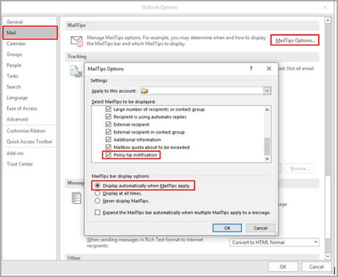

## Policy tips are configured in multiple locations

Policy tips don't work as expected if they're configured in multiple locations. You should configure or enable policy tips in only one of the following locations:

- Exchange admin center
- Security and Compliance Center

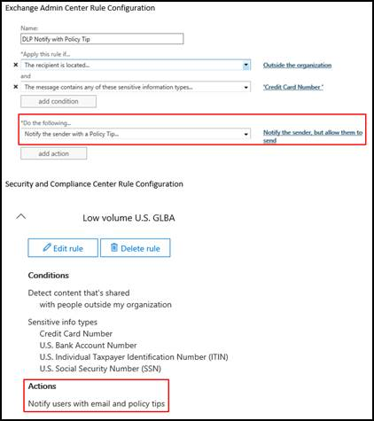

To view unified DLP policy tips, remove the **Notify the sender with a Policy Tip** action from all Transport rules in Exchange admin center.

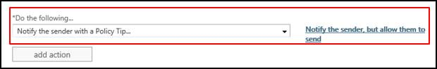

## How to edit a DLP policy in the Exchange admin center

1. In the Exchange admin center, locate **Compliance Management**, and then select **data loss prevention**.
1. Select the policy that requires editing, and then select the pencil icon or double-click the policy that has to be changed.

   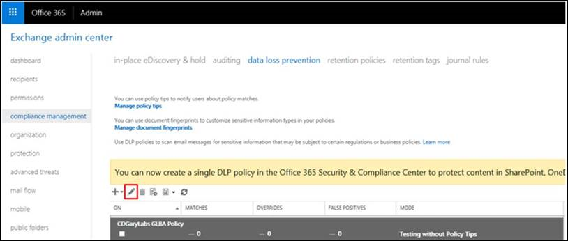

1. In the window that opens, select the rule, and then select the pencil icon or double-click the rule that has to be changed.

   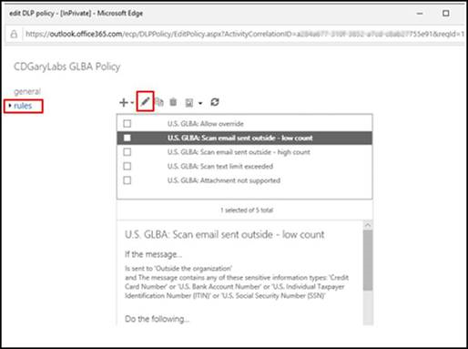

1. In the next window that opens, you can edit the rule.

   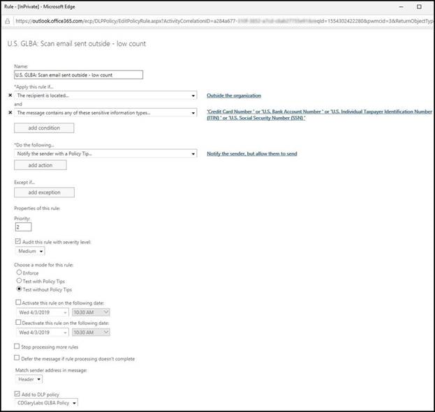

## Client doesn't support MailTips

There are several Outlook client licenses that don't support policy tips. [This article](https://support.office.com/article/outlook-license-requirements-for-exchange-features-46b6b7c5-c3ca-43e5-8424-1e2807917c99?ui=en-US&rs=en-001&ad=US) lists the Outlook client licenses that support DLP policy tips.

> [!NOTE]
> Policy tips are currently not supported for Outlook for Mac iOS clients. Although our Product Engineering teams know about this functionality gap between the Windows Outlook and Outlook for Mac clients, there's currently no set timeframe to add this functionality to a future release of Outlook for Mac. As a workaround, you can add text to the NDR response for your DLP policy rule that tells users to re-create their messages in the OWA client if they originally submitted the message by using Outlook for Mac. Use OWA client to expose the policy tips functionality to users and enable them to override, report a false positive, or enter a business justification (depending on the "Notify" action that"s specified in the DLP Policy rule). Users can then submit messages for delivery.

## Windows 7 and Adobe PDF

No policy tip is displayed if the following conditions are true:

- You are running Outlook 2013 or later clients on Windows 7.
- You try to attach a file of Adobe PDF version 10 or later versions to an email message that should trigger a DLP policy tip.

### Troubleshooting tip

To resolve this issue, carefully follow the steps in the "Resolution" section of [Outlook doesn't display DLP policy tips for PDF attachments in Windows 7](https://support.microsoft.com/help/3001881/outlook-doesn-t-display-dlp-policy-tips-for-pdf-attachments-in-windows).

## Invalid test data

When you evaluate the **Instance count** and **Match accuracy** of the DLP policy rule, the test data that's being used is not valid based on the information in [What the sensitive information types look for](/office365/securitycompliance/what-the-sensitive-information-types-look-for).

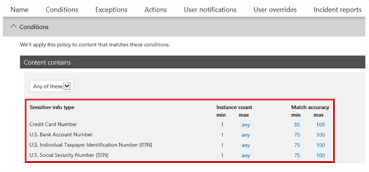

## References

- [Overview of data loss prevention policies](/office365/securitycompliance/data-loss-prevention-policies)
- [Send email notifications and show policy tips for DLP policies](/office365/securitycompliance/use-notifications-and-policy-tips)
- [What the sensitive information types look for](/office365/securitycompliance/what-the-sensitive-information-types-look-for)