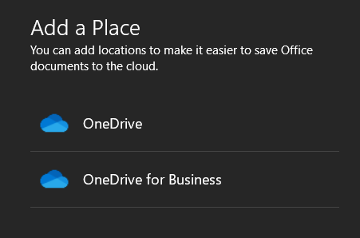

# How to disable personal OneDrive access from within Enterprise Office products

## Summary

Enterprise customers have a need to block access to personal OneDrive accounts from within Office to protect data and implement security.

Users can add their personal OneDrive account by browsing to **File** > **Save as** > **Add a place**. Here they have the option of adding their personal OneDrive as a location in their Office workspace.



## More information

To prevent users from adding their personal OneDrive account, use one of the following methods:

### Use a Group Policy object

Use the Office 2016 Administrative Templates to configure Group Policy settings.

Under **User configuration** > **Administrative Templates** > **Microsoft Office 2016** > **Miscellaneous**, configure **Hide file locations when opening or saving files** as **Hide OneDrive Personal**.

> [!Note]
> This policy setting only applies to Word, PowerPoint, and Excel.

### Modify the registry

Open registry editor and browse to the following registry key:

```
HKCU\Software\Microsoft\Office\16.0\Common\Internet
```

Modify the DWORD value "OnlineStorage".

Available values are:

* **0** Policy is off (all locations are shown)

* **1** Only OneDrive Personal locations are hidden

* **2** All SharePoint Online locations are hidden

* **3** All Microsoft Online Locations are hidden

If you set other values, the policy is off (all locations are shown).

If the value is set to **1**, uses can no longer see their personal OneDrive location under **Add a place**.