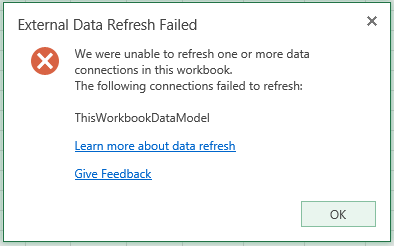
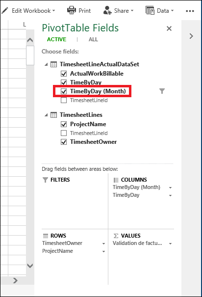
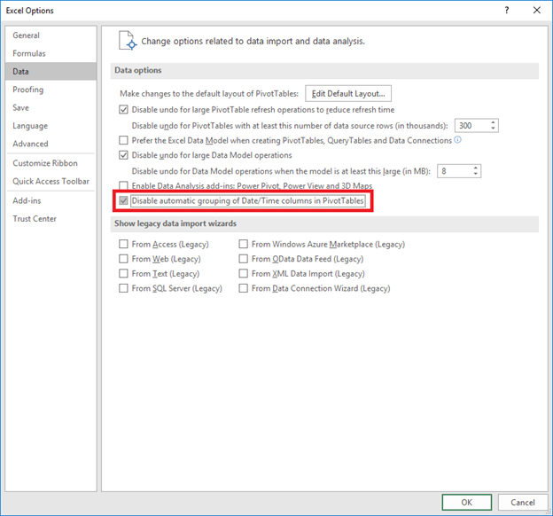
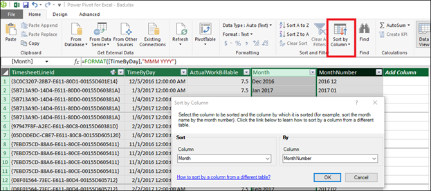
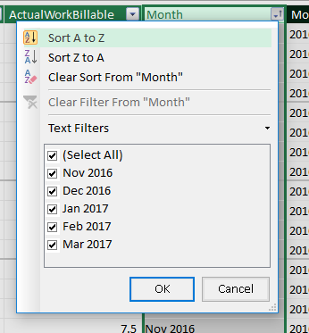
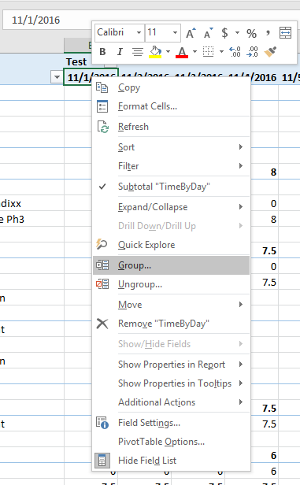
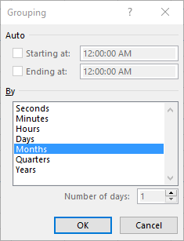

# "External Data Refresh Failed" when refreshing Project Online data in Excel Online

## Symptoms

When you try to refresh Project Online data in Excel Online, the refresh fails. Additionally, you receive the following error message:

**External Data Refresh Failed**

## Cause

This issue occurs if you select the **TimeByDay (Month)** option in **PivotTable Fields**.

## Resolution

If you clear the **TimeByDay (Month)** option, the error will not occur when you refresh Excel Online. However, your workbook may not look the way that you want it to look. To fix this, follows these steps:

1. In Excel, select **File** > **Options** > **Data**.
1. Select the **Disable automatic grouping of Date/Time columns in PivotTables** check box, and then select **OK**.

   

1. Remove the existing "TimeByDay" columns in Power Pivot. To do this, select the **Power Pivot** tab, and then select **Manage**. In the Power Pivot for Excel window, you see two columns on the **Home** tab that are named **TimeByDay (Month Index)** and **TimeByDay (Month)**. Select both columns, right-click both columns, and then select **Delete Columns**.
1. After you remove the auto-generated time columns, select **Add Column**, name it as **Month**, and then add the following formula to this column:

   **=FORMAT([TimeByDay],"MMM YYYY")**

   

1. Select **Add Column** again, name it as **MonthNumber**, and then add the following formula to this column:

   **=FORMAT([TimeByDay],"YYYY MM")**

   

1. Sort the **Month** column by **MonthNumber**. To do this, select the **Month** column, select **Sort by Column**, and then select **MonthNumber** in the **Sort by Column** window.

   

1. On the **Month** column, select **Sort A to Z**. This sorts the months in the correct chronological and alphabetical order.

   

1. Go back to your Pivot table, select one cell of the **TimeByDay** column, and then select **Group**.

   

1. Select **Months** > **OK**.

   

You now have the appearance of using the **TimeByDay (Month)** field.