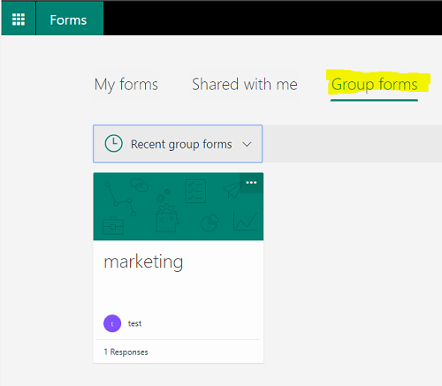
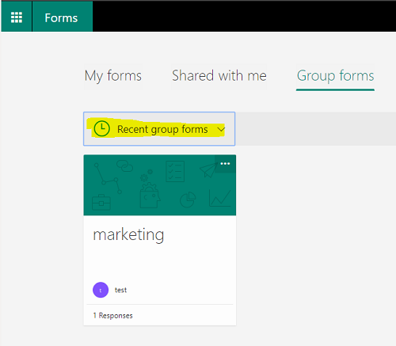
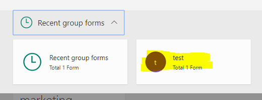
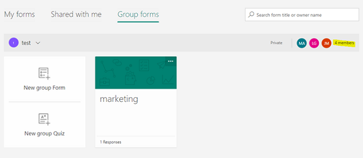
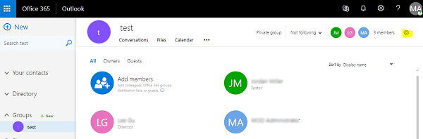
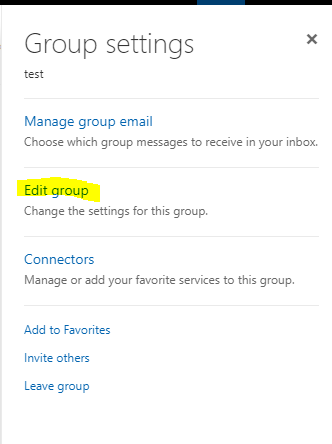
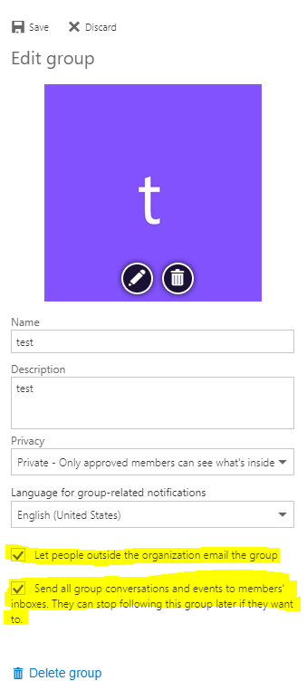
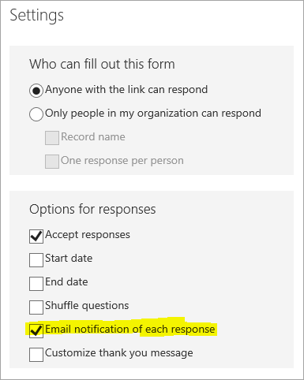

# No email notifications for responses to Group Forms

This article was written by [Zakir Haveliwala](https://social.technet.microsoft.com/profile/Zakir+H+-+MSFT), Senior Support Escalation Engineer.

You may not receive email notifications for responses that you submit to a Group Form, such as a Form that you create in Microsoft Teams. To receive email notifications, follow these steps:

1. Sign in to Forms at [https://forms.office.com](https://forms.office.com), and then click **Group forms**.
   
   

1. Click **Recent group forms**.
   
   

1. Select your group. In this example, the test group is selected.

   

1. On the right side, you see the number of members in the group. Click that number, and then it opens the group email page in Outlook.

   

1. In Outlook, on the right side of the number of members in the upper-right corner, select the gear icon.

   

1. Click **Edit group**.

   

1. Select the **Let people outside the organization email the group** and **Send all group conversations and events to members' inboxes** check boxes.

   

1. Click **Save**.
1. Open the Form, click the ellipsis button (...) on the upper-right corner of your screen, select **Settings**, and then select the **Email notification of each response** check box.

   

All the users in the group will receive email notifications when a response is submitted to the Form.