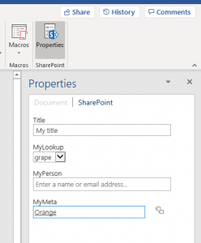

# SharePoint properties of type (lookup – multi select) don't work on Office backstage

## Symptoms

In Microsoft Office 365, Office 2019, or Office 2016, when you try to open a document from SharePoint that has SharePoint metadata properties of type (for example, **Lookup** type > Multiple value selections), you don't see and set these properties on the Office backstage area (**File** > **Info**).

## Cause

This is a current design limitation of Office, and there are no current plans to change this behavior.

## Workaround

If you use Word, you can use the SharePoint properties screen (through **View** tab > **Properties**) or use the properties page from the SharePoint web UI.

