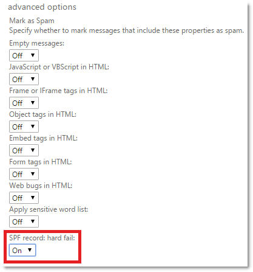
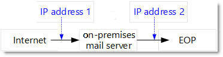
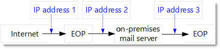

# Lots of false positives are generated when the "SPF record: hard fail" advanced spam filtering option is enabled

[!INCLUDE [Branding name note](../../../includes/branding-name-note.md)]

_Original KB number:_&nbsp;3089691

## Problem

The advanced spam filtering (ASF) option **SPF record: hard fail** generates lots of false positives for users who have the option enabled.



## Cause

This issue occurs for one of the following reasons:

- The primary MX record for your domain doesn't point to Exchange Online Protection (EOP)

    An organization's domain whose MX record points to EOP resemble the following. (The MX record contains "mail.protection.outlook.com.")

    `contoso.com. IN MX 10 contoso-com.mail.protection.outlook.com`

    An MX record for a domain whose primary MX record doesn't point to EOP resembles the following. (The MX record does not contain "mail.protection.outlook.com.")

    `fabrikam.com. IN MX 10 mail.fabrikam.com`

    Or, the domain may have EOP as a secondary MX record. (The number in the MX record indicates its priority. High numbers indicate lower priority. This means that mail is first routed to the MX record that has the lower number and that retries are made at subsequently higher numbers.) Consider the following example:

    ```console
    fabrikam.com. IN MX 10 mail.fabrikam.com.
    fabrikam.com. IN MX 100 contoso-com.mail.protection.outlook.com.
    ```

    In either case, fabrikam.com routes mail to its on-premises mail server first (or through a third-party-hosted email filter) and then routes mail to EOP by using connectors or internal email forwarding from its on-premises mail server.

    The message traverses the following path from the Internet to the mailbox:

    

    Within EOP, the SPF check is performed on IP address 2. (This is the on-premises mail server's relaying IP address.) However, the SPF check should have been performed on IP address 1. (This is the original connecting IP address.) Because EOP uses IP address 2 instead of IP address 1, any domain that publishes an SPF hard fail will fail SPF and will be marked incorrectly as spam. This occurs even if the domain would originally have passed SPF if the messages had been sent first through EOP and then to the on-premises mail server.

    This occurs if the MX record points to the on-premises mail servers or to a third-party-hosted email filtering service.

- Email is routed out of EOP and then back in to EOP  

    Some organizations route mail in through EOP, then out to an on-premises mail server or third-party filtering service, and then back in through EOP again. In this case, the domain's primary MX record points to EOP. Email is relayed to an on-premises mail server through outgoing connectors and back into EOP through connectors or even through MX-based routing.

    

    The typical way to do this is through centralized mail control routing if the on-premises mail server is an Exchange server. If the on-premises mail server isn't an Exchange server, the local version of a connector is used, or mail is relayed back by using MX-based routing.

    If a connector is set up from EOP to the on-premises mail server, and if the connector is configured correctly from the on-premises mail server back to EOP, the previous spam verdict is reused and filtered accordingly when the message is relayed back to EOP.

    However, if the outgoing and incoming connectors for EOP aren't configured correctly, the message is scanned again. The original SPF check that uses IP address 1 will be correct. However, the second SPF check (the check that uses IP address 3) will be incorrect, and that's the SPF check that's used on the second spam scan. Any sending domain that publishes an SPF hard fail will be marked as spam regardless of whether the first check was correct, and this leads to incorrect filtering results (that is, false positives).

## Solution

Microsoft Exchange Online automatically resolves both conditions without any action being required by customers. It does this by suppressing the ASF rule for SPF hard fail. However, you can manually make sure that the ASF rule is enforced.

To do this, take one of the following actions, as appropriate for your situation:

- If the primary MX record for your domain doesn't point to Exchange Online Protection (EOP)

    Make sure that the domain's primary MX record points to EOP and not to the on-premises mail server or third-party filter.

    If the domain's primary MX record can't be pointed to EOP, EOP will automatically detect when it's not the primary MX record and stop enforcing the ASF option for SPF hard fail. When the MX record points to EOP, the service detects this and starts enforcing the ASF option.

- If email is routed out of EOP and then back to EOP

    Make sure that your connectors are configured correctly to maintain the required headers from EOP to an on-premises mail server and then from the on-premises mail server back to EOP. This maintains the original spam verdict from the first time that a message was scanned in EOP so that it's reused when it's sent back to EOP the second time.

    If the necessary connectors aren't created, EOP will automatically detect when this situation occurs and stop enforcing the ASF option for SPF hard fail. When the required connectors are created, the service detects this and starts enforcing the ASF option.

    For more information about connectors, see [Configure mail flow using connectors in Office 365](/exchange/mail-flow-best-practices/use-connectors-to-configure-mail-flow/use-connectors-to-configure-mail-flow).

    For more information about centralized mail control options, see [Transport options in Exchange 2013 hybrid deployments](/exchange/transport-options).

## More information

Still need help? Go to [Microsoft Community](https://answers.microsoft.com/).