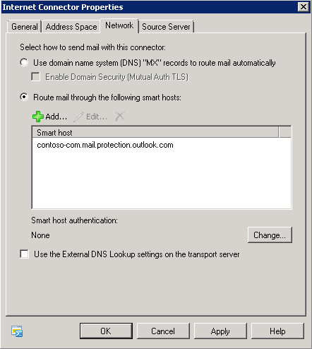

# "550 5.4.1 Relay Access Denied" NDR when sending mail from an on-premises Exchange organization through Exchange Online Protection in Office 365 Dedicated/ITAR

[!INCLUDE [Branding name note](../../../includes/branding-name-note.md)]

_Original KB number:_&nbsp;2827473

## Symptoms

Assume that you try to establish mail flow from an on-premises Microsoft Exchange organization through Microsoft Exchange Online Protection (EOP). However, when you try to send an email message from an on-premises Exchange mailbox to an external recipient, the message is not sent. Additionally, you receive the following non-delivery report (NDR):

> #550 5.4.1 Relay Access Denied ##

## Cause

This issue occurs for one of the following reasons:

- Case 1: The on-premises Exchange Send connector that is designated to send mail to the Internet is not correctly set up to deliver mail to EOP.
- Case 2: The EOP inbound connector has not been created, or it is either set up incorrectly or disabled.

## Resolution

To resolve this issue, use one of the following methods, as appropriate for your situation.

### Case 1

Make sure that the delivery address is set up correctly for the on-premises Send connector. To do this, verify the following conditions under **Select how to send mail with this connector** on the **Network** tab in the **Internet Connector Properties** dialog box:

- The **Route mail through the following smart host** option is selected.
- The smart host address is specified to the EOP MX address of the domain. The EOP MX address can be found under the DNS settings of the domain.

For example, the correct smart host address for contoso.com is contoso-com.mail.protection.com.For an example of an on-premises Exchange connector for the EOP-associated domain contoso.com, see the following screenshot:

#### Case 2

Verify that an inbound connector that is associated with your on-premises domain has been created, or that it is set up and enabled correctly.

To create an inbound connector, follow these steps:

1. Sign in to the Exchange admin center as an administrator.
2. In the Exchange admin center, click **mail flow**. If you do not see **mail flow**, click **Exchange Online Protection** on the **Admin** menu in Microsoft Office 365.
3. Click **connector**, and then click the Plus Sign (+) to create a new inbound connector.
4. After the new inbound connector window appears, follow these steps:
   1. Complete the required fields.
   2. Set **Connector Type** to **On-premise**.
   3. Set **Connection Security** to **Force TLS**.
   4. Specify the certificate subject name of the certificate that is used from the on-premises deployment.
5. Under **scope**, click the Plus Sign (+).
6. After the **add domain&#160** dialog box appears, add your on-premises domain, and then click **OK**.
7. Under **IP addresses**, click the Plus Sign (+) to add the IP addresses of your mail servers, and then click **OK**.
8. Save the inbound connector. The inbound connector appears in the list of connectors, and when you select it, its properties are displayed.

## More Information

You may experience this issue when you have a domain that was previously associated with the Microsoft Forefront Online Protection for Exchange (FOPE) service, and the Send connector of the domain points to the endpoint of FOPE. For example, the Send connector of the domain points to contoso.com.mail.eo.outlook.co.
