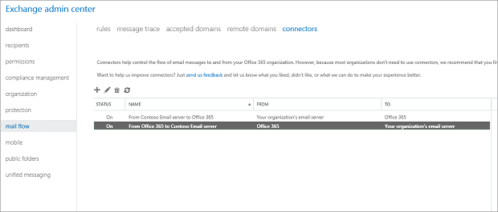

# "Tenant has exceeded threshold" NDR when mail is sent from your organization

[!INCLUDE [Branding name note](../../../includes/branding-name-note.md)]

_Original KB number:_&nbsp;4498191

## Symptoms

When anyone in your organization sends email, they receive the following NDR:

> 550 5.7.705 Access denied, tenant has exceeded threshold

When this error occurs, every user in your tenant is blocked from sending email.

## Cause

This issue occurs because Exchange Online Protection (EOP) filters identify a very large volume of suspicious email coming from the tenant. This triggers a block of outgoing email.

The increased level of spam can occur for several different reasons. The most common reasons are the following:

- Sending bulk mail. This is because bulk mail violates the Office 365 terms of service. Exchange Online customers who have to send legitimate bulk commercial email (for example, customer newsletters) should use third-party providers that specialize in these services.

  For more information, see the "Receiving and sending limits" section of [Exchange Online Limits](/office365/servicedescriptions/exchange-online-service-description/exchange-online-limits#receiving-and-sending-limits).
- A compromised system, in which attackers can use your tenant to send email without your knowledge.

## Resolution

To fix this issue, follow these steps:

1. Remove any unknown or unused inbound connectors from Office 365. To do this, follow these steps:
   1. Go to [Exchange Admin Center](https://outlook.office.com/ecp/), and sign in as an Exchange Online administrator.
   1. Select **mail flow** in the left-hand frame, and click **connector**.
   1. If any connectors already exist for your organization, you can see them listed here. If you see any connectors that don't belong, you should remove them by selecting the connector and clicking the Trash icon. The following screenshot shows some sample connectors that you should have if you are in a hybrid scenario. All other connectors should be inspected and removed if they are not required.

      

1. Check the audit logs to determine whether a connector was created recently. Spammers are known to create connectors, send out lots of mails on that connector, and then delete the connector to cover their tracks.
1. Because an admin account was compromised, change the passwords for all your admins.
1. To prevent future compromise, enable multi-factor authentication (MFA) for, at least, the admin accounts. For more information, see [Set up multi-factor authentication](/office365/admin/security-and-compliance/set-up-multi-factor-authentication?preserve-view=true&view=o365-worldwide).
1. Contact Microsoft Support to unblock the tenant.

## References

[Email non-delivery reports in Office 365](https://support.office.com/article/51daa6b9-2e35-49c4-a0c9-df85bf8533c3)