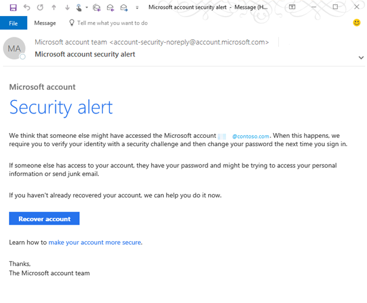

# You receive a Microsoft account security alert email message in Office 365 Dedicated/ITAR (vNext)

## Symptoms

In Microsoft Office 365 Dedicated/ITAR (vNext), you receive an email message that has the subject "Microsoft account security alert," and you are worried that it's a phishing email message.

## Cause

You may have set your Office 365 work account as a secondary email address on your Microsoft Live account. 

## Resolution

Always use caution, and perform due diligence to determine whether the message is a phishing email message before you take any other action. 
Start by hovering your mouse over all email addresses, links, and buttons to verify that the information looks valid and references Microsoft. You can also analyze the message headers and message tracking to review the "spam confidence level" and other elements of the message to determine whether it's legitimate. 

## More Information

For more information, see the following: 

- [How to review and mitigate the impact of phishing attacks in Office 365](https://blogs.technet.microsoft.com/office365security/how-to-review-and-mitigate-the-impact-of-phishing-attacks-in-office-365/)   
- [Microsoft Remote Connectivity Analyzer](https://testconnectivity.microsoft.com/)   
- [Anti-spam message headers](https://technet.microsoft.com/library/dn205071%28v=exchg.150%29.aspx)   
- [Spam confidence levels](https://technet.microsoft.com/library/jj200686%28v=exchg.150%29.aspx)   
