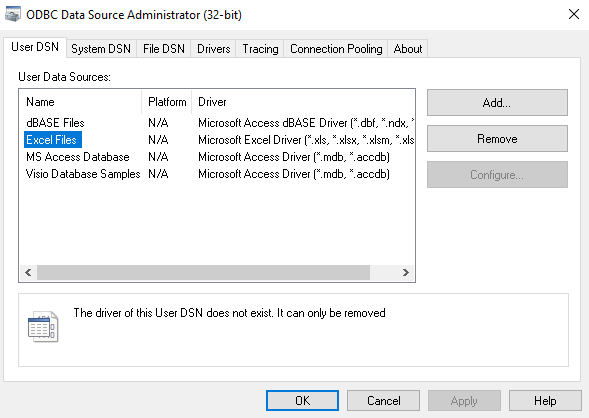

# Can't use the Access ODBC driver or OLEDB provider outside Office Click-to-Run applications

[!INCLUDE [Branding name note](../../../includes/branding-name-note.md)]

## Symptoms

When you try to create an ODBC DSN for drivers that are provided by Microsoft Access in the Data Sources ODBC Administrator, the attempt fails. This problem occurs if you're using a Click-to-Run (C2R) installation of Office. Depending on the version of Office, you may encounter any of the following issues when you try this operation:
 
- The ODBC drivers provided by ACEODBC.DLL are not listed in the **Select a driver** dialog box.    
- You receive a "The operating system is not presently configured to run this application" error message.    
- You receive an "Unable to load odbcji32.dll" error message.    
- You receive a "The driver of this User DSN does not exist. It can only be removed" error message together with the platform showing **N/A**.

    

Affected drivers:

- Microsoft Access Driver (*.mdb, *.accdb)    
- Microsoft Access Text Driver (*.txt, *.csv)    
- Microsoft Excel Driver (*.xls, *.xlsx, *.xlsm, *.xlsb)
- Microsoft Access
- Microsoft Excel
 
Additionally, if you try to define an OLEDB connection from an external application (one that's running outside of Office) by using the Microsoft.ACE.OLEDB.12.0 OLEDB provider, you encounter a "Provider cannot be found" error when you try to connect to the provider. 

## Cause

Click-to-Run installations of Office run in an isolated virtual environment on the local operating system. Some applications outside Office may not be aware of where to look for the installation in the isolated environment. 

[Overview of Click-to-Run for Office 365 setup architecture](https://technet.microsoft.com/library/jj219420.aspx) 

## Resolution

### ODBC connections to be used in Office applications

You can work around the issue by creating a DSN from within an Office application, such as Access, instead of using the ODBC Administrator. To create a new DSN in Access, follow these steps:  
 
1. On the ribbon, select **External Data** > **ODBC Database**.
2. Select **Import** or **Link**, and then click **OK**.
3. Select the tab for the kind of DSN that you want to create (**File Data Source** or **Machine Data Source**), and then click **New**.
4. Select the appropriate driver along with any required information to complete the entry.
5. After the DSN is created, click **Cancel** to exit the remaining Import/Link steps.
6. The DSN should now appear in the ODBC Administrator, and you can use it in any Office application.

### ODBC or Microsoft.ACE.OLEDB.12.0 OLEDB provider connections that will be used outside of Office

You must install an MSI installation of the Microsoft Access Database Engine from one of the following sources so that the calling application can locate the driver and provider.

[Microsoft Access Database Engine 2016 Redistributable](https://www.microsoft.com/download/details.aspx?id=54920)

**Note** If Office 365 is already installed, side-by-side detection will prevent the installation from proceeding. To install the package, perform a [quiet installation](https://msdn.microsoft.com/library/windows/desktop/aa372024%28v=vs.85%29.aspx) by running a command such as the following:

> **\<File location>:\\\<File name> /quiet**
>
> For example: C:\AccessDatabaseEngine.exe /quiet
 
[Microsoft Access 2013 Runtime](https://www.microsoft.com/download/details.aspx?id=39358)
 
[Microsoft Access Database Engine 2010 Redistributable](https://www.microsoft.com/download/details.aspx?id=13255)