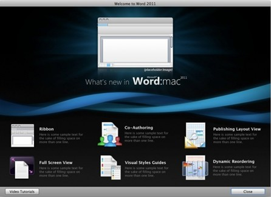

# Cannot pass the Welcome Screen in Office for Mac

## Symptoms

When you start any Office for Mac application such as Microsoft Word for Mac, PowerPoint for Mac, Excel for Mac or Outlook for Mac, the Welcome screen does not have any buttons such as OK or Close to continue.

## Cause

The screen resolution is too low and the **Close** button is on the bottom. 

## Resolution

Increase the screen resolution to be able to see the **Close** button. You can also press the Return or Enter key on the right hand side of your keyboard.

### Increase screen resolution

1. Click Apple
2. Click System Preferences.
3. Open Display.
4. Change to a higher resolution. For example, change to 1280x800 or 1680x1050.
    > [!NOTE]
    > The highest resolution depends on what your monitor supports. Some monitors are only capable of displaying 1024X768.
5. Close the window.
