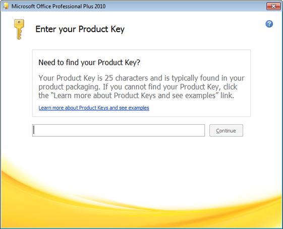
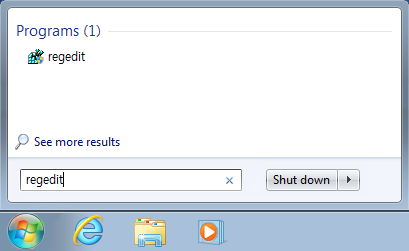
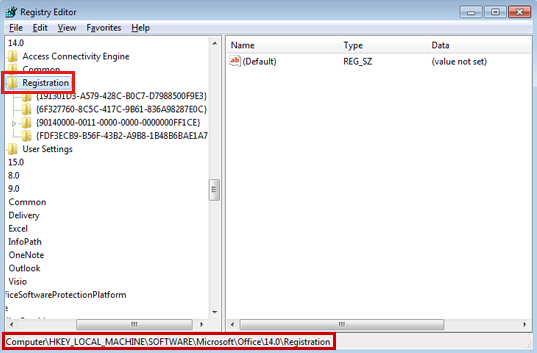
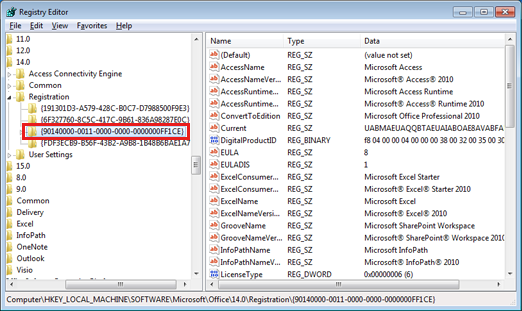
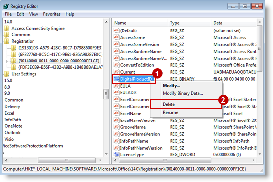
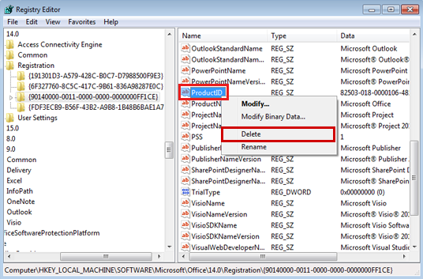
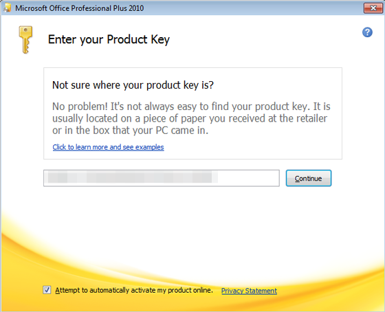

# Office 2010 product key change error step by step

## Symptoms

The previously installed version of Office 2010 prompts the user to change the product key. The screen then disappears, and shows no response when product key change is clicked.

## Cause

This may be caused when the product keys of Office 2010 programs do not match.

## How to fix

This issue can be resolved by removing the Office 2010 registry values.

 The following describes how to modify the registry. Incorrect registry modification can cause serious problems, so please proceed with extra caution. For additional protection, you are recommended to back up the registry before modifying it. This allows you to restore the registry if a problem occurs. For more information about backing up the registry, see [Back up the registry](https://support.microsoft.com/help/322756).

1. Click Start  and enter regedit in the search pane. At the top of the program list, click regedit.

     

     If the user account control message appears, enter the administrator password, or click Yes.

2. In Registry Editor, go to the HKEY_LOCAL_MACHINE\SOFTWARE\Microsoft\Office\14.0\Registration path.

     

    > [!TIP]
    > If the operating system is Windows 7 64-bit, go to the HKEY_LOCAL_MACHINE\SOFTWARE\Wow6432Node\Microsoft\Office\14.0\Registration path.

3. There are several GUID (Globally Unique Identifiers), consisting of a combination of alphanumeric characters, in the Registration subpath. Each GUID specifies the program that is installed on your computer. Click each GUID to view the registry entries in the right pane, and find and select the GUID that contains the relevant Office program version.

    

4. After selecting the GUID that contains the Office program version, find and right-click DigitalProductID and click delete.
    
     

     Click Yes when the confirm value delete message appears.

5. Find and right-click ProductID and click delete.
     
     

     Click Yes when the confirm value delete message appears.
6. Close Registry Editor and restart the computer.

7. When you run any Office 2010 program, the Enter your product key screen will appear. Enter the correct product key to complete product key change.

    

### Issue resolved?

- Determine if the issue has been resolved. If the issue has been resolved, the process described in this section is finished. If the issue is not resolved, you can [contact technical support](https://support.microsoft.com/contactus).  
- Thank you for your comments. To submit feedback or any problems found in the approach to resolving this issue, please leave comments on the "[Fix it for me](https://blogs.technet.com/fixit4me/)" blog or send an [E-mail](mailto:fixit4me@microsoft.com?Subject=KB).

## Reference materials

- [2186281: Overview of product code GUID numbering in Office 2010](https://support.microsoft.com/kb/2186281)
- [895456: How to change the product key for Office XP, Office 2003 and 2007 Office Systems](https://support.microsoft.com/kb/895456)

## Send us feedback

Microsoft Help and support site values your opinion. Please send us feedback below to give us your valuable opinion.
