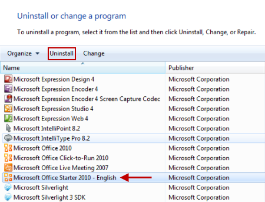
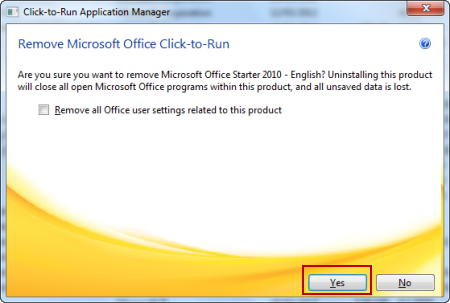
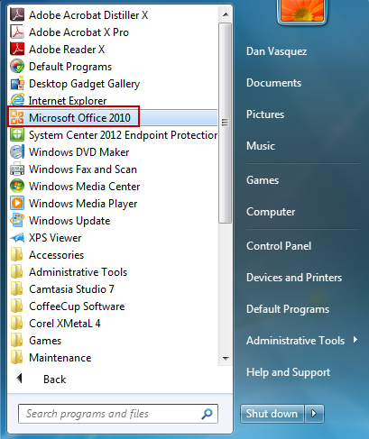
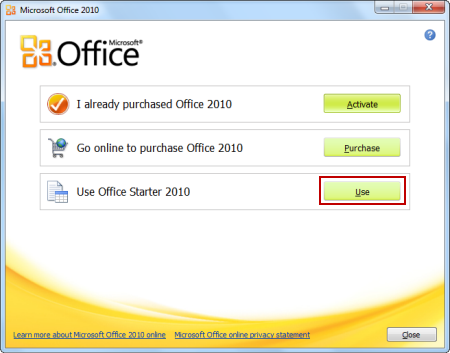
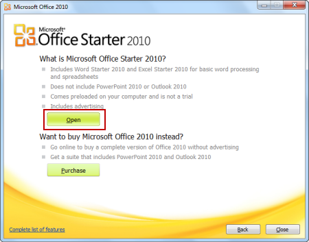

# "Cannot be opened" error when you start an Office Starter 2010 program.

##  Resolution

If Word Starter 2010 or Excel Starter 2010 cannot be opened, uninstall and reinstall Microsoft Office Starter 2010: 
 
1. Click Start (or Start > Run in Windows XP).    
2. Type appwiz.cpl, and then press Enter.

   **Warning** Do not remove Microsoft Office 2010from the list of installed programs. You will need this to reinstall Microsoft Office Starter 2010.

3. Click Microsoft Office Starter 2010, and then click Uninstall (or Remove in Windows XP).

        
4. Click Yes and follow the instructions to uninstall Office Starter 2010.

        
5. To reinstall Office Starter 2010, click Start > All Programs > Microsoft Office 2010.

        
6. Click Use.

        
7. And then click Open. This will re-install Office Starter 2010.

        
 If the error continues to occur, you may have to do a full restore of the computer to reinstall Microsoft Office Starter 2010. We recommend you contact the computer manufacturer to talk about your options before you do this.

Get help from the [Microsoft Community](https://answers.microsoft.com/) online community, search for more information on [Microsoft Support](https://support.microsoft.com/search/) or [Office Help and How To](https://office.microsoft.com/support/), or learn more about [Assisted Support](https://support.microsoft.com/contactus/) options.
