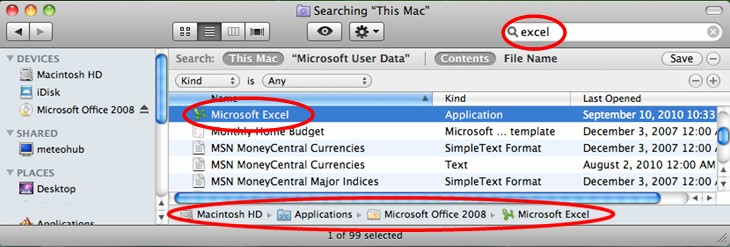
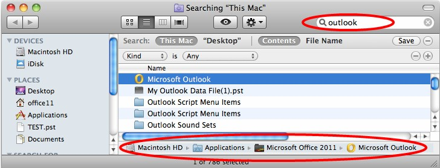

# "Microsoft  cannot be opened because of a problem" error when you start an Office program

> [!NOTE]
> **Office 365 ProPlus** is being renamed to **Microsoft 365 Apps for enterprise**. For more information about this change, [read this blog post](https://go.microsoft.com/fwlink/p/?linkid=2120533).

## Symptoms

When you try to start any Office for Mac applications (Microsoft Word, Microsoft Excel, Microsoft PowerPoint, Microsoft Entourage, or Microsoft Outlook for Mac) in Mac OS X 10.6.x (Snow Leopard), you receive the following error message:

```asciidoc
Microsoft <application_name> cannot be opened because of a problem.Check with the developer to make sure Microsoft <application_name> works with this version of Mac OS X. You may need to reinstall the application. Be sure to install any available updates for the application and Mac OS X.
```

## Cause

This error occurs if the Office program was moved or duplicated.

## Resolution

### Step 1: Check the program path

When the error message is displayed, view the comments under "Problem Details and System Configuration.". Note the "Path" that is listed in the error message, and then close the error message box. The path must be as follows:

*Macintosh HD\Applications\Microsoft Office 2008*

*Macintosh HD\Applications\Microsoft Office 2011*

If the path in the error message differs, you must move the application folder to its correction location. To do this, follow these steps:

1. Locate the Office 2008 folder.    
2. Click to select the folder.    
3. On the Finder menu, click **Edit**, and then select **Copy Microsoft Office 2008** or Copy Microsoft Office 2011.   
4. On the Finder menu, click **Go**, and then select **Applications.**   
5. On the Finder menu, click **Edit**, and then select **Paste the Item**.   
6. Start the Office program to see whether the problem is resolved.    

If the problem continues to occur, there might be duplicate entries. 

### Step 2: Delete duplicate entries

To delete duplicate entries, follow these steps:

1. On the Finder menu, click **File**, and then click **Find**.    
2. In the search box, type the program name, and then press Enter. For example, type Excel.

    
    
    
3. In the results, look for duplicate instances of the Excel icon. If there is only one icon, go to "step 3". If there are several Excel icons, select a duplicate icon. On the Finder menu, click **File**, and then select **Move to Trash**.   
4. Empty the Trash.   
5. Start the Office program. If the problem continues to occur, remove and then reinstall the Office program.   

### Step 3: Remove and then reinstall Office

Office 2011

To remove Office 2011, follow these steps: 

1. Quit all applications.   
2. In the Finder, click Go select Computer.   
3. Open your hard drive (Macintosh HD), then open the Application Folder.    
4. Click to select Microsoft Office 2011 drag and then drop it to the Trash.    
5. Reinstall Office for Mac 2011.    

Office 2008

To remove Office 2008, follow these steps: 

1. Quits all applications.   
2. In the Finder, click **Go**, and then select **Computer**.
3. Open **Macintosh HD**, then open the Applications folder.
4. Open the Microsoft Office 2008 folder.
5. Open the Additional Tools folder.
6. Double-click the Remove Office file. The "Remove Office" window will open.
7. Click **Continue**.
8. Follow the directions that are provided.
9. Reinstall Office 2008 on your computer.
