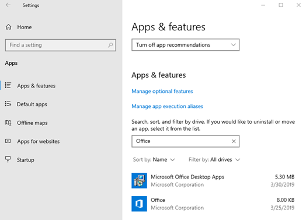
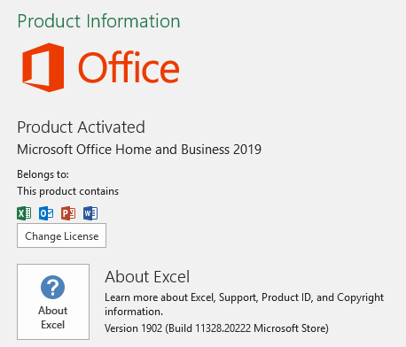

# "Windows cannot access specified device, path, or file" error launching Office

> [!NOTE]
> **Office 365 ProPlus** is being renamed to **Microsoft 365 Apps for enterprise**. For more information about this change, [read this blog post](https://go.microsoft.com/fwlink/p/?linkid=2120533).

## Symptoms

When you try to launch an Office in the Microsoft Store app, you receive the following error:

```adoc
Windows cannot access the specified device, path, or file. You may not have the appropriate permission to access the item.
```

> [!NOTE]
> This issue occurs with Office in the Microsoft Store (or pre-installed) apps and does not occur with Click-To-Run or volume license Products.

## Cause

Office apps won't launch when Folder Redirection for AppData folder is enabled.

## Resolution

This issue has been resolved in the following Microsoft Knowledge Base articles:

- RS4: [April 25, 2019—KB4493437 (OS Build 17134.753)](https://support.microsoft.com/help/4493437)
- RS5: [May 3, 2019—KB4495667 (OS Build 17763.475)](https://support.microsoft.com/help/4495667)

These KBs address an issue that prevents certain apps from launching when you set folder redirection for the Roaming AppData folder to a network path.

## Workaround

If the issue persists, try adding permission for all users to access the %appdata\Microsoft folder:

1. Select the Windows Start button (or CTRL + R) and type **%appdata%**.

1. In the Roaming folder, right-click the Microsoft folder.

1. Select **Properties** and then the Security tab.

1. Select the user or users required to access this folder.

1. Ensure that "List folder contents" is checked under Permission for Everyone.

1. Select **OK**.

## More information

For more information, see the following Microsoft Knowledge Base articles:

- [FAQ: Office on Windows 10 in S mode](https://support.office.com/article/717193b5-ff9f-4388-84c0-277ddf07fe3f)

- [Install Office from the Microsoft Store app on a PC](https://support.office.com/article/94e0c114-9457-455e-8459-86bdd87d9f03)

    > [!NOTE]
    > You can also get Office apps (Office in Microsoft) with a PC that bundles with Microsoft Office.

- ["Windows cannot access the specified device, path, or file" error when you try to install, update or start a program or file](https://support.microsoft.com/help/2669244/windows-cannot-access-the-specified-device-path-or-file-error-when-you)

### Determine your version of Office

To determine whether your Office is an "Office in the Microsoft Store" version or another, follow these steps:

#### Method 1

1. Open **Settings** from the Windows menu and select **Apps**.

1. Under "Apps & features", enter "Office" in the **Search this list** box.

 If "Microsoft Office Desktop Apps" is listed, you are using "Office in the Microsoft Store".



#### Method 2

1. Start an Office application.

1. On the **File** menu, select **Account**.

If you are using "Office in the Microsoft Store", the **Update Options** button will not be displayed, and you will see "**Microsoft Store**" in under About Word instead of a build version.


