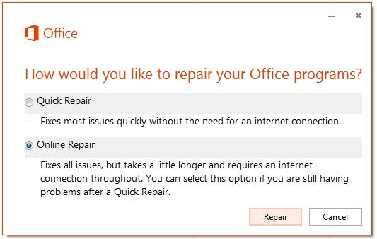
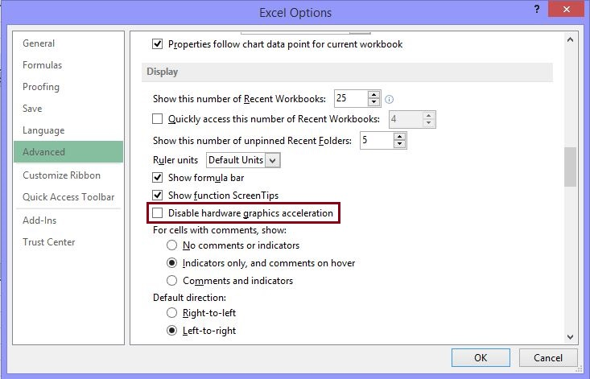

# Troubleshoot Excel opening blank when you double-click a file icon or file name

## Symptoms

When you double-click an icon or file name for a Microsoft Excel workbook, Excel starts but displays a blank screen where you expect the file to appear.

## Resolution

To resolve this problem, try the following methods, as appropriate, in the given order.

### Method 1: Ignore DDE

This problem may occur if the **Ignore other applications that use Dynamic Data Exchange (DDE)** check box in Excel options is selected. 

When you double-click an Excel workbook in Windows Explorer, a dynamic data exchange (DDE) message is sent to Excel. This message instructs Excel to open the workbook that you double-clicked.

If you select the "Ignore" option, Excel ignores DDE messages that are sent to it by other programs. Therefore, the DDE message that is sent to Excel by Windows Explorer is ignored, and Excel does not open the workbook that you double-clicked.

To correct this setting, follow these steps:

1. On the **Tools** menu, click **Options**.   
2. Click the **General** tab.   
3. Clear the **Ignore other applications that use Dynamic Data Exchange (DDE) check box**, and then click **OK**.   

> [!NOTE]
> For more information about how to turn off DDE, see the following Microsoft Knowledge Base article:

[211494](https://support.microsoft.com/help/211494) "There was a problem sending the command to the program" error in Excel

If these steps do not resolve the problem, go to Method 2.

### Method 2: Repair User Experience Virtualization (UE-V)

If you are running Update User Experience Virtualization (UE-V), install hotfix 2927019. To do this, see the following Microsoft Knowledge Base article:

[2927019](https://support.microsoft.com/help/2927019) Hotfix Package 1 for Microsoft User Experience Virtualization 2.0

If you are not sure whether you are running UE-V, examine the program list in the **Programs and Features** item in Control Panel. An entry for "Company Settings Center" indicates that you are running UE-V.

If these steps do not resolve the problem, go to Method 3.

### Method 3: Reset file associations

To check whether the file associations in the system are performing correctly, reset the Excel file associations to their default settings. To do this, follow the steps for your operating system.

#### Windows 8

1. On the Start screen, type Control Panel.   
2. Click or tap **Control Panel**.   
3. Click **Default Programs**, and then click **Set your default programs**.   
4. Click **Excel**, and then click **Choose default for this program**.   
5. On the **Set Program Associations** screen, click **Select All**, and then click **Save**.   

#### Windows 7

1. Click **Start**, and then click **Control Panel**.   
2. Click **Default Programs**.   
3. Click **Associate a file type or protocol with a specific program**.   
4. Select **Microsoft Excel Worksheet**, and then click change program.   
5. Under **Recommended Programs**, click **Microsoft Excel**.   
6. If Excel does not appear in this list, click **Browse**, locate the Excel installation folder, click **Excel.exe**, and then click **Excel**.   

If these steps do not resolve the problem, go to Method 4.

### Method 4: Repair Office

Try to repair your Office programs. To do this, follow the steps for your installation type and operating system.
 
#### For an Office 365 Click-to-Run installation

##### Windows 8

1. On the Start screen, type Control Panel.   
2. Click or tap **Control Panel**.   
3. Under **Programs**, click or tap **Uninstall a program**.   
4. Click or tap **Microsoft Office 365**, and then click or tap **Change**.   
5. Click or tap **Online Repair**, and then click or tap **Repair**. You may have to restart your computer after the repair process is finished.   

##### Windows 7

1. Click **Start**, and then click **Control Panel**.   
2. Double-click **Programs and Features**.   
3. Click **Microsoft Office 365**, and then click **Change**.   
4. Select **Online Repair**, and then click **Repair**. 
   > [!NOTE]
   > You may have to restart your computer after the repair process is complete.

   

#### For an Office 2013, Office 2010, or Office 2007 installation

To repair Office 2013, Office 2010, or Office 2007, follow the steps in the following Office website topic:

[Repair Office programs](https://office.microsoft.com/outlook-help/repair-office-programs-ha010357402.aspx)

If these steps do not resolve the problem, go to Method 5.

### Method 5: Turn off add-ins

Excel and COM add-in programs can also cause this problem. These two kinds of add-ins are located in different folders. For testing, disable and isolate the conflict by turning off each add-in one at a time. To do this, follow these steps:

1. On the **File** menu, click **Options**, and then click **Add-Ins**.   
2. In the **Manage** list at the bottom of the screen, select **COM Add-Ins** item, and then click **Go**.   
3. Clear one of the add-ins in the list, and then click **OK**.   
4. Restart Excel by double-clicking the icon or file name for the workbook that you are trying to open.   
5. If the problem persists, repeat steps 1-4, except select a different add-in in step 3.   
6. If the problem persists after you clear all the COM Add-ins, repeat steps 1-4, except select **Excel Add-Ins** in step 2, and then try each of the Excel add-ins one at a time in step 3.  

If Excel loads the file, the add-in you last turned off is causing the problem. If this is the case, we recommend that you visit the manufacturer's website for the add-in to learn whether an updated version of the add-in is available. If a newer version of the add-in is not available, or if you don’t have to use the add-in, you can leave it turned off.

If Excel does not open the file after you turn off all the add-ins, the problem has a different cause. 

If these steps do not resolve the problem, go to Method 6.

### Method 6: Disable hardware acceleration

To work around this problem, disable hardware acceleration until a fix is released by your video card manufacturer. Make sure to check regularly for updates to your video card driver.

To disable hardware acceleration, follow these steps: 

1. Start any Office 2013 program.   
2. On the **File** tab, click **Options**.   
3. In the **Options** dialog box, click **Advanced**.   
4. In the list of available options, select the **Disable hardware graphics acceleration** check box.

   The following screen shot shows this option in Excel.

      
5. Click **OK**.   

> [!NOTE]
> For more information about hardware acceleration, see the following Microsoft Knowledge Base article:

[2768648](https://support.microsoft.com/help/2768648) Performance and display issues in Office 2013 client applications

If you still experience this problem after you try all these methods, contact [Microsoft Support](https://support.microsoft.com/) for additional troubleshooting help.