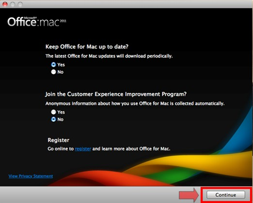
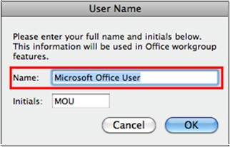
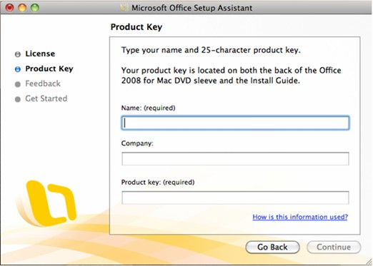
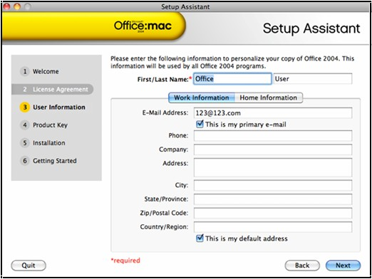

# Change the Software License Registration Information (Company, Name) for Office for Mac

## Summary

This article describes on how to change the Software License Registration Information such as the name, company name, or the software owner.

Before you proceed with the steps below, please have your installation media and product key in hand.  If you have downloaded version of the product, find email with the link to re-download the executable.

## More information

> [!IMPORTANT]
> The location of certain files are different if you have Service Pack 2 (SP2) installed. To check if it is installed, open Word, and then click About Word from the Word menu. If the version number is 14.2.0 or above, you have Service Pack 2 and you should follow the Service Pack 2 steps when provided in this article.

To change your license information, follow these steps for your version of Office (2011, 2008, or 2004) below:

### Office 2011

1. Quit all Microsoft applications.
2. On the Go menu, click Home. 
3. Open Library.
    > [!NOTE]
    > The Library folder is hidden in MAC OS X Lion. To display this folder, hold down the OPTION key while you click the Go menu.
4. Open Preferences.
5. Click to select com.microsoft.office.plist and drag it to Trash(Don't empty the Trash before the new information is entered).
6. Open the Microsoft folder.
    > [!NOTE]
    > If you have Service Pack 2 installed, open Application Support > Microsoft instead of Preferences > Microsoft.
7. Open Office 2011.
8. Click to select Office Registration Cache and OLE Registration Database and drag it to  Trash(Don't empty the Trash before the new information is entered).
9. Restart the Mac.
10. Launch Word/Excel/PowerPoint/Outlook and click Continue on the first window.
11. Select Yes or No to the 2 questions on the next window and click Continue. See screenshot below:

     
12.  Enter the correct user information on the next window. See screenshot below.

     

If the steps above did not resolve the issue, follow these steps:

1. Quit all Microsoft applications.
1. On the Go menu, click Home. 
1. Open Library.
    > [!NOTE]
    > The Library folder is hidden in MAC OS X Lion. To display this folder, hold down the OPTION key while you click the Go menu.
1. Open Preferences.
1. Move com.microsoft.office.plist to the Trash(Don't empty the Trash before the new information is entered).
1. Open the Microsoft folder.
    > [!NOTE]
    > If you have Service Pack 2 installed, open Application Support > Microsoft instead of Preferences > Microsoft.
1. Open Office 2011.
1. Move Office Registration Cache and OLE Registration Database to the Trash(Don't empty the Trash before the new information is entered).
1. On the  Go menu, click Home.
1. Open Documents.
1. Click to select Microsoft User Data press Return (enter) on your keyboard then rename the folder to Microsoft User Data Good
1. Restart the Mac.
1. Launch Word/Excel/PowerPoint/Outlook and enter the correct name and Company.

    If you are using Outlook or Entourage, follow the steps below to rename the, "Microsoft User Data Good" folder back to "Microsoft User Data".
1. Quit all Microsoft Programs.
1. On the Go menu, click Home.
1. Open Documents.
1. Click to select Microsoft User Data and drag it to Trash (don't empty the Trash until the data is restored in Outlook or Entourage).
1. Click to select Microsoft User DataGood press Return (enter) on your keyboard then rename the folder to Microsoft User Data

   > [!NOTE]
   > Do not leave extra spaces after word "data".
1. Restart the Mac.
1. Open Outlook or Entourage to make sure the data is there. If so, then the Trash can be emptied as long as you do not have files you wish to keep in the Trash.

### Office 2008

Before you start, make sure that you have Office 2008 product key in hand. Note: If you do not have Product key do not proceed with these steps:

1. Disconnect from Network.   
2. 
      - If it is a wireless connection; turn off AirPort at the top of the screen next to the clock.
         
            
      - If its a wired connection, physically unplug the Ethernet cable, quit all Office applications (Including MSN Messenger).
3. On the Go menu, click Computer.
4. Open your Hard Drive (Example, Macintosh HD).   
5. Open the Applications folder   
6. Open the Microsoft Office 2008 folder.
7. Open the Office folder.   
8. Click and then drag the OfficePID.plist file (Don't empty the Trash before the new information is entered) to the Trash.
9. On the Go menu, click Home.   
10. Open Library.
    > [!NOTE]
    > The Library folder is hidden in MAC OS X Lion. To display this folder, hold down the OPTION key while you click the Go menu.
11. Open the Preferences folder.

    > [!NOTE]
    > If you have Service Pack 2 installed, open Application Support instead of Preferences.   
12. Open the Microsoft Folder.   
13. Open the Office 2008 folder.   
14. Trash the Microsoft Office 2008 Settings.plist file (Don't empty the Trash before the new information is entered).
15. Launch Word/Excel/PowerPoint/Outlook and click Continue on the first Window. On the next window, enter the correct information in the Name field, the Company field is optional and enter the Product Key, and click Continue, find a screenshot of this window below. Click Continue on the Product Identification window and click Finish on the next

      

### Office 2004

Before you start, make sure that you have Office 2004 product key in hand.

> [!NOTE]
> If you do not have Product key do not proceed with these steps.

1. Disconnect from Network.

    - If it is a wireless connection; turn off AirPort at the top of the screen next to the clock.
    
       
    - If it’s a wired connection, physically unplug the Ethernet cable, and quit all Office applications (Including MSN Messenger).
2. On the Go menu, click Home.
3. Open Library.
    > [!NOTE]
    > The Library folder is hidden in MAC OS X Lion. To display this folder, hold down the OPTION key while you click the Go menu.
4. Open the Microsoft folder and move the file named Microsoft Office Settings (11) to the Trash (Don't empty the Trash before the new information is entered).
5. On the Go menu, click Applications. 
6. Open the Microsoft Office 2004 folder, open Additional Tools, and then open Remove Office. 
7. Double-click the Remove Office tool, press and hold down the Option key, click Remove Licensing Information Only, and then click Remove and release the Option key.

    > [!NOTE]
    > The Continue command label changes to Remove Licensing Information Only when you press the Option key.
8. When finished, close out the "Welcome to Remove Office" screen by clicking on the red dot, you will get a “Nothing was Removed” message, just click Quit.
9. Launch Word/Excel/PowerPoint/Entourage and click Next on the first window.
10.  Click Accept and enter your personal information on the Setup Assistant window. Only the first name is required and click Next. See screenshot below. Enter your Product Key on the next screen and click Finish and OK.

    
