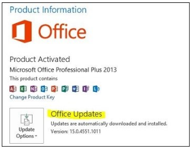

# Excel 2013 crashes when moving Excel sheet tab

[!INCLUDE [Branding name note](../../../includes/branding-name-note.md)]

##  Symptoms

While you are working with Excel spread sheet, Microsoft Excel 2013 crashes when you move Excel sheet tab to reposition within the same workbook or to a separate workbook window.

When you examine your Application event log, you find an event (Event ID = 1000) with a crash signature that matches one of the following.

|Application Name|Application Version|Module Name|Module Version|Offset|
|---|---|---|---|---|
|Excel.exe|15.0.4517.1004|Excel.exe|15.0.4517.1004|0x000218AE|
|Excel.exe|15.0.4535.1507|Excel.exe|15.0.4535.1507|0x000218AE|
|Excel.exe|15.0.4569.1504|Excel.exe|15.0.4569.1504|0x000219C5|

##  Cause

This problem is caused by a known issue in certain builds of Microsoft Excel 2013.

##  Resolution

If you find a crash signature in your Application event log that mataches one of the signatures in the table in the System section, please install the latest update for Excel. The method of updating depends on whether you have a Click-to-Run installation of Office or an MSI installation of Office.

To see whether you are using a Click-to-Run installation of Office 2013, click the File tab in Excel and then click Account. If you see"Office Updates" under Product Information, as shown in the following figure, you are using a Click-to-Run installation of Office.

If you do not see "Office Updates" under Product Information, you have an MSI installation of Office 2013.

The latest updates for Office can be found using the following links:

MSI installation

[https://technet.microsoft.com/en-us/office/ee748587.aspx](https://technet.microsoft.com/office/ee748587.aspx)

Click-to-Run installation

[https://support.microsoft.com/gp/office-2013-click-to-run](https://docs.microsoft.com/office/troubleshoot/office/office-click-to-run-installation)

##  More Information

The following crash signatures have not been correlated to reproducible steps that cause the crash. Crash signatures are based on a combination of the different elements listed in the signature data. So, if you find one of these crash signatures in your application event log, then the update recommended by this article has a very high chance of stopping these particular crashes on your computer.