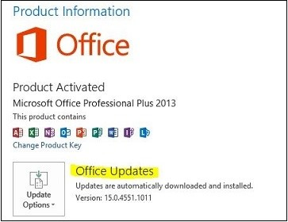

# Excel crashing issues fixed in recent updates

[!INCLUDE [Branding name note](../../../includes/branding-name-note.md)]

## Symptoms

Consider the following scenario when working in Excel the application stops responding or crashes. If you examine the Application Event log, you will find entries for Event ID 1000 that have one or more of the following crash signatures.

|Faulting application name|Version|Faulting module name|Version|Offset|
|---|---|---|---|---|
|Excel.exe|15.0.4517.1004|Excel.exe|15.0.4517.1004|0x0004F20E|
|Excel.exe|15.0.4420.1017|Excel.exe|15.0.4420.1017|0x003CBD72|
|Excel.exe|15.0.4551.1510|Excel.exe|15.0.4551.1510|0x003BFFCA|
|Excel.exe|15.0.4569.1504|Excel.exe|15.0.4569.1504|0x0006045C|
|Excel.exe|15.0.4517.1004|Excel.exe|15.0.4517.1004|0x0005F9B4|
|Excel.exe|15.0.4605.1000|Excel.exe|15.0.4605.1000|0x0005FC4C|

##  Cause

Microsoft is researching this problem and this article will be updated with additional information as it becomes available.

##  Resolution

To resolve this problem, please install the latest update for Excel. The method for updating depends on whether you have a Click-to-Run installation of Office or an MSI installation of Office.

To see whether you are using a Click-to-Run installation of Office 2013, click the File tab in Outlook and then click Office Account. If you see "Office Updates" under Product Information, as shown in the following figure, you are using a Click-to-Run installation of Office. 

If you do not see "Office Updates" under Product Information, you have an MSI installation of Office 2013. 

The latest updates for Office can found using the following links:

MSI installation [https://technet.microsoft.com/office/ee748587.aspx](https://technet.microsoft.com/office/ee748587.aspx)

Click-to-Run installation 
[https://support.microsoft.com/gp/office-2013-click-to-run](https://support.microsoft.com/gp/office-2013-click-to-run])

##  More Information

> [!NOTE]
> The following crash signatures have not been correlated to reproducible steps that cause the crash. Crash signatures are based on a combination of the different elements listed in the signature data. So, if you find one of these crash signatures in your application event log, then the update recommended by this article has a high chance of stopping these particular crashes on your computer.

> [!NOTE]
> This is a "FAST PUBLISH" article created directly from within the Microsoft support organization. The information contained herein is provided as-is in response to emerging issues. As a result of the speed in making it available, the materials may include typographical errors and may be revised at any time without notice. See [Terms of Use](https://go.microsoft.com/fwlink/?linkid=151500) for other considerations.