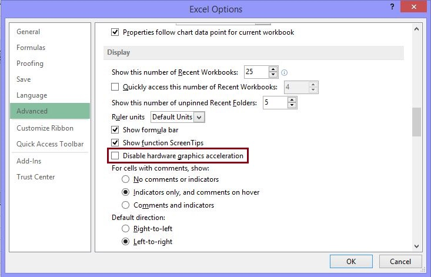

# Troubleshoot Excel opening blank when you double-select a file icon or file name

[!INCLUDE [Branding name note](../../../includes/branding-name-note.md)]

## Symptoms

When you double-select an icon or file name for a Microsoft Excel workbook, Excel starts, then displays a blank screen where you expect the file content to appear.

*Try the following options to help determine the cause of your printing failure. Select the arrow image to see more detailed instructions about that option.*

> [!IMPORTANT]
> Follow the steps in this section carefully. Serious problems might occur if you modify the registry incorrectly. Before you modify it, [back up the registry for restoration ](https://support.microsoft.com/help/322756) in case problems occur.

<table align="left">
<tr>
<td valign="top"> 

</td><td><b>Ignore DDE</b>

> [!NOTE]
> This step can be skipped for Excel 2019 and Excel O365
<ol>
<li>In the upper-left corner of the Excel window, select <b>File</b>, then <b>Options</b>.</li>
<li>On the left side of the <b>Options</b> window, select <b>Advanced</b> to open the Advanced window.</li>
<li>In the <b>Advanced</b> window, scroll down to the <b>General</b> section.</li>
<li>Clear the <b>Ignore other applications that use Dynamic Data Exchange (DDE)</b> check box, then select the <b>OK</b> button at the bottom of the window.
</li>
</ol>
</td>
</tr>
<tr>
<td valign="top">

</td>
<td><b>Repair User Experience Virtualization (UE-V)</b>
If you are running Update User Experience Virtualization (UE-V), install Hotfix 2927019. To do this, see the following Microsoft Knowledge Base article:

[2927019](https://support.microsoft.com/help/2927019) - Hotfix Package 1 for Microsoft User Experience Virtualization 2.0
</td>
</tr>
<tr>
<td valign="top">

</td>
<td><b>Reset file associations</b>

<b>Windows 10</b>

1. Copy the file that is opening incorrectly, to your desktop.
1. Right-click the file, and choose <b>Properties</b>
1. On the <b>General</b> tab, next to <b>Type of file</b>, the type of file will be indicated within parenthesis. For example, (.docx), (.pdf), or (.csv).

The <b>Opens with</b> shows you which app it is currently associated with.

To open this type of file in a different app:

1. Select <b>Change</b>.
1. Select <b>More apps</b>.
1. Select the desired app, then select the checkbox to <b>Always use this app</b>.
1. Select the <b>OK</b> button.

</td>
</tr>
<tr>
<td valign="top">

</td>
<td><b>Delete the Word Options registry key</b>

*For an Office 365 or Office 2019 Click-to-Run installation*

##### Windows 10

1. On the <b>Start</b> screen, type <b>Settings</b>.
1. Select or tap <b>Settings</b>.
1. In the <b>Settings</b> window, select or tap <b>Apps</b>.
1. In the <b>Apps & features</b> window, scroll down to your <b>Office</b> program and select or tap it.
1. Select or tap the <b>Modify</b> button.
1. In the <b>How would you like to repair your Office programs</b> window, select or tap the <b>Online Repair</b> radio button, then select or tap the <b>Repair</b> button.

</td>
</tr>
<tr>
<td valign="top">

</td>
<td><b>Turn off add-ins</b>

1. On the **File** menu, select **Options**, then select **Add-Ins**.
1. In the **Manage** list at the bottom of the screen, select **COM Add-Ins** item, then select **Go**.
1. Clear one of the add-ins in the list, then select **OK**.
1. Restart Excel by double-selecting the icon or file name for the workbook that you are trying to open.
1. If the problem persists, repeat steps 1-4, except select a different add-in in step 3.
1. If the problem persists after you clear all the COM Add-ins, repeat steps 1-4, except select **Excel Add-Ins** in step 2, then try each of the Excel add-ins one at a time in step 3.  

</td>
</tr>
<tr>
<td valign="top">

</td>
<td><b>Disable hardware acceleration</b>

1. Start any Office 2013, 2016, 2019, or O365 program.
1. On the **File** tab, select **Options**.
1. In the **Options** dialog box, select **Advanced**.
1. In the list of available options, select the **Disable hardware graphics acceleration** check box.

1. Select the **OK** button.
</td>
</tr>
<tr>
<td valign="top">

</td>
<td><b>Minimizing and maximizing the window</b>

1.    Select the minimize button in the top-right corner of the Excel sheet.
2.    In the task tray, right-click Excel and select your spreadsheet. (Or double click the Excel icon.)

</td></tr>
<tr>
<td valign="top">

</td>
<td><b>Check for hidden sheets</b>

1.    Select the minimize button in the top-right corner of the Excel sheet.
2.    In the task tray, right-click Excel and select your spreadsheet. (Or double click the Excel icon.)

</td>
</tr>
</table>

## Resolution

To resolve this problem, try the following options, as appropriate, in the given order.

<a id="option1">

### Option 1: Ignore DDE

</a>

This problem may occur if the **Ignore other applications that use Dynamic Data Exchange (DDE)** check box in Excel options is selected.

When you double-select an Excel workbook in Windows Explorer, a dynamic data exchange (DDE) message is sent to Excel. This message instructs Excel to open the workbook that you double-selected.

If you select the "Ignore" option, Excel ignores DDE messages that are sent to it by other programs. Therefore, the DDE message that is sent to Excel by Windows Explorer is ignored, and Excel does not open the workbook that you double-selected.

To correct this setting, follow these steps:

> [!NOTE]
> This step can be skipped for Excel 2019 and Excel O365

1. In the upper-left corner of the Excel window, select **File**, then **Options**.
1. On the left side of the **Options** window, select **Advanced** to open the Advanced window.
1. In the **Advanced** window, scroll down to the **General** section.
1. Clear the **Ignore other applications that use Dynamic Data Exchange (DDE)** check box, then select the **OK** button at the bottom of the window.

> [!NOTE]
> For more information about how to turn off DDE, see ["An error occurred when sending commands to the program" in Excel](https://docs.microsoft.com/office/troubleshoot/excel/error-when-send-commands-in-excel)

If these steps do not resolve the problem, continue to **Option 2**.

<a id="option2">

### Option 2: Repair User Experience Virtualization (UE-V)

</a>

If you are running Update User Experience Virtualization (UE-V), install Hotfix 2927019. To do this, see the following Microsoft Knowledge Base article:

[2927019](https://support.microsoft.com/help/2927019) - Hotfix Package 1 for Microsoft User Experience Virtualization 2.0

If you are not sure whether you are running UE-V, examine the program list in the **Programs and Features** item in Control Panel. An entry for "Company Settings Center" indicates that you are running UE-V.

If these steps do not resolve the problem, continue to **Option 3**.

<a id="option3">

### Option 3: Reset file associations

</a>

To check whether the file associations in the system are performing correctly, reset the Excel file associations to their default settings. To do this, follow the steps for your operating system.

#### Windows 8.1/10

1. Copy the file that is opening incorrectly, to your desktop.
1. Right-click the file, and choose **Properties**
1. On the **General** tab, next to **Type of file**, the type of file will be indicated within parenthesis. For example, (.docx), (.pdf), or (.csv).

The **Opens with** shows you which app it is currently associated with.

To open this type of file in a different app:

1. Select **Change**.
1. Select **More apps**.
1. Select the desired app, then select the checkbox to **Always use this app**.
1. Select the **OK** button.

#### Windows 8

1. On the Start screen, type Control Panel.
1. Select or tap **Control Panel**.
1. Select **Default Programs**, then select **Set your default programs**.
1. Select **Excel**, then select **Choose default for this program**.
1. On the **Set Program Associations** screen, select **Select All**, then select **Save**.

#### Windows 7

1. Select **Start**, then select **Control Panel**.
1. Select **Default Programs**.
1. Select **Associate a file type or protocol with a specific program**.
1. Select **Microsoft Excel Worksheet**, then select change program.
1. Under **Recommended Programs**, select **Microsoft Excel**.
1. If Excel does not appear in this list, select **Browse**, locate the Excel installation folder, select **Excel.exe**, then select **Excel**.

If these steps do not resolve the problem, continue to **Option 4**.

<a id="option4">

### Option 4: Repair Office

</a>

Try to repair your Office programs. To do this, follow the steps for your installation type and operating system.

#### For an Office 365 or Office 2019 Click-to-Run installation

##### Windows 10

1. On the **Start** screen, type **Settings**.
1. Select or tap **Settings**.
1. In the **Settings** window, select or tap **Apps**.
1. In the **Apps & features** window, scroll down to your **Office** program and select or tap it.
1. Select or tap the **Modify** button.
1. In the **How would you like to repair your Office programs** window, select or tap the **Online Repair** radio button, then select or tap the **Repair** button.

##### Windows 8

1. On the Start screen, type Control Panel.
1. Select or tap **Control Panel**.
1. Under **Programs**, select or tap **Uninstall a program**.
1. Select or tap **Microsoft Office 365**, then select or tap **Change**.
1. Select or tap **Online Repair**, then select or tap **Repair**. You may have to restart your computer after the repair process is finished.

##### Windows 7

1. Select **Start**, then select **Control Panel**.
1. Double-select **Programs and Features**.
1. Select **Microsoft Office 365**, then select **Change**.
1. Select **Online Repair**, then select **Repair**.

   

> [!NOTE]
> You may have to restart your computer after the repair process is complete.

#### For an Office 2013, Office 2010, or Office 2007 installation

To repair Office 2013, Office 2010, or Office 2007, follow the steps in the following Office website topic:

[Repair an Office application](https://office.microsoft.com/outlook-help/repair-office-programs-ha010357402.aspx)

If these steps do not resolve the problem, continue to **Option 5**.

<a id="option5">

### Option 5: Turn off add-ins

</a>

Excel and COM add-in programs can also cause this problem. These two kinds of add-ins are located in different folders. For testing, disable and isolate the conflict by turning off each add-in one at a time. To do this, follow these steps:

1. On the **File** menu, select **Options**, then select **Add-Ins**.
1. In the **Manage** list at the bottom of the screen, select **COM Add-Ins** item, then select **Go**.
1. Clear one of the add-ins in the list, then select **OK**.
1. Restart Excel by double-selecting the icon or file name for the workbook that you are trying to open.
1. If the problem persists, repeat steps 1-4, except select a different add-in in step 3.
1. If the problem persists after you clear all the COM Add-ins, repeat steps 1-4, except select **Excel Add-Ins** in step 2, then try each of the Excel add-ins one at a time in step 3.  

If Excel loads the file, the add-in you last turned off is causing the problem. If this is the case, we recommend that you visit the manufacturer's website for the add-in to learn whether an updated version of the add-in is available. If a newer version of the add-in is not available, or if you don't have to use the add-in, you can leave it turned off.

If Excel does not open the file after you turn off all the add-ins, the problem has a different cause.

If these steps do not resolve the problem, continue to **Option 6**.

<a id="option6">

### Option 6: Disable hardware acceleration

</a>

To work around this problem, disable hardware acceleration until a fix is released by your video card manufacturer. Make sure to check regularly for updates to your video card driver.

To disable hardware acceleration, follow these steps:

1. Start any Office 2013, 2016, 2019, or O365 program.
1. On the **File** tab, select **Options**.
1. In the **Options** dialog box, select **Advanced**.
1. In the list of available options, select the **Disable hardware graphics acceleration** check box.

   The following screen shot shows this option in Excel.

   

1. Select the **OK** button.

> [!NOTE]
> For more information about hardware acceleration, see the following Microsoft Knowledge Base article:
>
>[2768648](https://support.microsoft.com/help/2768648) - Performance and display issues in Office 2013 client applications

<a id="option7">

### Option 7: Minimizing and maximizing the window

</a>

Minimizing and then maximizing the window can sometimes refresh the Excel page and cause any hidden data to appear.

1.    Select the minimize button in the top-right corner of the Excel sheet.
2.    In the task tray, right-click Excel and select your spreadsheet. (Or double click the Excel icon.)

When your sheet is maximized, your data may appear.

<a id="option8">

### Option 8: Check for hidden sheets

</a>

An Excel sheet may have inadvertently been saved as a hidden document. To find out:
1.    Go to the **View** tab.
2.    Select **Unhide**.
3.    Choose a workbook from the list.
4.    Select **OK**. 

If you still experience this problem after you try all these options, contact [Microsoft Support](https://support.microsoft.com/) for additional troubleshooting help.