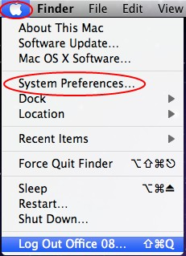
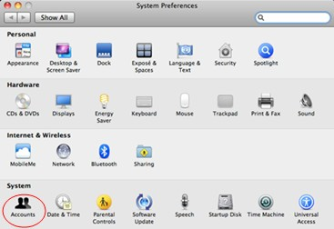
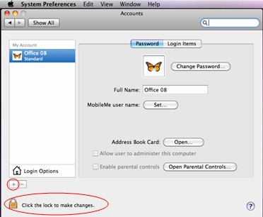
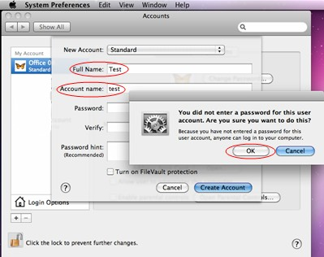
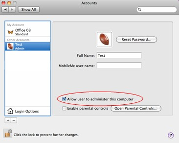
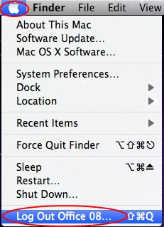

# "Microsoft Excel has encountered a problem and needs to close" when starting Excel for Mac

[!INCLUDE [Branding name note](../../../includes/branding-name-note.md)]

## Symptoms

When you try to start Microsoft Excel for Mac, you receive the following error message:

**Microsoft Excel has encountered a problem and needs to close. We are sorry for the inconvenience.**

## Cause

This error may occur if one of the following conditions is true:  

- The Excel preferences are corrupted.
- Programs that are running in the background are interfering with Excel for Mac.
- Application files are corrupted.
- A user account profile is corrupted.

## Resolution

To resolve this issue, try the following methods, in order, until the issue is resolved.

### Method 1

**Step 1: Quit all programs**

You must quit all programs before you continue. To quit an application, select the application on the toolbar (top), and then select **Quit**. If you cannot quit an application or do not know how, hold down the Command and Option keys, and then press Esc on your keyboard. Select the application in the "Force Quit Application" window, and then select **Force Quit**. Click **Force Quit** to quit the application.

> [!NOTE]
> You cannot quit Finder.

When you are finished, click the red button in the upper-left corner and go to step 2.

**Step 2: Remove your Excel preferences**

1. Quit all Microsoft Office for Mac applications.
2. On the **Go** menu, click **Home**.
3. Open **Library**. **Note** The **Library** folder is hidden in Mac OS X Lion. To display this folder, hold down the OPTION key while you click the **Go** menu.
4. Open **Preferences**.
5. Drag *com.microsoft.Excel.plist* to the desktop. If you cannot locate the file, Excel is using the default preferences. Go to step 7.
6. Open Excel, and check whether the problem still occurs. If the problem still occurs, quit Excel, restore the file to its original location, and go to the next step. If the problem is resolved, drag *com.microsoft.Excel.plist* to the **Trash**.
7. Quit all Office for Mac applications.
8. On the **Go** menu, click **Home**.
9. Open **Library**.

   > [!NOTE]
   > The **Library** folder is hidden in Mac OS X Lion. To display this folder, hold down the OPTION key while you click the **Go** menu.
10. Open **Preferences**.
11. Open **Microsoft**, and then drag *com.microsoft.Excel.prefs.plist* to the desktop. If you cannot locate the file, Excel is using the default preferences. Go to **Method 2**.
12. Open Excel, and check whether the problem still occurs. If the problem still occurs, quit Excel, restore the file to its original location, and go to **Method 2**. If the problem is resolved, drag *com.microsoft.Excel,prefs.plist* to the **Trash**.

### Method 2

Use the "Repair Disk Permissions" option

You can use the Repair Disk Permissions option to troubleshoot permissions problems in Mac OS X 10.2 or later versions. To use the **Repair Disk Permissions** option, follow these steps:

1. On the **Go** menu, click **Utilities**.
2. Start the Disk Utility program.
3. Click the primary hard disk drive for your computer.
4. Click the **First Aid** tab.
5. Click **Repair Disk Permissions**.

> [!NOTE]
> The Disk Utility program only repairs software that is installed by Apple. This utility also repairs folders, such as the Applications folder. However, this utility does not repair software that is in your home folder.

Open Excel and check if the issue is resolved. If it is not, continue to Method 3.

### Method 3

Create and use a new user account

To create a new user account, use the following procedure.

> [!NOTE]
> You many have to reinstall Office if you log on with a new account.

1. Click the Apple icon, and then click **System Preferences**.

   

2. Click **Accounts**.

   

3. Click the plus sign ("+") in the lower-left corner to open the new account window.

   > [!NOTE]
   > If you are not the Administrator of the computer, click **Click the lock to make changes**. Log on by using your Administrator user name and password, and then click **OK**.

   

4. Type the word **Test** for the user name, and leave the password box blank. Click **Create Account**. When you receive a warning, click **OK**.

   

5. Click to select **Allow User to Administer this computer**. (If this option is not available, just go to the next step).

   

6. Click the Apple icon, and then click **Log Out *name***.

   

7. Log on with your Test account.

Open Excel and check if the issue is resolved. If you can save when you use a new user account, contact Apple support to troubleshoot your existing account. If you do not want to keep your existing account, you can rename the "Test" account that you create in the following procedure, and continue to use that account. If it is not, continue to Method 4.

### Method 4

Remove and then reinstall Office

For information about how to remove and then reinstall Office, see the following article:

[Troubleshoot Office 2011 for Mac issues by completely uninstalling before you reinstall](https://support.office.com/article/Troubleshoot-Office-2011-for-Mac-issues-by-completely-uninstalling-before-you-reinstall-ba8d8d13-0015-4eea-b60b-7719c2cedd17)

[!INCLUDE [Third-party information disclaimer](../../../includes/third-party-information-disclaimer.md)]

[!INCLUDE [Third-party contact disclaimer](../../../includes/third-party-contact-disclaimer.md)]
