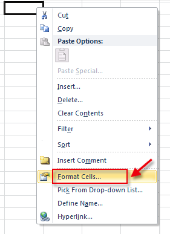
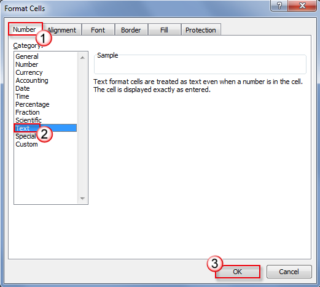
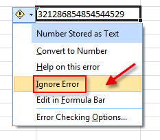
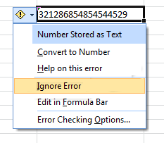
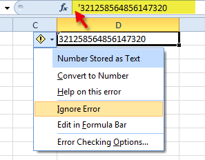

# Long numbers are displayed incorrectly in Excel

[!INCLUDE [Branding name note](../../../includes/branding-name-note.md)]

## Symptoms

After you enter a long number (such as a credit card number) in an Excel cell, the number is not displayed correctly in Excel. For example,

> [!NOTE]
> Default number format in Excel is General therefore you can display up to 11 digits in a cell.

## Workaround

To work around this issue, use one of the following methods.

### Method 1: Format the cell as text

To do this, follow these steps:

1. Right-click target cell, and then click **Format Cells**.

    

2. On the **Number** tab, select **Text**, and then click **OK**.

    

3. Then type a long number. (Be sure to set the cell format before you type the number)

    
4. If you do not want to see the warning arrows, click the small arrow, and then click **Ignore Error**.

    

    

### Method 2: Use a single quotation mark

When you enter a long number, type a single quotation mark (**'**) first in the cell, and then type the long number.

For example, type **'1234567890123456789** and the quotation mark will not be displayed after you press ENTER.

## Related articles

[Format numbers as text in Excel for Mac](https://support.microsoft.com/office/format-numbers-as-text-in-excel-for-mac-dfbe20dc-e7b1-44b2-80fe-2072d074e2a3)

Your opinion is important to us!Do not hesitate to tell us what you think of this article using the comment field located at the bottom of the document. This will allow us to improve the content. Thank you in advance!
