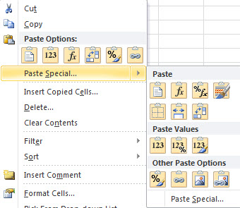
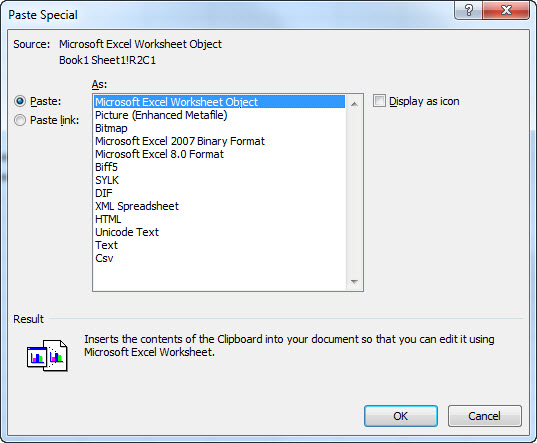

# Paste Special option is missing or not working in Microsoft Office

[!INCLUDE [Branding name note](../../../includes/branding-name-note.md)]

If you have Skype installed, please read: [Text has incorrect format when using paste in Microsoft Office](https://support.microsoft.com/help/2697462).
Paste Special can make the task of pasting text go more smoothly by letting you choose which formatting you want to keep (source or destination) or by stripping all the formatting and just pasting the text. If you are having issues with Paste Special, continue on to the resolutions below:

##  Resolution

To see if Paste Special is enabled: 
 
1. Go to: File > Options > Advanced.    
2. Under Cut, copy and paste, ensure Show Paste Options button when content is pasted is checked. 

 Ensure that all instances of the web browsers that you use are Closed and try to use Paste Special again. Paste Special will not function if your web browser is causing the conflict. Windows Internet Explorer (8-9) do not conflict with the Excel 2010 Paste Special option.
   Third party Add-ins can cause a variety of issues, one of then being, conflicting with the Paste Special option. To determine if an Add-in is causing the issue:

 
1. Click Start > All Programs> Microsoft Office.    
2. Press and hold the CTRL key, and click Microsoft Excel 2010. You will be asked if you want to open Excel in the Safe Mode, click Yes.

   **Note:** If you have an icon on your desktop, hold down Ctrl and click on the icon. This works with any Microsoft Office product.    
3. If Paste Special works in the Safe Mode as follows, enable your Add-ins one at a time until you hit that one that is causing the conflict. Leave that one disabled or uninstall it.

   **Note:** Find out more on [ Adding or Removing Add-ins.](https://office.microsoft.com/excel-help/add-or-remove-add-ins-HP010342658.aspx) Find out more on [ Working with Office Safe Modes.](https://office.microsoft.com/excel-help/work-with-office-safe-modes-HP010354300.aspx)    

      
     |

You can also get help from the [Microsoft Community](https://answers.microsoft.com/) online community, search for more information on [Microsoft Support](https://support.microsoft.com/search/) or [Windows Help and How To](https://office.microsoft.com/support/), or learn more about [Assisted Support](https://support.microsoft.com/contactus/) options.