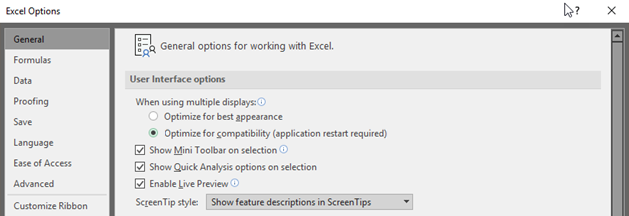

# SAP add-ins don't display controls after update to Office 1806 or higher

## Symptoms

Consider the following scenario:

- You're running Windows 10 with an lower version than 1809, and you update your Microsoft Office instance to version 1806 or higher.    
- You install a SAP add-in for Microsoft Office (for Microsoft Excel, PowerPoint, or Word).    

In this scenario, the SAP add-in can no longer display some controls in dialog boxes and task panes. If you revert Office to version 1805, this issue doesn't occur. 

## Resolution

To resolve the issue, update Office to version 1808, or a later version, and update Windows to version 1809 or a later version.

**Third-party disclaimer information** 

The third-party products that this article discusses are manufactured by companies that are independent of Microsoft. Microsoft makes no warranty, implied or otherwise, about the performance or reliability of these products.    

## Workaround

Until Office and Windows have been updated to the required versions, you can configure the **When using multiple displays** setting in Office to **Optimize for compatibility**. The issues should not occur in compatibility mode.

