# How to install Office 2019 installation files not found in VLSC

[!INCLUDE [Branding name note](../../../includes/branding-name-note.md)]

## Summary

Office files can be downloaded separately. 

## More information

> [!IMPORTANT]
> The steps below apply only to the following programs: 
> - Office Professional Plus 2019
> - Office Standard 2019
> - Visio Professional 2019
> - Visio Standard 2019
> - Project Professional 2019
> - Project Standard 2019

Follow the steps below to download and install your Office 2019 software or application:

> [!NOTE]
> The screenshots below are examples that may not match your own experience.

1. Browse to https://www.microsoft.com/download/details.aspx?id=49117 and select **Download**.
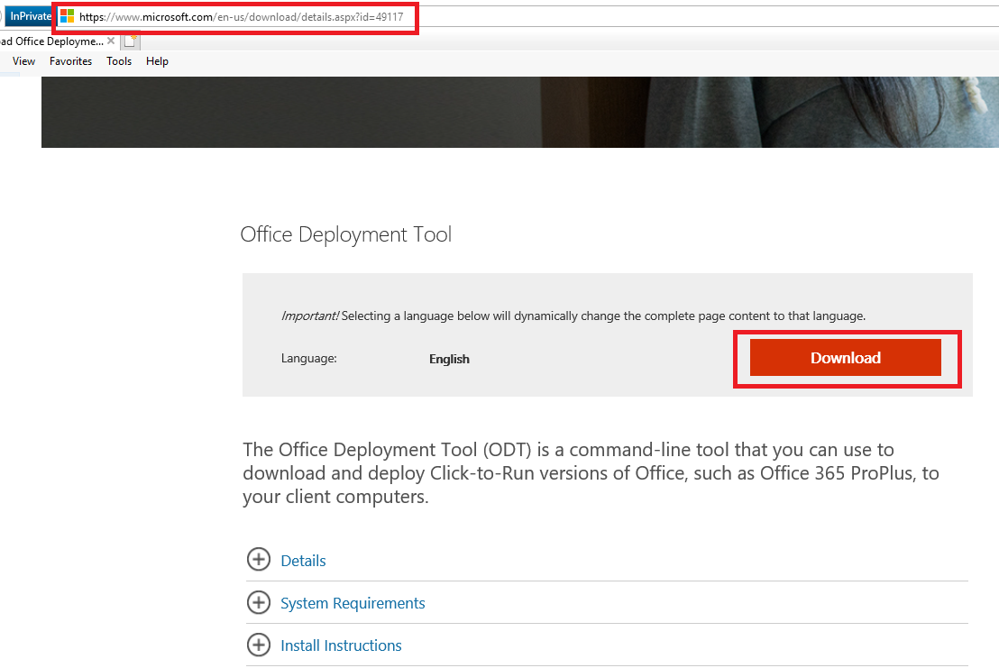
2. Select the arrow next to the **Save As** option.
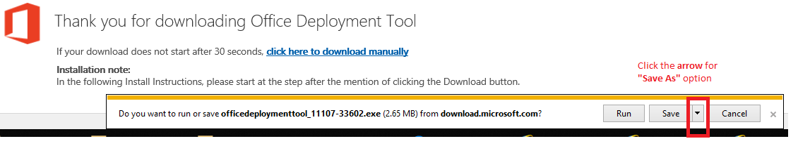
3. Create a new folder and save the file to this folder. (The name of the folder is irrelevant. For instance, create a folder on your Desktop named "Office".)
    > [!NOTE]
    > This folder should be a shared location that is accessible for installation to other devices. 

   
4. Double click the .EXE file (or select **Run**, if the dialog box is still open). If asked, select **Yes**. 
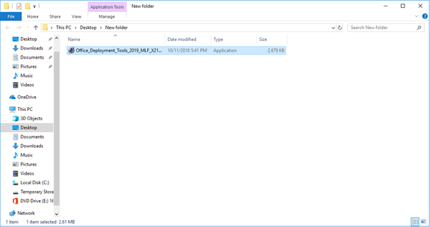
5. A pop up window will display the Microsoft Software License Terms. Check the box and select Continue.
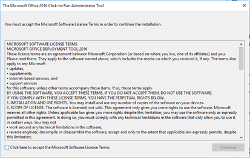
   > [!NOTE]
   > You might be requested to select a location where you want the files saved. If so, select the folder that you created. 

6. Open your browser and go to https://config.office.com.

7. Under **Create a new configuration**, select **Create**. 
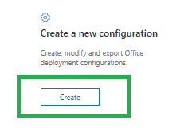
8. Under **Products and releases**, select 64-bit.
    > [!NOTE]
    > For more information, see [Choose between the 64-bit or 32-bit version of Office](https://support.microsoft.com/office/2dee7807-8f95-4d0c-b5fe-6c6f49b8d261).

   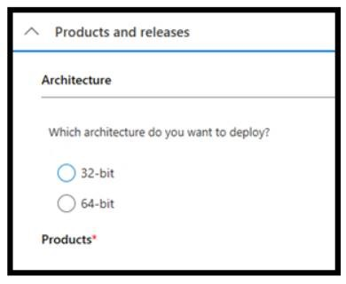
9. Then, select the product or app that you want to deploy and select **Next**.
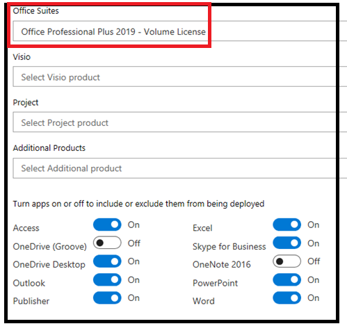
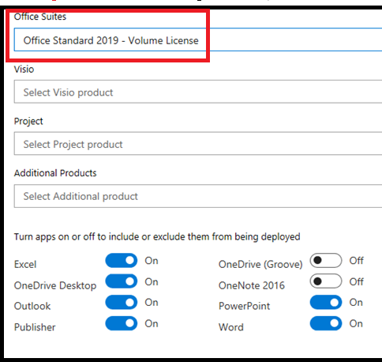
10. Choose your Language and then select **Next**.
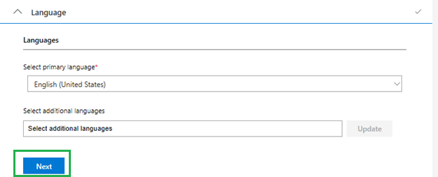
11. Under **Installation options**, select the options that match your needs (or do nothing) and select **Next**.
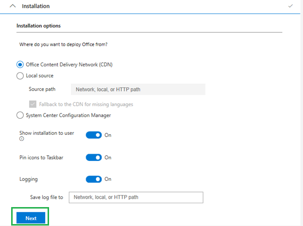
12. Under **Update and Upgrade**, select the options that match your needs (or do nothing) and then select **Next**.
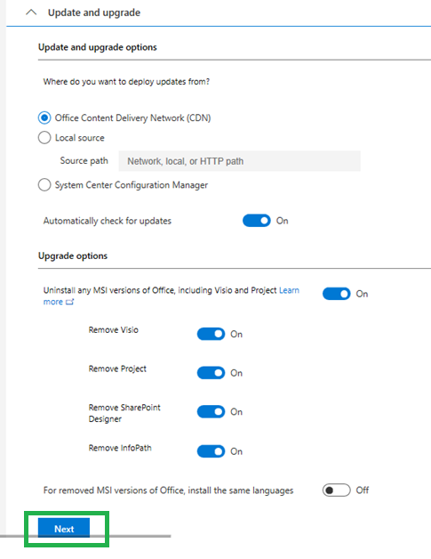
13. Select the **Multiple Activation Key (MAK)** option. Enter the volume license key specific to the software, move the **Autoactivate** slider to **On**, and then select **Next**.
    >[!NOTE]
    > If your organization uses Key Management Service (KMS) activation, select KMS Client Key instead.

    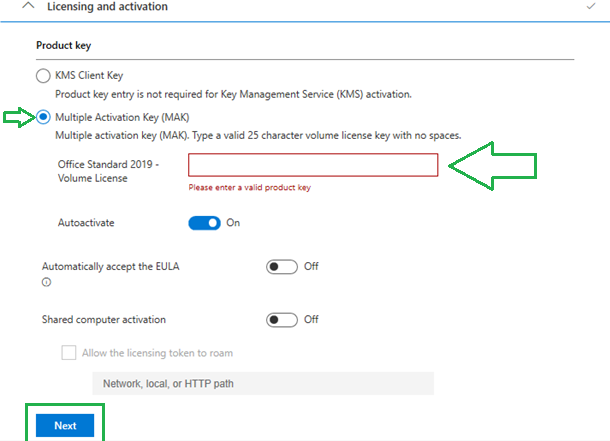

14. Enter your name or the name of your company or organization and then select **Next**.
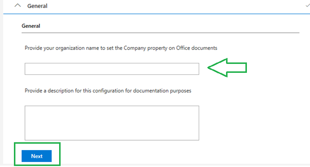
15. Under **Application preferences**, select **Finish**.
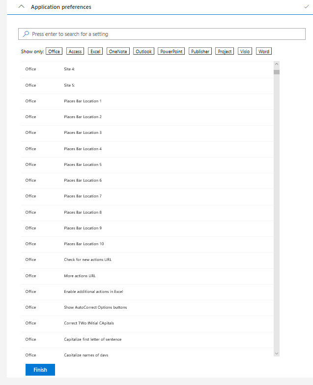
16. Select **Export** in the upper-right corner of the page. 
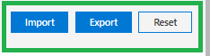
17. In the **File Name** text box, type "Configuration" (if it does not already show this) and then select **Save as** to save it to the folder you created.
    > [!NOTE]
    > Make a note of this location as it will be needed for the following steps. 

    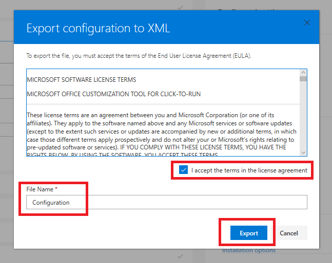
    
18. Open an elevated Command Prompt. (Select the **Windows** button, type "CMD", right-click **Command Prompt**, and select **Run as administrator**.) 
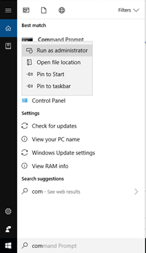
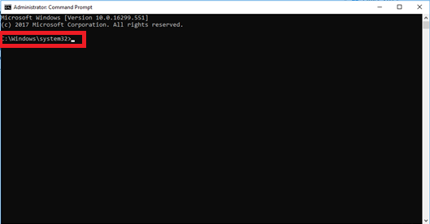
19. Type "cd "(c+d+space bar). Copy the file path of the location where you downloaded the file and paste it in the command prompt window.
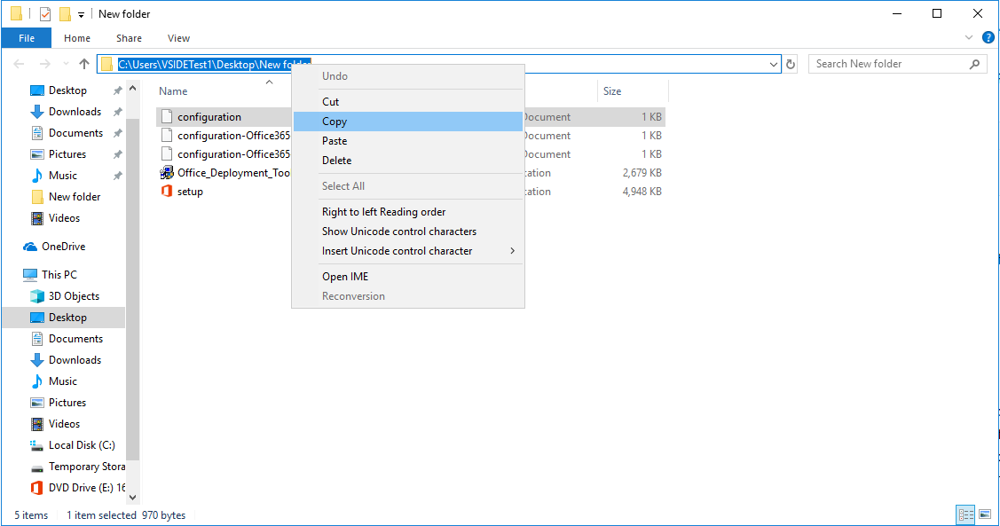
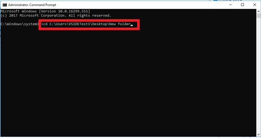
20. Select **Enter**. The Command Prompt Line is now updated to the location where the files were downloaded:
    > [!NOTE]
    > This will vary depending on where you created the folder for the downloaded file.

    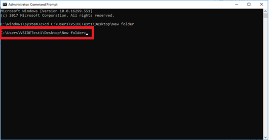
21. Copy and paste the following command in the Command Prompt window and select **Enter**:

    > Setup /configure configuration.xml

    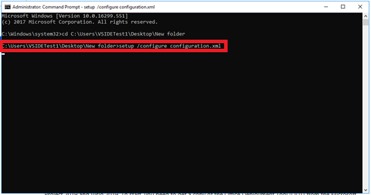

22. The Office installation will start. 
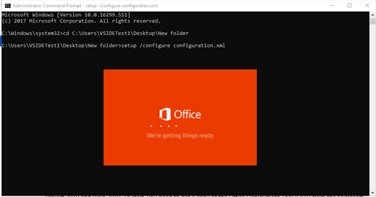
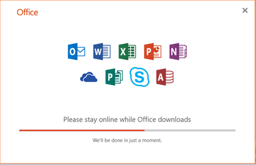
 

## How to Activate Microsoft Office 2019 using a product key

If automatic activation did not work, you can manually activate your software by following the steps below:

1. Open a Word, Excel, or PowerPoint file. Select **File**. 

 
2. Select **Help** or **Account**.  
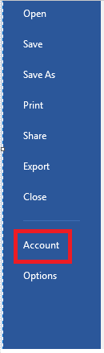
3. Select **Change Product Key**. 
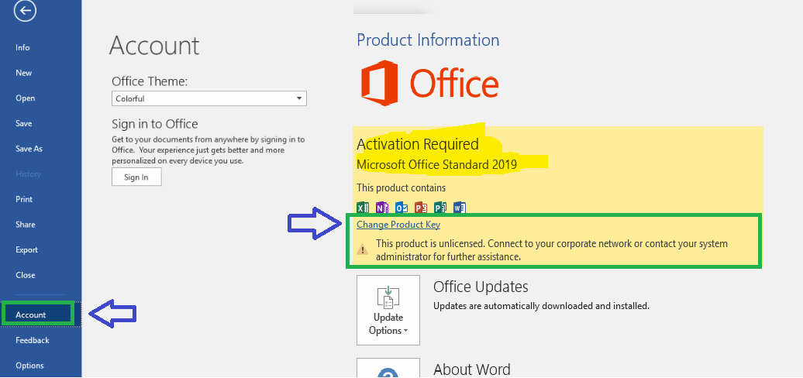
4. Enter the product key in the field box and then select **Install**. 
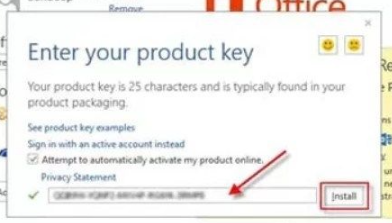
The Office installation will begin. 
