# "The Windows Installer service could not be accessed" when you try to install Office

[!INCLUDE [Branding name note](../../../includes/branding-name-note.md)]

## Symptoms

When you try to install Microsoft Office, you may receive an error message that is similar to the following: 

"The Windows Installer Service could not be accessed."

## Cause

This problem may occur if the Windows Installer files are damaged or missing.

## Resolution

To resolve this problem, use one of the following methods.

### Method 1: Use the Msconfig tool to confirm that the installer service is running

1. Click **Start**, and then click **Run**. (The screen shot for this step is listed below).

   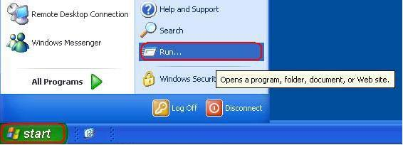

2. In the **Open** box, type msconfig, and then click **OK**. (The screen shot for this step is listed below).
   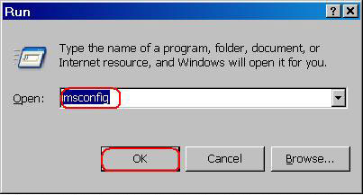

3. On the **Services** tab, click to select the check box that is next to **Windows Installer**. (The screen shot for this step is listed below).
   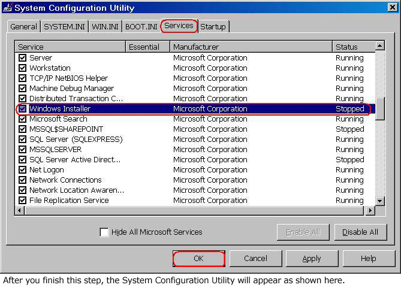
4. Click **OK**, and then click **Restart** to restart the computer. (The screen shot for this step is listed below).
   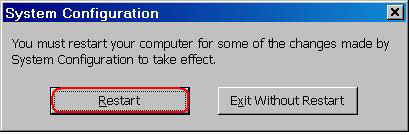

5. Install Office again. When you are prompted to enter the product key, type the product key, and then click **Next**.    
 
Office will be installed, and you will not be prompted for the product key when the programs start. 

### Method 2: Re-register Windows Installer

> [!IMPORTANT]
> This section, method, or task contains steps that tell you how to modify the registry. However, serious problems might occur if you modify the registry incorrectly. Therefore, make sure that you follow these steps carefully. For added protection, back up the registry before you modify it. Then, you can restore the registry if a problem occurs. For more information about how to back up and restore the registry, see [How to back up and restore the registry in Windows](https://support.microsoft.com/help/322756).  

**Note** Because there are several versions of Microsoft Windows, the following steps may be different on your computer. If they are, see your product documentation to complete these steps.

To re-register Windows Installer, follow these steps.

**Note** If you cannot complete the following steps, go to method 3. 
 
1. Click **Start**, and then click
 **Search**. (The screen shot for this step is listed below).
 
   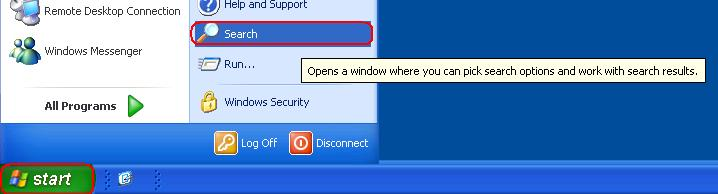

2. Click **All files and folders**. (The screen shot for this step is listed below).

   

3. In the **File name** box, type Msiexec.exe, and then click
 **Search**. (The screen shot for this step is listed below).
 
   

4. After the search is complete, make a note of the location of the Msiexec.exe file. The location of the file should be similar to the following example: C:\Windows\System32 (The screen shot for this step is listed below). 

   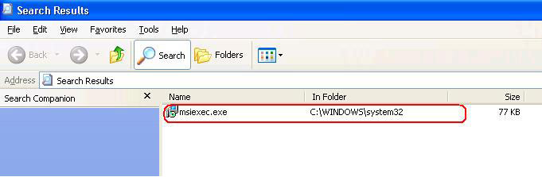

5. On the **File** menu, click **Close** to close the **Search** dialog box. (The screen shot for this step is listed below).
 
   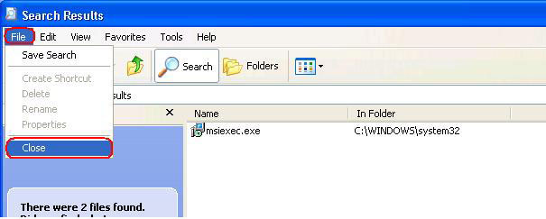

6. Click **Start**, and then click **Run**. (The screen shot for this step is listed below).

   

7. In the **Open** box, type regedit, and then click **OK**. (The screen shot for this step is listed below).

    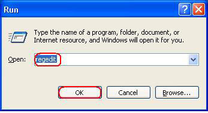

8. Locate and then click the following registry key: ****HKEY_LOCAL_MACHINE\SYSTEM\CurrentControlSet\Services\MSIServer****(The screen shot for this step is listed below).

   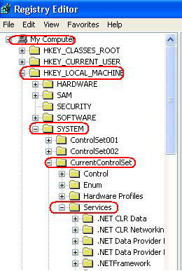     
9. In the right pane of the Registry Editor window, double-click **ImagePath**. (The screen shot for this step is listed below).

   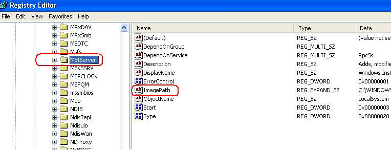

10. In the **Edit String** dialog box that appears, make sure that the string in the **Value data** box contains the correct path for the Msiexec.exe file that you determined in step 4.

    **Note** The following is an example of the correct path, where
 **drive** is the drive where Windows is installed: 
 
    **drive**:\Windows\System32\msiexec.exe /V 

    If the **Value data** box does not contain the correct path, make changes to correct the path, and then click **OK** to close the **Edit String** dialog box. (The screen shot for this step is listed below).
 
    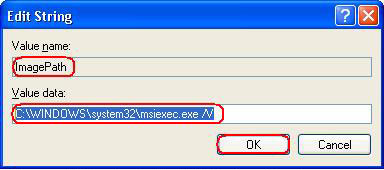

11. On the **File** menu, click **Exit** to quit Registry Editor. (The screen shot for this step is listed below).
 
    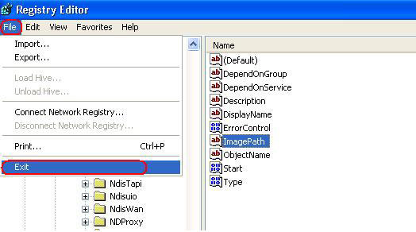

12. Start your computer in Safe mode, and then register the Msiexec.exe file. To do this, follow these steps:  
    1. Shut down your computer, and then restart your computer.    
    2. Restart your computer and press the F8 key on your keyboard. On a computer that is configured for booting to multiple operating systems, press the F8 key when you see the **Boot** menu.    
    3. Use the ARROW keys to select **Safe Mode**, and then press ENTER.    
    4. If the **Boot** menu appears again, and the words "Safe Mode" appear in blue at the bottom, select the installation that you want to start, and then press ENTER.    
    5. Log on to the computer.    
    6. Click **Start**, click **Run**, type msiexec /regserver in the **Open** box, and then click **OK**. (The screen shot for this step is listed below).

       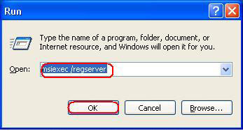      

13. Shut down your computer, and then restart your computer normally.    
 
If you still cannot install Microsoft Office successfully and you receive an error message that is similar to the message listed in the "Symptoms" section, go to Method 3.

### Method 3: Try the methods that are listed in Microsoft Knowledge Base Article 319624

Try the methods that are listed in the following Microsoft Knowledge Base article: 

[319624 ](https://support.microsoft.com/help/319624) "Windows Installer Service could not be accessed" error message when installing application

### Method 4: Reinstall Windows Installer

**Note** This method applies to Microsoft Windows 95, Microsoft Windows 98, Microsoft Windows Millennium Edition (Me), and Microsoft Windows NT 4.0. For Microsoft Windows 2000, Microsoft Windows XP, and Microsoft Windows Server 2003, either reapply the latest service pack or repair the operating system.

To reinstall the Windows Installer, follow these steps.
 
1. Click **Start**, and then click **Run**. (The screen shot for this step is listed below).

   

2. In the **Open** box, type cmd, and then click **OK**. (The screen shot for this step is listed below).
 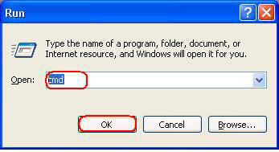

3. At the command prompt, type the following lines. Press ENTER after you type each line. 

   cd %windir%\system32 
   
   (The screen shot for this step is listed below).
 
    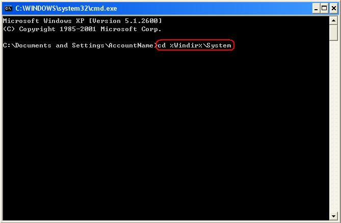

    ren msi.dll msi.old
 
    (The screen shot for this step is listed below).
 
    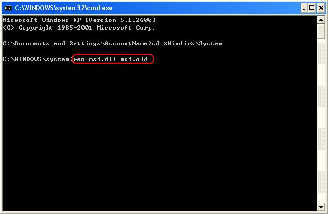

    ren msiexec.exe msiexec.old
 
    (The screen shot for this step is listed below).
 
    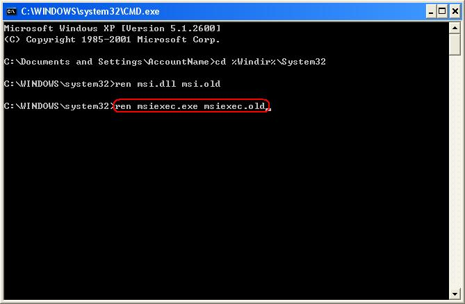

    ren msihnd.dll msihnd.old
 
    (The screen shot for this step is listed below).
 
    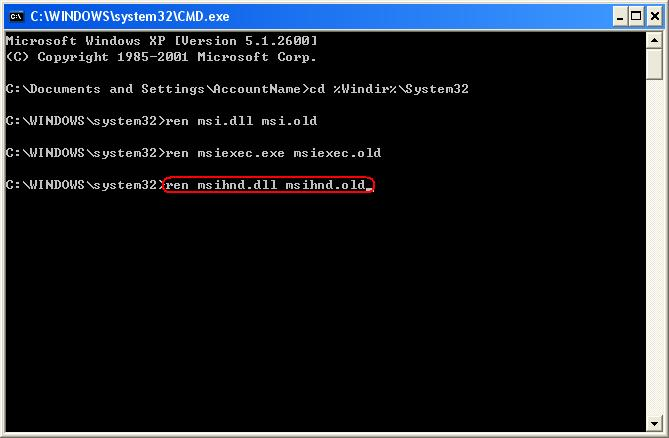

4. At the command prompt, type exit, and then press ENTER.
 (The screen shot for this step is listed below).
 
   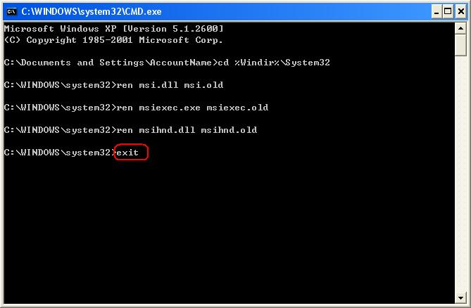

5. Restart your computer.    
6. Update the Windows Installer files to the latest version. To do so, visit one of the following Microsoft Web sites, and then download and install Windows Installer 2.0.

   **Note** Windows Installer 2.0 is included with Microsoft Windows XP. You do not have to perform this step if you are using Windows XP.    
7. After the installation of the Windows Installer is complete, shut down and restart your computer normally before you install Microsoft Office.    
  

## More Information

For more information about how to restart Windows in Safe mode, see [Advanced startup options (including safe mode)](https://support.microsoft.com/help/315222).