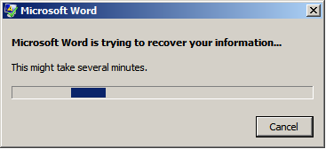

# You must declare the return type explicitly in a VBA macro that you run in a 64-bit environment

## Summary

When you try to run some code that uses some callback functions to declare some APIs in Microsoft Visual Basic for Applications (VBA) in a 64-bit version of Microsoft Office, the code fails. However, this code does not fail on a 32-bit version of Microsoft Office. This issue occurs because the return type must be declared explicitly in a 64-bit VBA application. 

**Note** When the return type is not explicitly declared, the value is handled by using the Variant data type. 

## More Information

To test this issue that is mentioned in the "Summary" section, follow these steps:

1. Open a Word document in a 64-bit version of Microsoft Word 2010.   
2. To open VBA Editor, click **Visual Basic** on the **Developer** tab in the Ribbon.   
3. To create a new module in VBA Editor, follow these steps:
   1. Right-click **This Document** under **Project tree** that is located at the upper-left area of the VBA Editor.   
   2. Select **Insert**, and then click **Module**.    
   3. A new module node is displayed under **Project tree**, and a VBA code window opens for the new module.   
   4. Copy the following code, and then paste the code into the VBA code window for the new module.

```vb
Option Explicit
Dim iCounter As Integer
Dim lngTimerID As Long
Dim BlnTimer As Boolean

Declare PtrSafe Function SetTimer Lib "user32" (ByVal hwnd As Long, _
 ByVal nIDEvent As Long, _
 ByVal uElapse As Long, _
 ByVal lpTimerFunc As LongPtr) As Long

Declare PtrSafe Function KillTimer Lib "user32" (ByVal hwnd As Long, _
 ByVal nDEvent As Long) As Long

Sub TimerProc(ByVal hwnd As Long, _
 ByVal uMsg As Long, _
 ByVal idEvent As Long, _
 ByVal dwTime As Long)
iCounter = iCounter + 1
End Sub 

Private Sub ToggleTimer()
 If BlnTimer = False Then
 lngTimerID = SetTimer(0, 0, 200, AddressOf TimerProc)
 If lngTimerID = 0 Then
 MsgBox "Timer not created. Ending program"
 Exit Sub
 End If
 BlnTimer = True
 Else 
lngTimerID = KillTimer(0, lngTimerID)
 If lngTimerID = 0 Then
MsgBox "Could not kill the timer"
 End If
 BlnTimer = False
 MsgBox " Timer Count " & iCounter
 End If

End Sub

Sub Macro1()
 ToggleTimer
End Sub   
```

4. To run the code, click **Run** in VBA Editor, or select the **Run Sub\User Form** command from the **Run** menu. Then, click **Run Macro1** in the dialog box that appears.    
5. Then, change the code that resembles the following from a Sub procedure to a Function procedure: 

```vb
Sub TimerProc(ByVal hwnd As Long, _
 ByVal uMsg As Long, _
 ByVal idEvent As Long, _
 ByVal dwTime As Long)

iCounter = iCounter + 1
End Sub
After you have changed the Sub procedure to a Function procedure, the code resembles the following:

Function TimerProc(ByVal hwnd As Long, _
 ByVal uMsg As Long, _
 ByVal idEvent As Long, _
 ByVal dwTime As Long)

iCounter = iCounter + 1
End Function   
```
6. Run the code again, and then you receive the following error:



The return type cannot be of the Variant data type. This limitation applies to only the callback functions in VBA that you run in a 64-bit environment. This limitation does not apply to the Declare statements for calling external API methods. In VBA that you run in a 32-bit environment, you can use a Function procedure that uses the Variant data type and a Sub procedure for API callbacks that may return a Void value, an Integer data type that is 16-bits, or a Long data type that is 32-bits. Therefore, the steps that are mentioned earlier do not produce the error if you run the code in VBA in a 32-bit environment. This issue occurs because of pointer changes in VBA that you run in a 64-bit environment. Therefore, callback functions must be explicitly declared by using the correct return type in 64-bit environment. This behavior requires that TimerProc that is in the example mentioned earlier be declared as a Sub procedure and not a Function procedure.
