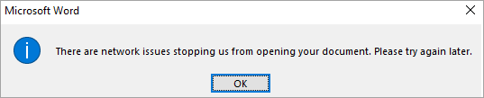
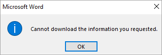
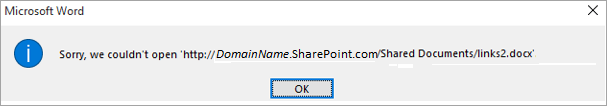
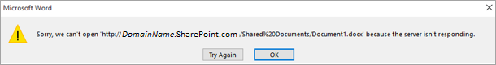
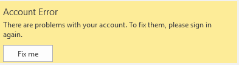
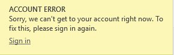
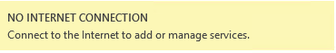
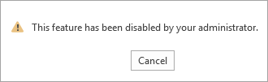
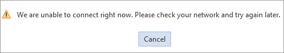
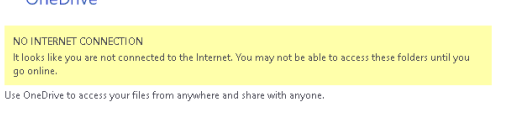

# Office files in SharePoint fail to open from an Office 2016 client

## Symptoms

An error occurs when you try to open a Microsoft Office file from SharePoint by using an Office 2016 client, such as Word, Excel, or PowerPoint. You may receive one of the following error messages, depending on the version of Office or SharePoint and the method that's used to open the file: 
    
    There are network issues stopping us from opening your document. Please try again later.   
  

     
    Cannot download the information you requested.  
   
 
    
    Sorry, we couldn’t open <DocumentLocation>    
 
  
   
    Sorry, we can’t open <DocumentLocation> because the server isn’t responding.  
   

Additionally, you may see one of the following error messages when you try to sign in Office. Or, if you have successfully signed in to Office, you may still see the error message in an Office application: 

    Account Error   
    There are problems with your account. To fix them, please sign in again.   

   

    Account Error   
    Sorry, we can’t get to your account right now. To fix this, please sign in again.  
   

   
    No Internet Connection   
    Connect to the Internet to add or manage services.
     
 
    
    This feature has been disabled by your administrator.
     
 
    
    We are unable to connect right now. Please check your network and try again later.
     

   
    No Internet Connection
    It looks like you are not connected to the Internet. You may not be able to access these folders until you go online.
     
 

## Cause

**Network List Service** is stopped and disabled on the client computer. 

## Resolution

Enable and start **Network List Service** on the client computer. To do this, follow these steps:  
 
1. Click Start, type "**services.msc**" (without quotation marks) in the Start Search box and press Enter.    
2. Double-click **Network List Service**.    
3. Right-click the service, and then click **Start**.    
