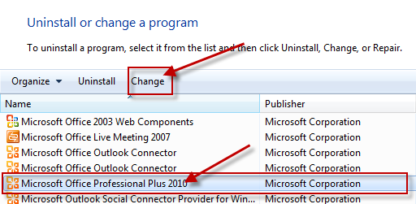

# A Microsoft Excel, Word or PowerPoint file does not open because of incorrect file associations

[!INCLUDE [Branding name note](../../../includes/branding-name-note.md)]

## Symptoms

When you double-click one of these file types: 
 
- Word document (.doc or .docx)    
- Excel (.xls or .xlsx)    
- PowerPoint (.ppt or .pptx)    
 
You may experience any of these problems: 
 
1. The file icon is blank or displays an incorrect image.    
2. The file does not open.    
3. You receive this error: 

    **This file does not have a program associated with it for performing this action. Create an association in the Folder Options control panel.**
1. You receive this error: 

    **\<file name> not a valid Win32 Application**
  
## Cause

These problems occur when the association between the file and the corresponding application is missing. 

## Resolution

Before you continue with any of the methods in this section, we recommend that you check for multiple Office installations on your computer. To do this, follow these steps: 
 
1. Type appwiz.cpl in the Search box, and then press Enter.    
2. Check the list of currently installed programs for multiple installations of the Microsoft Office suite.    
 
If there are multiple installations of Microsoft Office installed on the computer we recommend that you follow the steps that are listed in Method 2 of this section. If there is only one installation of Microsoft Office on the computer, follow the steps that are listed in Method 1 of this section. Only follow the steps that are listed in Method 3 if you still experience the problem after you have attempted the first two methods or you have installed Microsoft Office Trial suite.

### Method 1  
If there is only one installation of Microsoft Office 2010 on the computer, follow these steps to repair Microsoft Office: 
 
1. Type appwiz.cpl in the Search box, and then press Enter.    
2. Select the Microsoft Office 2010 suite you want to repair and then click **Change**.
 
        
3. Select **Repair**, and then click **Continue**. You may have to restart your computer after the repair is completed. 

### Method 2  

If you have more than one installation of a Microsoft Office 2010 suite on your computer we recommend that you uninstall the Click-to-Run based suites to avoid file type association issues. You will have to uninstall the Microsoft Office Starter, Microsoft Office Click-to-Run or Microsoft Office 2010 Trial suite and repair the traditional MSI (Microsoft Installer package) based installation of Microsoft Office 2010: 
 
1. Type appwiz.cpl in the Search box, and then press Enter.    
2. In the Currently installed programs list, select Microsoft Office Click-to-Run 2010, and click **Uninstall**.    
3. You will see a prompt requesting to uninstall your selection. Click **Yes**.  
4. Follow the uninstall instructions, and then restart the computer.    
5. Type appwiz.cpl in the Search box, and then press Enter.    
6. Select the Office 2010 MSI-based suite that you want to repair and click **Change**.    
7. Select **Repair**, and click **Continue**. You may have to restart your computer after the repair is completed. 

### Method 3  

> [!NOTE]
> This method may not be a permanent fix to the file type association problem that you are experiencing. We recommend that you follow the previous methods first and only try these steps if you continue to experience the problem.

If you only have one of Microsoft Office Starter, Microsoft Office 2010 Trial or Microsoft Office Click-to-Run 2010 installed on the computer follow these steps to manually reassociate the file: 
 
1. Right-click the Microsoft Office file that you want to open.    
2. Select **Open with**, and then click **Choose default program...**.    
3. In the Recommended Programs list, select **Microsoft Office Client Virtualization Handler**.    
4. Click to select the **Always use the selected program to open this kind of file** check box, and then click **OK**.    
If you only have a Microsoft Office 2010 MSI (Microsoft installer package) based suite installed on the computer follow these steps to manually reassociate the file: 
 
1. Right-click the Microsoft Office file that you want to open.    
2. Select **Open with**, and then click **Choose default program...**.    
3. In the Recommended Programs list, select the appropriate program to associate with the file.    
4. Click to select the **Always use the selected program to open this kind of file** check box, and then click **OK**.    
Your file icon should now display the correct image and it should open in the correct Microsoft Office program.     

## More Information

The Click-to-Run and traditional MSI (Microsoft installer package) versions of Microsoft Office 2010 are not designed for use on the same computer. We recommend that you select one version to run on the computer to avoid problems such as those stated in this article.

For more information about Microsoft Office Click-to-Run and file associations, click the following article number to view the article in the Microsoft Knowledge Base:

[982434](https://support.microsoft.com/help/982434) An overview of Microsoft Office Click-to-Run for Office 2010 
 
If you have followed the steps in this article, and you are still receiving the same error messages listed in the Symptoms section of this article, you may have permissions problems with your registry.
 Since it may not be possible to know what caused or led to the permissions problems, we suggest you consider restoring Windows to a previous state.

Restore system files and settings (Windows 7)
 [https://windows.microsoft.com/en-US/windows7/Restore-system-files-and-settings](https://windows.microsoft.com/windows7/restore-system-files-and-settings)

How to repair the operating system and how to restore the operating system configuration to an earlier point in time in Windows Vista

[https://support.microsoft.com/kb/936212](https://support.microsoft.com/help/936212)

How to restore Windows XP to a previous state

[https://support.microsoft.com/kb/306084](https://support.microsoft.com/help/306084)

If your Excel files are still not opening, but the error has stopped after following these steps, you may have an additional problem to resolve.

We suggest you also check the content provided in this article:
 
[https://support.microsoft.com/kb/211494](https://support.microsoft.com/help/211494)