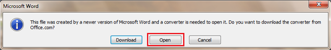

# Error message (Do you want to download the converter?) when you try to open a file in Excel, Word or PowerPoint

_Original KB number:_ &nbsp; 967950

## Symptoms

> [!note]
> This issue doesn't apply to Office 2013 and newer versions as they support the standard Open XML formats. For more information, see [Open XML Formats and file name extensions](https://support.microsoft.com/office/open-xml-formats-and-file-name-extensions-5200d93c-3449-4380-8e11-31ef14555b18).

When you try to open a Microsoft Office Excel workbook (.xlsx), a Microsoft Office Word document (.docx), or a Microsoft Office PowerPoint presentation (.pptx), you may receive one of the following error messages and you may not be able to open the file:

> This file was created by a newer version of Microsoft Excel and a converter is needed to open it. Do you want to download the converter from the Microsoft Office Web site?

> This file cannot be opened by using Microsoft Excel. Do you want to search the Microsoft Office Online Web site for a converter that can open the file?

> [!NOTE]
> The above messages are displayed when you try to open an Excel file. When you try to open a Word or PowerPoint file, the product names in the message are replaced accordingly.

## Resolution

To resolve this issue, follow these steps:

### For Excel 2010, Word 2010, or PowerPoint 2010

1. Go to the Microsoft Download Center to download and install the [OOXML Strict Converter for Office 2010](https://www.microsoft.com/download/details.aspx?id=38828).
2. Open the file in Excel 2010, Word 2010 or PowerPoint 2010.
3. Click **Open** when the following message appears.

    

4. When the file opens, select **Save As** to save the file in Excel 2010, Word 2010, or PowerPoint 2010 default format.

    > [!NOTE]
    > If your issue wasn't resolved by the download in this KB, please see one of the following Office Blogs:
    >
    > - [The Microsoft Excel Support Team Blog](https://blogs.technet.microsoft.com/the_microsoft_excel_support_team_blog/2016/11/02/do-you-want-to-download-the-converter-when-you-try-to-open-a-file-in-excel-word-or-powerpoint-kb-article/)
    > - [Microsoft Office Word Support Team Blog](https://blogs.technet.microsoft.com/wordonenotesupport/2016/11/02/do-you-want-to-download-the-converter-when-you-try-to-open-a-file-in-excel-word-or-powerpoint-kb-article/)
    > - [Business Graphics Products - Support Blog](https://blogs.technet.microsoft.com/bgp/2016/11/02/do-you-want-to-download-the-converter-when-you-try-to-open-a-file-in-excel-word-or-powerpoint-kb-article/)

## More information

An Excel workbook (.xlsx), a Word document (.docx), or PowerPoint presentation (.pptx) files can now be created by non-Microsoft software products by using the standards that are outlined by ISO/IEC 29500. Therefore, Office versions released after 2007 Microsoft Office suite Service Pack 2 (SP2) have supported many of the requirements of the ISO/IEC 29500 standard. However, some of the standards have not been supported in Microsoft Office.

The file that you are trying to open may have been created by a third-party (non-Microsoft) software product in compliance with the International Standard ISO/IEC 29500 Office Open XML (OOXML). Microsoft Excel 2007, Excel 2010, Word 2007, Word 2010, PowerPoint 2007, and PowerPoint 2010 do not support all the standards that are outlined by ISO/IEC 29500.

For more information about the adoption of the ISO 29500 standard by Microsoft, see the following Web sites: [Microsoft Expands List of Formats Supported in Microsoft Office](https://news.microsoft.com/2008/05/21/microsoft-expands-list-of-formats-supported-in-microsoft-office/)
