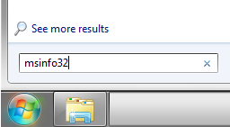
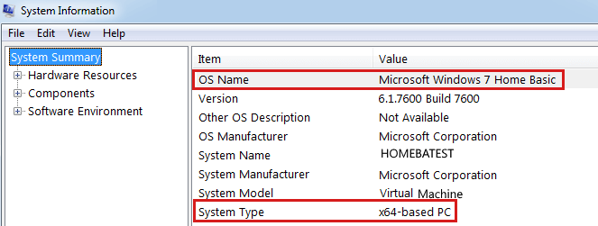
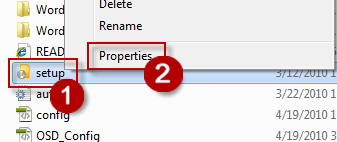
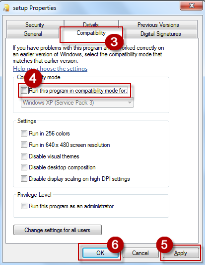

# "To install and use this product..." error when you install Office 2010

[!INCLUDE [Branding name note](../../../includes/branding-name-note.md)]

## Symptoms

When you try to install Microsoft Office 2010, the installation does not finish, and you receive the following error message:

> To install and use this product, you must be running one of the following operating systems:
>
> x86 Platform
>
> - Windows 7
> - Windows Vista sp1
> - Windows XP Sp3
> - Windows Server 2003 Sp2
>
> x64 Platform
>
> - Windows 7
> - Windows Vista Sp1
> - Windows Server 2008

**Note** Office 2010 x64 does not support Windows XP and Windows Server 2003.

## Cause

This issue occurs when one of the following conditions is true:

- The operating system on which you are trying to install Office 2010 does not meet the system requirements for the product. For example, you are trying to install Office 2010 on a Windows XP-based computer that does not have Windows XP Service Pack 3 installed.   
- The Office 2010 Setup program (Setup.exe) is configured to run in compatibility mode. That is, the Setup program is set to run under a particular operating system, such as Microsoft Windows 95.

## Resolution

Follow the two methods provided to resolve your problem:

### Method 1: Verify Office 2010 system requirements

 All Microsoft Office 2010 editions have these operating system requirements:

|Operating System| Minimum Required Version| Architecture |
|--|--|--|
|Windows XP|Windows XP with Service Pack 3|32-bit |
|Windows Vista|Windows Vista with Service Pack 1|32-bit or 64-bit |
|Windows Server 2003|Windows Server 2003 with Service Pack 2|32-bit or 64-bit |
|Windows Server 2008|Windows Server 2008|32-bit or 64-bit |
|Windows 7|Windows 7|32-bit or 64-bit |

Check your computer and determine if you are running one of these minimal required versions of the operating system.

If you are not sure how to check the version of Windows installed on your computer, follow the steps  

1. Click **Start,** type msinfo32 in the **Start Search** or **Search programs and files**, then press ENTER.
     
2. Locate your operating system next to the **OS Name** line and your architecture type next to the **System Type** line.
     
     
 If the operating system on your computer does not meet the minimum system requirements you will need to update it. The preferred method to update your computer is through automatic updates. However, you can also obtain service pack updates by clicking on the following link:

[Download Windows Vista Service Pack 1 (32-bit) now](https://www.microsoft.com/downloads/details.aspx?familyid=f559842a-9c9b-4579-b64a-09146a0ba746)
 [Download Windows Vista Service Pack 1 (64-bit) now](https://www.microsoft.com/downloads/details.aspx?familyid=86d267bd-dfcd-47cf-aa76-dc0626dcdf10)

[Download Windows 2003 Service Pack 2 (32-bit) now](https://www.microsoft.com/downloads/details.aspx?familyid=95ac1610-c232-4644-b828-c55eec605d55)
 [Download Windows 2003 Service Pack 2 (64-bit) now](https://www.microsoft.com/downloads/details.aspx?familyid=08fec2f5-6e3b-4e0d-9314-646414d0a421)
 
If you meet the minimum system requirements, visit the following TechNet webpage to make sure you meet the minimum hardware requirements:

[System requirements for Office 2010](https://technet.microsoft.com/library/ee624351.aspx)

### Method 2: Turn off compatibility mode

To resolve this issue, you must disable compatibility mode before you try to install Office 2010. To do this, follow these steps: 
 
1. Right-click the Office 2010 **Setup.exe** file. The screen shot for step 1 and 2 is under the step 2.    
2. Click **Properties**.

   

3. Click the **Compatibility** tab. The screen shot for step 3 ,4 and 5 is under the step 5.    
4. Click to clear the **Run this program in compatibility mode for** check box.    
5. Click **Apply**, and then click **OK**.

     
1. Double-click **Setup.exe** to install Office 2010.    

## More Information

- [How to obtain the latest Windows Vista service pack](https://support.microsoft.com/help/935791)

- [How to obtain the latest Windows XP service pack](https://support.microsoft.com/help/322389)

- [How to obtain the latest service pack for Windows Server 2008](https://support.microsoft.com/help/968849)
