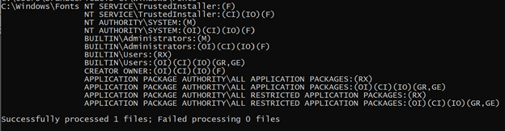

# Error messages opening Office documents when fonts are missing from the machine

## Symptoms

When opening a document in Microsoft Word, you receive one of the following error messages:

- > There is insufficient memory or disk space. Word cannot display the requested font.

    

- > Not enough system resources to display completely.

    

> [!NOTE]
> Error messages also occur in other Office applications (such as Microsoft Excel, or Microsoft PowerPoint).

The permissions of the **Fonts** folder may be different from the default permissions (see the following screenshot for the default permissions). To check the default permissions, open a Command Prompt window and run the `icacls C:\Windows\Fonts` command.

## Cause

When upgrading from Windows 7, Windows 8, or Windows 8.1 to Windows 10, certain fonts aren't available with the default post-upgrade. To reduce the operating system footprint, improve performance, and optimize disk space usage, many of the fonts included with prior versions of Windows were moved to the optional features of Windows 10. If you install a fresh instance of Windows 10 or upgrade an older version of Windows to Windows 10, these optional features aren't enabled by default. As a result,  fonts appear to be missing from the system.

If permissions for the `C:\Windows\Fonts` folder were changed or are different from the default permissions, they will persist after the upgrade, causing the issue.

## Resolution

If you have documents created using the missing fonts, they might display differently on Windows 10.

For example, if you have an English or a Roman Alphabet Language version of Windows 10 installed, you might notice that the following fonts are missing:

- Gautami
- Meiryo
- Narkism/Batang
- BatangChe
- Dotum
- DotumChe
- Gulim
- GulimChe
- Gungsuh
- GungsuhChe

If you want to use these fonts, enable the optional feature to add them to your system. Be aware that this is a permanent change in behavior for Windows 10.

For more information, see [How to install fonts that are missing after upgrading to Windows 10](/windows/deployment/windows-10-missing-fonts).

## More Information

### Issue outside of Office applications

When this issue occurs in Office applications, you will also see the following behavior of the Font dropdown menu in WordPad.

### References

- [Third-party installed font does not appear in the font list in Word for Mac](/office/troubleshoot/word/third-party-installed-font-fails-appearing)
- [Overview of fonts and how to troubleshoot font problems in Microsoft Word](/office/troubleshoot/word/troubleshoot-font-problems)
- [Block untrusted fonts in an enterprise](/windows/security/threat-protection/block-untrusted-fonts-in-enterprise)
