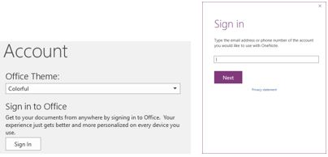

# How to locate your OneNote notebooks

##  Symptoms

After you start OneNote, you do not see the notebooks that you expect to see. 

##  Cause

This issue occurs if you are not logged in with the correct Microsoft account or work or school account. 

##  Resolution

### Step 1: Locate your notebooks by using OneNote Online

1. Go to [https://www.onenote.com](https://www.onenote.com/).   
2. Click the Sign In button at the top-right corner of the screen. If you don’t see the Sign In button, click the Sign out link, and you will be directed to Sign In. 

   

3. Click Sign In, and then select an account type.

   

4. A work or school account takes you to your company or school Office 365 sign-in page. A Microsoft account takes you to an MSA sign-in page.

    

You should now see your notebooks on OneDrive or OneDrive for Business, depending on which account you signed in with. Note which account you used to access your notebooks so that you can make sure you're signed in with the correct account in OneNote on your other devices.

   I can’t get signed into my Microsoft account – what next?

   Try signing in to your Microsoft account directly by going to [https://account.microsoft.com](https://account.microsoft.com/) and then selecting Sign in. If you cannot sign in, this means you're using the incorrect email or password for your Microsoft account, or that you don't have a Microsoft account.   

### Step 2: Connect OneNote to the correct account

Now that you know which account contains your notebooks, sign out of the accounts in OneNote, and sign back in with the correct account.

#### Win32 OneNote:

1. Start OneNote 2016 for Windows. If you haven’t signed into a Microsoft account or to a work or school account, you will be prompted to sign in when you start OneNote. Use the account that you used in step 1 at the top of the "Resolution" section.

   If you do not see your notebooks, go on to step 2.

2. On the File menu in OneNote, click Account, and then click Remove next to any Connected Services.

   

3. Click Sign out to sign out of the current account.

   

4. Click Sign In to enter your account credentials. Enter your Microsoft account if your notebooks are stored on OneDrive, or enter your work or school account if your notebooks are stored on your work or school locations or OneDrive for Business.

   

5. Click Open.

   

6. Depending on whether you're signed in with a Microsoft account or with a work or school account, you will see options for OneDrive or OneDrive – Personal. Click the desired location to see your notebooks.

       

#### OneNote Universal

1. Start OneNote Universal. If you haven’t signed in to a Microsoft account or to a work or school account, you will be prompted to sign in when you start OneNote. Use the account that you used in step 1 at the top of the "Resolution" section.

   If you do not see your notebooks, go on to step 2.   
2. On the File menu in OneNote, click Settings, and then click Accounts. Click each account that's listed, and then click **Sign out**.

   

3. Restart OneNote. You will be prompted to sign in with a Microsoft account or with a work or school account. Enter the credentials for the location where your notebooks are stored, most likely a OneDrive – Personal account or a work or school account.

   

4. On the File menu, click More Notebooks. OneNote will show you the notebooks that are stored in that location. If you are signed in to more than one account, such as to both a Microsoft account and a work or school account, you will see notebooks from all the locations that are listed under More Notebooks.

      

#### OneNote for Android:

1. Start OneNote for Android. If you haven’t signed into a Microsoft account or work or school account, you will be prompted to sign in when you start OneNote. Use the account that you used in step 1 at the top of the "Resolution" section.

   If you do not see your notebooks, go on to step 2.

2. In OneNote, click the vertical ellipsis (…) icon in the upper-right corner, click Settings, and then click Account.

   

3. Click Sign Out to sign out of your accounts.

   

4. Add your account back by tapping Add your personal Microsoft accountor Add your work or school account.Use the account that you used in step 1 at the top of the "Resolution" section.   
5. If you don’t see the notebook that you want, click Open Notebook on the home screen in OneNote. OneNote will show you the notebooks that are stored in that location. If you are signed in to more than one account, such as to both a Microsoft account and a work or school account, you will see notebooks from all the listed locations.

   You can click a notebook to open it, or you can add a work or school account to connect to your work or school notebooks.

   

#### OneNote for iPhone or iPad

1. Start OneNote for iPhone or iPad. If you haven’t signed in to a Microsoft account or to a work or school account, you will be prompted to sign in when you start OneNote. Use the account that you used in step 1 at the top of the "Resolution" section.

   If you do not see your notebooks, go on to step 2.

2. In OneNote, click the File icon in the upper left, click Settings (the gear icon), and then click Account.

   

3. Click each account, and then click Remove Account until all the accounts are removed.

   

4. Add your account back. In OneNote, click the File icon in the upper-left, click **Settings** (the gear icon), click **Account**, and then click **Sign in**.

   

5. Enter your Microsoft account or your work or school account.

6. If you don’t see the notebook that you want, click the File icon on the OneNote home screen, and click then the Open folder icon in the lower-left corner.

   

7. OneNote will show you the notebooks at that location.

   

#### I can't remember the Microsoft account I use with Office

Check out [this article](https://support.office.com/article/i-can-t-remember-the-microsoft-account-i-use-with-office-eba0b4a2-c0ae-472c-99f6-bc63ee2425a8), which contains information about determining which Microsoft account was used to purchase and activate Office. 

#### I forgot the password for my Microsoft account

Reset the password of your Microsoft account:

1. If you forgot the password for the Microsoft account that you associated with Office, you can reset it at [https://account.live.com/ResetPassword.aspx](https://account.live.com/resetpassword.aspx).   
2. Follow the guidance to reset your password. 

#### I forgot the password for my work or school account.

In this situation, you must contact the IT admin for your work or school for assistance in resetting your password.

#### How do I add an additional Microsoft account or an additional work or school account to OneNote?

##### Windows 32-bit

1. On the File menu in OneNote, click Accounts.   
2. Click Add Account.   
3. Enter your Microsoft account or your work or school credentials.   

You should now see it as a Connected Service. If you click Open, you will see it as an available location under Open from other locations, from which you can open or create other notebooks.

##### OneNote Universal

1. On the File menu in OneNote, click Settings, and then click Accounts.    
2. Click Add account.   
3. Enter your Microsoft account or your work or school credentials.   

##### OneNote for Android

1. In OneNote, click the vertical ellipsis (…)icon in the upper-right corner, click Settings, and then click Account.   
2. Click to add your personal Microsoft account or your work or school account.

      

##### OneNote for iPhone and iPad

1. Cick the Fileicon in OneNote in the upper-left corner, click Settings(the gear icon), and then click Account.

2. Click your account, select Add a Service, and then add the additional location where your notebooks are stored.

      
