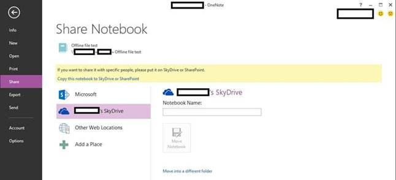

# Warning in OneNote 2013 when a notebook is in an offline location

## Symptoms

When Microsoft OneNote 2013 detects a notebook that is in an offline location (for example, an offline folder that is created by IntelliMirror), you receive the following message in the information bar: 

```adoc

This notebook may not sync correctly because Windows Offline Files is enabled on this folder. Click here to share this notebook to a new location or turn off Windows Offline Files on this notebook and restart OneNote. 
```

When you click this message, you receive the following message: 

```adoc
If you want to share it with specific people, please put it on OneDrive or SharePoint. 
```



## Cause

Windows Offline Files provides cached access to network file shares when you're offline. Also, OneNote has its own cache that enables it to work offline and to do things like multi-user edit, sync, and merge automatically. We do not recommend that you use these caching methods together. This has been true since OneNote 2007. However, the message in the information bar is new in OneNote 2013. It warns users that doing this may cause problems with syncing. 

When OneNote 2013 detects that the notebook is in an offline folder location, you see the information bar message that is mentioned in the "Symptoms" section. You can disable the information bar message by using a registry key. (See the "More Information" section.) However, we do not recommend that you do this, because you can encounter problems when you use both an offline folder and OneNote’s own cache (such as Windows Offline Files). For example, doing this can cause the following issues: 

- Duplicate copies of sections may be created if those sections are edited from more than one computer.    
- Edits that are performed on one computer do not appear or are lost.    

For more information, see item 4 of the "Troubleshooting steps" section of the following blog post: 

[OneNote Shared Notebooks - Options and Troubleshooting - Part 1: Windows File Shares](https://blogs.msdn.com/b/david_rasmussen/archive/2007/12/10/onenote-shared-notebooks-options-and-troubleshooting-part-1-windows-file-shares.aspx)

## Resolution

To resolve this issue, move the notebook from the current file location to a location that does not have offline folders enabled. 

**Note** We recommend that you first sync the notebook. To do this, press Shift+F9. 

To move the notebook, take one of the following actions: 

- From On the **File** menu, click **Share**, and then click **Copy this notebook to OneDrive or SharePoint**.    
- Right-click the notebook, click **Properties**, and then click **Change Location**.   

## More Information

Warning If you use Registry Editor incorrectly, you may cause serious problems that may require you to reinstall your operating system. Microsoft cannot guarantee that you can solve problems that result from using Registry Editor incorrectly. Use Registry Editor at your own risk.

To disable the information bar warning message, set the following registry key:

**HKEY_CURRENT_USER\Software\Microsoft\Office\15.0\OneNote\Options\DWord: DisableCSCInfobar = 1**
