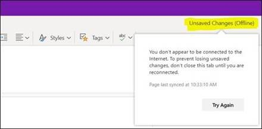
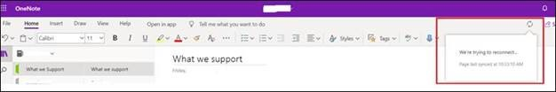

# OneNote error “Content Not Yet Available” 

## Symptom

You see the following error when trying to access a OneNote page:

> **Content Not Yet Available** 
> Sorry, it looks like this page was added from another computer and hasn't synced yet. Click here or press ENTER to reload the page.

   

## Cause

Your OneNote Notebook content might not have synced completely to the SharePoint Online or OneDrive for Business server. You might be disconnected from Internet, unauthenticated (not signed-in), or the OneNote client may be offline. 

## Resolution 

Check to see if the page (or section) is in one of the following states:

1.	**Opened and accessed across different devices.** If so, check to see if the content is visible on another device. 

2. **Shared with multiple users.** If so, check to see if other users also experience the same problem. 

    a.	If No (content is visible), move the available content to a new section.

    b.	If Yes (content isn’t visible), go to step 3 or step 4.

3.	**Stored in OneDrive for Business.** If so, follow the steps in Restore your OneDrive to restore the content to a previous state.

4.	Stored in SharePoint Online. If so, follow the steps in [Restore your OneDrive](https://support.office.com/article/restore-your-onedrive-fa231298-759d-41cf-bcd0-25ac53eb8a15) to identify whether the content is in a state to restore. 
    > [!NOTE]
    > SharePoint Online retains backups of all content for 14 additional days beyond actual deletion. If content cannot be restored via the Recycle Bin or [Files Restore](https://nam06.safelinks.protection.outlook.com/?url=https%3A%2F%2Fsupport.office.com%2Fen-us%2Farticle%2Frestore-your-onedrive-fa231298-759d-41cf-bcd0-25ac53eb8a15&data=02%7C01%7Cbalram%40microsoft.com%7C48b866a3c2bf4c828f4108d7e31207cb%7C72f988bf86f141af91ab2d7cd011db47%7C1%7C0%7C637227538903709955&sdata=IXbX%2BT4MeiG%2FkCdUW9yJc3ViqPE2OHB7I%2FovYQdsJNI%3D&reserved=0), an [administrator can contact Microsoft Support to request a restore](https://docs.microsoft.com/microsoft-365/admin/contact-support-for-business-products?view=o365-worldwide&tabs=online) any time inside the 14-day window.

## More information

### Best practices for saving pages 

To ensure your data is synced to cloud, you must see the successful sync status icon before exiting your OneNote session (whether by closing the OneNote app or closing the browser session).

> [!NOTE]
> OneNote Online (OneNote on the Web) and the OneNote on Teams client have no local caches. Using either app in offline mode may lead to unrecoverable data loss, if the sync fails to connect to the server.  
OneNote 2016 and OneNote for Win 10 each keep a cached copy of your pages on your device. Using them offline is recommended as the next time you connect to the internet, all the changes you made will sync to OneDrive so you’ll be able to see them on other devices.

A successful sync icon can appear as either of the two images below:

> [!NOTE]
> All screenshot images are taken from OneNote for Windows 10.

 

 
### Other OneNote sync status messages: 

- A page sync is in progress:

  

- A page has been saved offline:

  
  
 
- A page has not been saved due to network issues and is trying to connect:

  
 
## More information

Still need help? Go to [Microsoft Community](https://nam06.safelinks.protection.outlook.com/?url=https%3A%2F%2Fanswers.microsoft.com%2F&data=02%7C01%7Cv-todmc%40microsoft.com%7C98910814456c474880f108d7cf62d97d%7C72f988bf86f141af91ab2d7cd011db47%7C1%7C0%7C637205895885805857&sdata=9%2FYStDGvrU5ZIYXB7guowmaPlKazab0U%2BTpiBIItDaQ%3D&reserved=0).