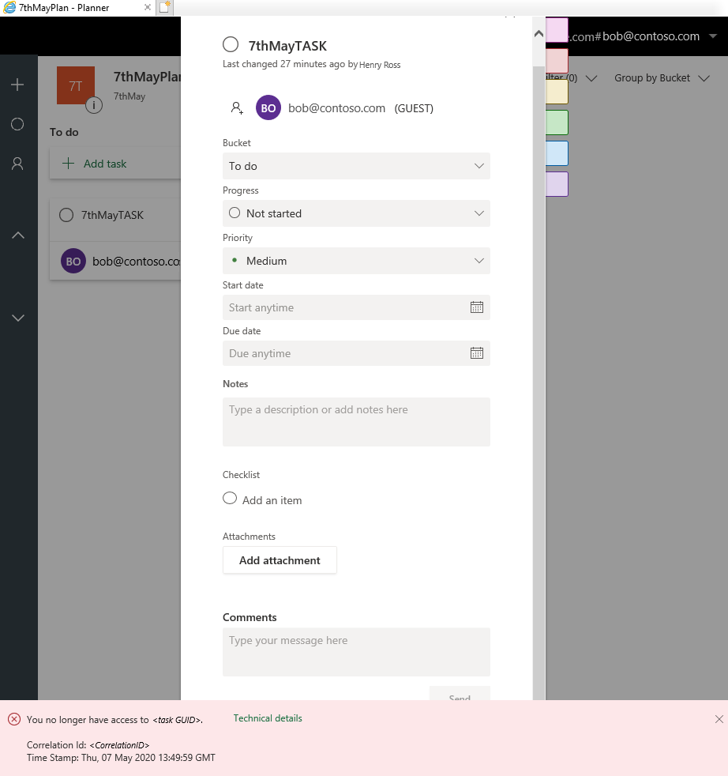

# Guest users can't add comments to assigned Planner tasks

## Symptoms

When [guest users are assigned tasks](https://support.microsoft.com/office/guest-access-in-microsoft-planner-cc5d7f96-dced-4da4-ab62-08c72d9759c6) in Microsoft Planner, they see the following error message if they try to add a comment to the tasks:

> You no longer have access to <*task GUID*>.

> [!NOTE]
> In this message, <*task GUID*> represents the GUID of the actual task GUID.

## Cause

When a task is assigned to a guest user in Planner, an Exchange Online recipient is created by using the guest user's SMTP address. The error occurs if this SMTP address is already assigned to another Exchange Online recipient in the O365 tenant. In most such cases, the recipient is a mail contact.

## Resolution

Change the SMTP address of the existing Exchange Online recipient to make it different from that of the guest user. Alternatively, delete the recipient that uses the same SMTP address as the guest user.

You must be signed in to your Microsoft 365 or Office 365 account and have Microsoft 365 administrator permissions to make these changes.

1. In the Microsoft 365 admin center, select **Admin centers** > **Exchange** to open the Exchange admin center.
1. Select **Recipients** > **Contacts**.
1. In the list of contacts, select the recipient that uses the same SMTP address as the guest user.
1. Select the **Edit** (+) button to change the SMTP address of the recipient, or the **Remove** (-) button to delete the recipient.

Still need help? Go to [Microsoft Community](https://answers.microsoft.com/).
