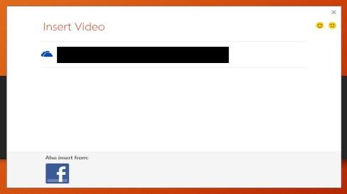

# Fixed: You can't embed an online video in a PowerPoint 2013 presentation

[!INCLUDE [Branding name note](../../../includes/branding-name-note.md)]

##  Symptoms

Consider the following scenario: 

1. In PowerPoint 2013.
1. Insert Ribbon > Video > Online Video
1. The dialog that comes up only displays OneDrive, and Facebook.

In this scenario, you will not be prompted with an error but will see the following dialog:

The options that are missing are; Bing Video Search, YouTube, and From a Video Embed Code.

##  Resolution

This has been resolved with the April Updates, please download the updates here:

- [2837627 ](https://support.microsoft.com/help/2837627) Description of the PowerPoint 2013 update 2837627: April 8, 2014
- [2817636 ](https://support.microsoft.com/help/2817636) Description of the Office 2013 update 2817636: April 8, 2014

The **YouTube** and **From a Video Embed Code** options appear in the **Online Video** dialog box regardless of whether you have the updates installed. However, you must install these two updates in order to insert or play back YouTube videos correctly. In addition, the **Bing Video Search** section will no longer appear in the **Online Video** dialog box.

For more information, please see the following blog: 

[Support for YouTube videos in PowerPoint returns](https://blogs.technet.com/b/bgp/archive/2014/04/09/support-for-youtube-videos-in-powerpoint-returns.aspx).