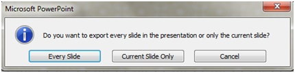

# How to export high resolution slides from PowerPoint (high dpi)

[!INCLUDE [Branding name note](../../../includes/branding-name-note.md)]

You can change the export resolution in Microsoft PowerPoint by saving a slide in a picture format. There are two steps to this process: using the system registry to change the default resolution setting for exported slides, and then actually saving the slide as a picture at the new resolution.

## Step 1: Change the export resolution setting

> [!IMPORTANT]
> Follow the steps in this section carefully. Serious problems might occur if you modify the registry incorrectly. Before you modify it, [back up the registry for restoration](https://support.microsoft.com/help/322756) in case problems occur.

By default, the export resolution of a PowerPoint slide that you want to save as a picture is 96 dots per inch (dpi). To change the export resolution, follow these steps:

1. Exit all Windows-based programs.
2. Right-click the **Start** button and then **Run**. (In Windows 7, select **Start**, and then **Run**.)  
3. In the **Open** box, type regedit, and then select **OK**.
4. Locate one of the following registry subkeys, depending on the version of PowerPoint that you're using:

    PowerPoint 2016, 2019, PowerPoint for Office 365

   **HKEY_CURRENT_USER\Software\Microsoft\Office\16.0\PowerPoint\Options**

   PowerPoint 2013

   **HKEY_CURRENT_USER\Software\Microsoft\Office\15.0\PowerPoint\Options**

   PowerPoint 2010

   **HKEY_CURRENT_USER\Software\Microsoft\Office\14.0\PowerPoint\Options**

   PowerPoint 2007

   **HKEY_CURRENT_USER\Software\Microsoft\Office\12.0\PowerPoint\Options**

   PowerPoint 2003

   **HKEY_CURRENT_USER\Software\Microsoft\Office\11.0\PowerPoint\Options**

5. Click the **Options** subkey, point to **New** on the **Edit** menu, and then click **DWORD (32-bit) Value**.
6. Type ExportBitmapResolution, and then press Enter.
7. Make sure that **ExportBitmapResolution** is selected, and then click **Modify** on the **Edit** menu.
8. In the Edit DWORD Value dialog box, select **Decimal**.
9. In the **Value data** box, type the value of the resolution that you want such as 300. Or, use the parameters in the following table.

    |Decimal value|Full-screen pixels (horizontal × vertical)|Widescreen pixels (horizontal × vertical)|Dots per inch (horizontal and vertical)|
    |---|---|---|---|
    |50|500 × 375|667 × 375|50 dpi|
    |96 (default)|960 × 720|1280 × 720|96 dpi|
    |100|1000 × 750|1333 × 750|100 dpi|
    |150|1500 × 1125|2000 × 1125|150 dpi|
    |200|2000 × 1500|2667 × 1500|200 dpi|
    |250|2500 × 1875|3333 × 1875|250 dpi|
    |300|3000 × 2250|4000 × 2250|300 dpi|

    > [!NOTE]
    > See the [Limitations](#limitations) section for more information when you set this value.

10. Select **OK**.
11. On the **File** menu, select **Exit** to exit Registry Editor.

## Step 2: Export the slide as a picture

1. In PowerPoint, open your slide presentation, and then open the slide that you want to export.
2. On the **File** menu, select **Save As**.
3. In the **Save as type** box, select one of the following picture formats:

   - GIF Graphics Interchange Format (.gif)
   - JPEG File Interchange Format (*.jpg)
   - PNG Portable Network Graphics Format (*.png)
   - TIFF Tag Image File Format (*.tif)
   - Device Independent Bitmap (*.bmp)
   - Windows Metafile (*.wmf)
   - Enhanced Windows Metafile (*.emf)

    > [!NOTE]
    > You may want to change the picture's save location in the **Save in** box. You may also want to change the name of the picture in the **File name** box.

4. Select **Save**. You will be prompted with the following dialog box:

    

    Select **Current Slide Only**. The slide is saved in the new format and resolution, in the location that you specified in the **Save in** box.
5. To verify that the slide is saved in the resolution that you specified, right-click the picture, and then select **Properties**.

## Limitations

When you set the ExportBitmapResolution registry value in PowerPoint, there's a maximum DPI limitation to consider for some versions of PowerPoint.

Maximum DPI is dependent upon the slide size. The formula is:
maxdpi = (sqrt(100,000,000 / (slide with * slide height)), where slide width/height are in inches.

For example, for a standard 13.3" x 7.5" slide, the equation would be:
sqrt(100,000,000 / (13.333 * 7.5) ) = 1000.

### PowerPoint 2019, 2016, 2013, and 365

There is no fixed DPI limit. Slide export is only limited by how big the resulting bitmap gets. PowerPoint can support creating bitmaps up to ~100,000,000 pixels (width x height). For standard widescreen slides (13.3" x 7.5") this means a maximum DPI of 1000. For the old style 10" x 7.5" slides this means a maximum of 1155 DPI, but depending on slide size, this can be more or less.

### PowerPoint 2010 and older

The maximum resolution that PowerPoint can export is 3072 pixels, based on the longest edge of the slide. For example, the standard 10" × 7.5" slide has a maximum effective DPI value of 307. The 3070-pixel result (10 × 307 = 3070) falls within the 3072 limit. However, any DPI setting that's greater than 307 for a standard slide reverts to the limit of 3072.

|Decimal value|Pixels (horizontal × vertical)|Dots per inch (horizontal and vertical)|
|---|---|---|
|307|3072 × 2304|307 dpi|

The 3072-pixel limit also applies to saving the slide programmatically.

For example, the following code programmatically saves a picture with dimensions of 3072 × 2304 pixels:

```powershell
ActiveWindow.Selection.SlideRange(1).export
"c:\<filename>.jpg","JPG",4000,3000
```

## More information

For information about changing the size of your slides, see [Change the size of your slides](https://support.office.com/article/Change-the-size-of-your-slides-040a811c-be43-40b9-8d04-0de5ed79987e).
