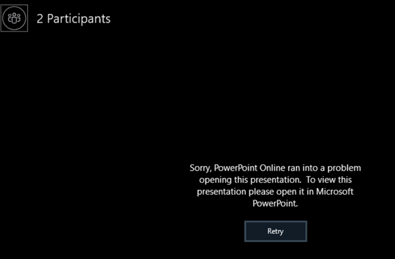
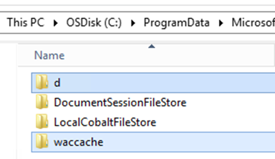

# PowerPoint files not rendering in Office Online Server after Security Update

## Symptoms
After patching Office Online Server to the May or June 2019 security update, PowerPoint files do not render, under what appears to be random circumstances during Skype for Business sharing sessions, and displays the following error:

> Sorry, PowerPoint Online ran into a problem opening this presentation. To view this presentation please open it in Microsoft PowerPoint.

Also, while attempting to render PowerPoint in the browser, you might see a similar error message before or after scrolling through slides:

The exact circumstances of the issue are not necessarily limited to the above scenarios. Also, the error may be present for issues other than those listed in this article.

## Cause
Issue was introduced to the product in the May and June 2019 security updates for Office Online Server.

## Resolution
This issue was resolved as part of the August 2019 Security Update for Office Online Server, but some steps must be taken to ensure functionality after the patch. This is currently the only supported resolution for the issue:

1.	Remove all Office Online Servers from the farm (all servers must be removed at the same time).
2.	Install the August 2019 Security update on all OOS servers but do NOT rebuild the farm yet.
https://support.microsoft.com/en-us/help/4475528/security-update-for-office-online-server-august-13 
3.	Clear the caches on each Office Online Server:  
   a. Navigate to the cache location (note that this can change if you did not install OOS on the root drive):   
C:\ProgramData\Microsoft\OfficeWebApps\Working  
    b. Delete the “d” and “waccache” folders. 

 

4.	Add the Office Online Servers back to the farm.
5.	Verify that the PowerPoint files appear as expected.

## More information
Still need help? Go to [Microsoft Community](https://answers.microsoft.com).

