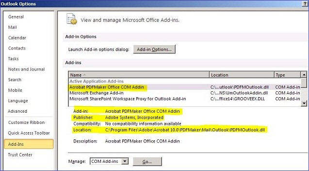
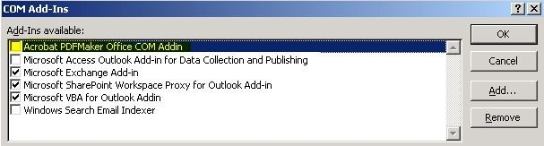

# Incompatibilities between Office programs and Adobe Acrobat PDFMaker Office COM Addin

## Resolution

If you have the AdobeAcrobat PDFMaker Office COM Addin add-in installed on your computer and your Office programs are crashing or unresponsive, this could mean that the current version that's installed on your computer is incompatible with your version of Office.

To check whether the add-in is installed on your computer and you're running Office 2010, open any Office application, and then click **File** > **Add-Ins**.

For Office 2013 and later versions, click File > Options > Add-Ins. You should see something that resembles the following:

### To fix this issue

#### Method 1: Upgrade your Adobe product
**Note** Fees may apply when you upgrade your Adobe product.

Check [here](https://helpx.adobe.com/acrobat/help/compatible-web-browsers-pdfmaker-applications.html#main_pdfmaker_compatible_applications) to see which version of the Adobe Acrobat PDFMaker Office COM Addin add-in is compatible with your Office version. If your version isn't compatible, try to upgrade your Adobe product to a later version that's compatible with your Office version. 

If you're an advanced user and want to check the PDFMOfficeAddin.dll version compatibility, see the following table.

|Office version|Supported PDFMaker add-in versions (check PDFMOfficeAddin.dll version)|
|--|--|
|2010 (32-bit)|10.x and later|
|2010 (64-bit)|10.1 and later|
|2013 (32-bit)|11.0.1 and later|
|2013 (64-bit)|11.0.1 and later|
|2016 (32-bit)|11.0.16 and later|
|2016 (64-bit)|11.0.16 and later|

#### Method 2: Use the Fix-it to automatically disable Acrobat PDFMaker Office COM Addin
You can run the following Fix-it, which will automatically disable the add-in for you. 

**IMPORTANT** To download the troubleshooter, click the **Download** button. In the **File Download** dialog box, click **Run** or **Open**, and then follow the steps in the easy fix wizard.

- This wizard may be in English only. However, the automatic fix also works for other language versions of Windows.   
- If you're not on the computer that has the problem, save the easy fix solution to a flash drive or a CD, and then run it on the computer that has the problem.   

#### For a Windows 10, Windows 8.1, or Windows 8-based computer
Click the Download button to disable the PDFMaker add-in.

#### For a Windows 7, Windows Vista, Windows XP, Windows Server 2008, or Windows Server 2003-based computer
Click the Download button to disable the PDFMaker add-in.

#### Method 3: Manually disable Acrobat PDFMaker Office COM Addin 
If you have administrative permissions, you can also disable the add-in by following these steps in each Office program:

1. Open the Office program, and then click File > Options > Add-ins.    
2. In the Manage drop-down list, select COM Add-Ins, and then click Go.    
3. Clear the Acrobat PDFMaker Office COM Addin check box, as follows (Office 2010 screen shot), and then click OK.

   
If you cannot disable the add-in by following these steps, use one of the following methods.

Important
 
Follow the steps in this section carefully. Serious problems might occur if you modify the registry incorrectly. Before you modify it, [back up the registry for restoration ](https://support.microsoft.com/help/322756) in case problems occur.

First, exit the Office program that you're having issues with when the PDFMaker add-in is loaded, and then use one of the following methods to start Registry Editor. 
#### Windows 8
From the Start screen, start typing CMD. In the results pane, swipe down on Command Prompt to reveal the charm bar, then click Run as administrator on the charm bar. If you are using a mouse, right-click Command Prompt to reveal the charm bar.
#### Windows 7, Windows Vista, or Windows XP

1. Click Start > All Programs > Accessories.    
2. Right-click Command Prompt, and then select Run as administrator.   

Click the Office program that you're having problems with, and then use the appropriate method, as follows, to manually disable the PDFMaker add-in.
#### Access, Excel, Word, PowerPoint, or Publisher
**Note** The <_Office program_> placeholder represents the name of the Office program that you're having issues with when the PDFMaker add-in is installed.

1. Locate and select the following registry key:

   HKEY_CURRENT_USER\software\microsoft\office\\\<Office program>\addins\Pdfmaker.OfficeAddin

   1. If the PDFmaker.<Office program>Addin key exists, modify the Load Behavior value under the key to 0, and then go to step 2.   
   2. If the PDFmaker.<Office program>Addin key does not exist, go to step 2.   

2. Repeat step 1 with each of the following registry keys:

   - HKEY_LOCAL_MACHINE\Software\Microsoft\Office\\\<Office program>\Addins\PDFMaker.OfficeAddin   
   - HKEY_LOCAL_MACHINE\Software\Wow6432Node\Microsoft\Office\\\<Office program>\Addins\PDFMaker.OfficeAddin   
   
3. Exit Registry Editor, and then start the Office program.    

#### Outlook

1. Locate and select the following registry key:

   HKEY_CURRENT_USER\software\microsoft\office\Outlook\addins\PdfmOutlook.PDFMOutlook

   1. If the PdfmOutlook.PDFMOutlook key exists, modify the Load Behaviorvalue under the key to 0, and then go to step 2.   
   2. If the PdfmOutlook.PDFMOutlook key does not exist, go to step 2.   
   
2. Repeat step 1 with each of the following registry keys:

   - HKEY_LOCAL_MACHINE\software\microsoft\office\Outlook\addins\PdfmOutlook.PDFMOutlook   
   - HKEY_LOCAL_MACHINE\Software\Wow6432Node\Microsoft\Office\Outlook\Addins\PdfmOutlook.PDFMOutlook   

3. Exit Registry Editor, and then start Outlook.   

#### Visio

1. Find and select the following key in the registry:

   HKEY_CURRENT_USER\software\microsoft\Visio\addins\PDFMVisio.PDFMVisioCOMAddin

   1. If the PDFMVisio.PDFMVisioCOMAddin exists, modify the LoadBehaviorvalue under the key to 0, and then go to step 2.   
   2. If the PDFMVisio.PDFMVisioCOMAddin key does not exist, go to step 2.    

   **Note** This registry path does not include the \Office subkey as do the registry paths used by other Office programs.    
2. Repeat step 1 with each of the following registry keys:

   - HKEY_LOCAL_MACHINE\software\microsoft\Visio\addins\PDFMVisio.PDFMVisioCOMAddin   
   - HKEY_LOCAL_MACHINE\Software\Wow6432Node\Microsoft\Visio\addins\PDFMVisio.PDFMVisioCOMAddin   

3. Exit the Registry Editor and open Visio.   

**Third-party information disclaimer**

The third-party products that this article discusses are manufactured by companies that are independent of Microsoft. Microsoft makes no warranty, implied or otherwise, about the performance or reliability of these products.