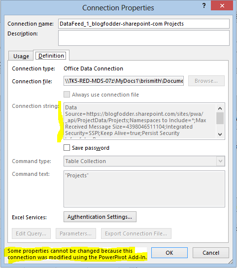

# Cannot modify the oData connections in an Excel 2013 PowerPivot workbook

## Symptoms

When you try to modify the oData connections in a Microsoft Excel 2103 PowerPivot workbook, you receive the following error message:

"Some properties cannot be changed because the connection was modified using the PowerPivot Add-In."

## Cause

This is a limitation in PowerPivot for Excel.

##  Workaround

To work around this issue, follow these steps:

1. You click the **PowerPivot** Tab.   
2. You click **Home**, click **Get External Data**, and then click **Existing Connections**.   
3. You select the connection, and then select **Edit**.   
4. You change the Data Feed Url or click **Advanced**, and then edit it.   
5. You save the changes and then refresh the workbook.   
