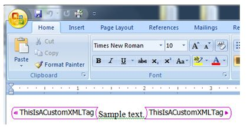

# "The file contains custom XML elements which are no longer supported by Word" when you try to open a document in Word

[!INCLUDE [Branding name note](../../../includes/branding-name-note.md)]

## Symptoms

Consider the following scenario. You try to open a document in Microsoft Office Word 2007, in Microsoft Word 2010 or in Microsoft Word 2013 that is using one of the following file formats: 

- Word Document (.DOCX)   
- Word Macro-Enabled Document (.DOCM)   
- Word Template (.DOTX)   
- Word Macro-Enabled Template (.DOTM)   
- Word XML Document (.XML)   
- Word 2003 XML Document (.XML)   
 
During the opening process for Word 2007, for Word 2010 or for Word 2013, you receive the following error message: 

```adoc
The file contains custom XML elements which are no longer supported by Word. If you save this file, these custom XML elements will be removed permanently.
```

Then when you click **OK**, the custom XML elements do not display.

**Note** Microsoft Word 2013 displays the error message for following file formats in addition to the file formats previously listed:

- Word 97-2003 Document (.DOC)   
- Word Web Pages (.HTML)   
- Rich Text Format (.RTF)   

## More Information

Versions of Word that are distributed by Microsoft after January 10, 2010 no longer read the custom XML markup that may be contained within .DOCX, .DOCM, .DOTX, .DOTM or .XML files. The new versions of Word 2007, Word 2010 and Word 2013 can still open these files, but any custom XML markup is removed.

Custom XML markup in a Word document is visible as pink (the default color) tag names surrounding text in a document: 



The removal of custom XML markup is the result of a United States court ruling on December 22, 2009. Generally, customers who purchase or license Word 2007, Word 2010 or Word 2013 from Microsoft after January 10, 2010 for use in the United States and its territories have to use updated software that does not include a particular custom XML tagging implementation. 

The following features of Word are not affected by the update.

- Content controls are not affected. Content controls are a common method of structuring document content and mapping content to custom XML parts.    
- Open XML standards (all ECMA and ISO versions) are not affected.   
- Custom XML markup that is stored within Word 97-2003 document (.DOC) files is not affected.   
- Ribbon XML and Ribbon Extensibility are not affected.   
- Custom XML Parts are not affected. For more information about custom XML Parts, visit the following MSDN Website: https://msdn.microsoft.com/library/bb608618.aspx.   
- The Word object model is not affected. However, some object model methods that deal with custom XML markup may produce different results. 

  - The TransformDocument method will continue to work, but any custom XML markup within the results of the transform will be removed.    
  - The InsertXML method will continue to work, but any custom XML markup that is present will be removed before the content is inserted.   
   
> [!NOTE]
> If you are a developer of a solution that uses custom XML markup, be aware that support for custom XML markup is no longer available. Many of the scenarios implemented by using custom XML markup can be implemented by using alternative technologies, such as content controls, form fields, and bookmarks which are available in Word 2007, Word 2010 and Word 2013. For example, as explained in the following articles, content controls (in addition to these other technologies such as bookmarks) enable developers to create structured documents and can be used to assign arbitrary values to structured content. These arbitrary values can be used to assign semantic meaning to parts of your content. 

For more information about content controls, visit the following Microsoft webpages: 

- [Creating Word 2007 Templates Programmatically](https://msdn.microsoft.com/library/bb266219%28v=office.12%29.aspx)
- [Building Word 2007 Document Templates Using Content Controls](https://msdn.microsoft.com/library/bb264571%28office.12%29.aspx)
- [Mapping Word 2007 Content Controls to Custom XML Using the XMLMapping Object](https://msdn.microsoft.com/library/bb510135%28office.12%29.aspx)
- [How to: Bind a Content Control to a Node in the Data Store](https://msdn.microsoft.com/library/bb243814%28office.12%29.aspx)
- [Taking Advantage of Bound Content Controls](https://docs.microsoft.com/archive/blogs/brian_jones/taking-advantage-of-bound-content-controls)
- [The Easy Way to Assemble Multiple Word Documents](https://docs.microsoft.com/archive/blogs/brian_jones/the-easy-way-to-assemble-multiple-word-documents)
- [Creating Data-Bound Content Controls using the Open XML SDK and LINQ to XML](https://docs.microsoft.com/archive/blogs/ericwhite/creating-data-bound-content-controls-using-the-open-xml-sdk-and-linq-to-xml)

## References

- [Custom XML mapping is removed when you open a document in Word 2010](https://support.microsoft.com/help/2445060) 
- [Custom XML markup is removed when you open a document in Word 2013](https://support.microsoft.com/help/2761189) 