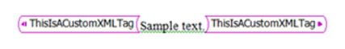

# Custom XML markup is removed when you open a document in Word 2013

[!INCLUDE [Branding name note](../../../includes/branding-name-note.md)]

## Symptoms

Consider the following scenario: In Microsoft Word 2013, you open a document that uses one of the following file formats: 

- Word Document (.docx)   
- Word Macro-Enabled Document (.docm)   
- Word Template (.dotx)   
- Word Macro-Enabled Template (.dotm)   
- Word XML Document (.xml)   
- Word 2003 XML Document (.xml)   
- Word 97-2003 Document (.doc)   
- Word Web Pages (.html)   
- Rich Text Format (.rtf)   

In this scenario, you notice that all custom XML markup in the document is removed. Custom XML markup in a Word document is visible as pink tag names that enclose text in a document. (Pink is the default color.)

## Cause

The removal of custom XML markup is the result of a United States court ruling on December 22, 2009. Customers who buy or license Word 2013 will find that the software does not include a particular custom XML tagging implementation. 

## More information

The following features of custom XML markup are removed in Word 2013: 

- All user interface elements that relate to custom XML markup are removed.    
- All object models for custom XML markup return the following errors when they are accessed: 

    **That method is not available for that object**

    **That property is not available for that object**

- When you open a file that contains custom XML markup, the markup is removed when you save the file. When you open a file that contains custom XML markup, you receive the following message: 

    **This file contains custom XML elements, which are no longer supported by Word. If you save this file, these custom XML elements will be removed permanently.**
    > [!NOTE]
    > The behavior of the message can be controlled through Group Policy by using a policy that is called CustomMarkupWarning.

All solutions that contain custom XML markup will have to be revised. Many of the scenarios that are implemented by using custom XML markup can be implemented by using alternative technologies that are available in Word 2013. These technologies include content controls, form fields, and bookmarks. For example, content controls (in addition to other technologies such as bookmarks) let developers create structured documents and can be used to assign arbitrary values to structured content. These arbitrary values can be used to assign semantic meaning to parts of your content. 

For an explanation and more information about content controls, see [Word content controls resource center](https://msdn.microsoft.com/office/gg278014.aspx).

## References

For more information, see the following articles:

- [Description of the January 2010 update for Word 2003 and Word 2007](https://support.microsoft.com/help/978951)

- [Error Message when you try to open a document in Word: "The file contains custom XML elements which are no longer supported by Word"](https://support.microsoft.com/help/2445062)

- [Custom XML mapping is removed when you open a document in Word 2010](https://support.microsoft.com/help/2445060)