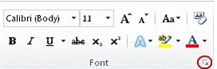
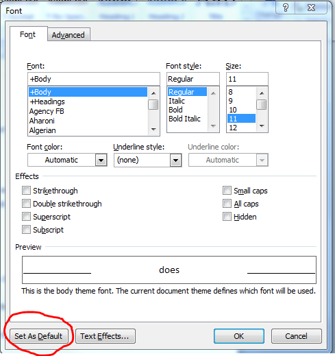
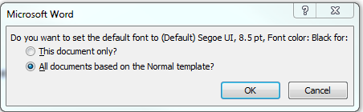
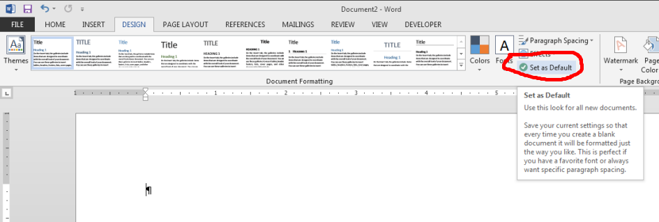

# Changes to default font settings are not retained in Word 2013 and 2010

[!INCLUDE [Branding name note](../../../includes/branding-name-note.md)]

##  Symptoms

When you set a font as the default font in Microsoft Office Word 2010 and Word 2013, and you then restart Word, the changes are not retained.

##  Cause

This can happen when you only apply the settings to the open document and not to all documents.

##  Resolution

### Method 1
To set and make sure that the style of the default font in Word 2010 or Word 2013 is retained or saved, follow these steps:

1. If you do not have a document open, create a new document that is based on the Normal template. To do this, click File, click New, click Blank Document, and then click Create.   
2. In the Font group, click the Font flyout to open the font dialog box.

      
1. Select the options that you want to apply to the default font, such as font style and font size. If you selected specific text, the properties of the selected text are set in the dialog box.
   
1. Click Set As Default.   
1. Select All documents based on the Normal.dotm template?   
1. Click OK.

      
1. This guarantees that every new document you open will use the font settings that you selected and set as the default. The default font applies to new documents that are based on the active template, usually Normal.dotm.   

### Method 2
To set and make sure that the style of the default font in Word 2013 is retained or saved, follow these steps:

1. If you do not have a document open, create a new document that is based on the Normal template. To do this, click File, click New, click Blank Document, and then click Create.   
2. Click on the Design tab at the top and set all of the options that you want in your template.
   
3. Click Set as Default.   
4. Click OK.   

##  More Information

Need More Help?

You can also get help from the [Microsoft Community](https://answers.microsoft.com/) online, search for more information on [Microsoft Support](/search/) or [Windows Help and How To](https://office.microsoft.com/support/), or learn more about [Assisted Support](https://support.microsoft.com/contactus/) options.