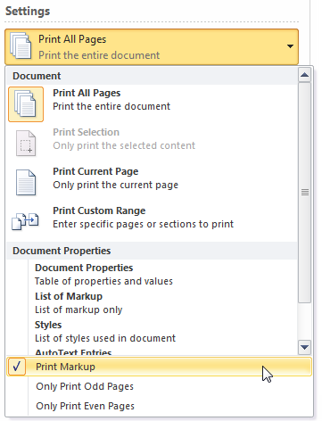

# Frequently asked questions about the Comments feature in Word

[!INCLUDE [Branding name note](../../../includes/branding-name-note.md)]

## Summary

A comment is a note or annotation that an author or reviewer can add to a document. Microsoft Word displays the comment in the Reviewing pane or in a balloon in the margin of the document.

This article answers some frequently asked questions about the Comment feature in Word. 

## More Information

### What is a balloon?

A balloon shows markup elements (for example, comments) in the margins of your document so that it doesn't cover text or affect the layout of the document. You can use balloons in Print Layout view or in Web Layout view to easily see and respond to reviewers' changes and comments. 

### How do I view the comments in a Word document?

To view the comments in a document, follow these steps:

**Word 2010 and Word 2007** 
 
- On the **Review** tab, click **Show Markup** in the **Tracking** group, and then select the **Comments** check box. If you do not see the comment balloon, click Print Layout or Web Layout on the View tab.    
 
**Word 2003 and Word 2002** 
 
- On the View menu, click Markup. Word displays balloons in your document for each comment. If you do not see the comment balloon, click Print Layout or Web Layout on the View menu.    
 
### How do I hide the comments in my Word document?

To hide the comments, follow these steps:

**Word 2010 and Word 2007**

- On the **Review** tab, click **Show Markup** in the **Tracking** group, and then clear the **Comments** check box.    
 
**Word 2003 and Word 2002**

- On the **View** menu, click Markup. 

### How do I insert a comment?

To insert a comment, follow these steps:

**Word 2010 and Word 2007** 
 
1. On the **Review** tab, in the **Comments** group, click **New Comment**.     
2. Type your comment in the comment balloon that appears when you are in Print Layout view or Web Layout view, or in the Reviewing pane when you are in Normal view or Outline view.    
 
**Word 2003 and Word 2002** 
 
1. Select the text or item that you want to comment about, or click the place where you want to insert your comment.    
2. On the Insert menu, click Comment.    
3. Type your comment in the comment balloon that appears when you are in Print Layout view or Web layout view, or in the Reviewing pane when you are in Normal view or Outline view.    
 
> [!NOTE]
> You cannot insert a comment in the header or footer area of a document. How do I change a comment?

To change an existing comment, do one of the following: 
 
- Click the comment balloon, and then type the text that you want.    
- In the Reviewing pane, find the comment that you want to change, and then type the text that you want.    
 
### How do I delete a comment?

To delete a comment, do one of the following: 
 
- Right-click the comment balloon, and then click Delete Comment.    
- In the Reviewing pane, right-click the comment, and then click Delete Comment.    
 
### What is the Reviewing pane?

Word doesn't always display the complete text of a comment in a balloon. This can happen when the page contains many comments or very long comments. To see the complete text for all comments in a document, view the comments in the Reviewing pane. 

**Word 2010 and Word 2007** 
 
- On the **Review** tab, click **Reviewing Pane**in the **Tracking** group, and then click **Reviewing Pane Vertical** or **Reviewing Pane Horizontal**.    
 
**Word 2003 and Word 2002**

- On the Reviewing toolbar, click Reviewing Pane. If the Reviewing toolbar is not displayed, point to Toolbars on the View menu, and then click Reviewing.    
 
### How do I print the comments in my Word document?

To print a document with comments showing, follow these steps:

**Word 2010** 
 
1. On the **View** tab, click **Print Layout** in the **Document Views**group.    
2. On the **Review** tab, click **Show Markup** in the **Tracking** group, and then select the **Comments** check box.    
3. To display the comments the way that you want them to appear in the printed document, do one of the following:   
   - View all comments: To view all comments in your document, on the **Review** tab, click **Show Markup** in the **Tracking** group, point to **Reviewers**, and then click to select **All Reviewers**.    
   - View comments that were made by a reviewer: To view the comments that were made by a specific reviewer, on the **Review** tab, click **Show Markup** in the **Tracking** group, point to **Reviewers**, and then click to select the reviewer whose comments that you want to display.    
     
4. On the File menu, click **Print**.    
5. Under **Settings**, click the arrow next to **Print All Pages**.    
6. Click **Print Markup**.
  
   

**Word 2007** 
 
1. On the **View** tab, click **Print Layout** in the **Document Views**group.    
2. On the **Review** tab, click **Show Markup** in the **Tracking** group, and then select the **Comments** check box.    
3. To display the comments the way that you want them to appear in the printed document, do one of the following:  
   - View all comments: To view all comments in your document, on the **Review** tab, click **Show Markup** in the **Tracking** group, point to **Reviewers**, and then click to select **All Reviewers**.    
   - View comments that were made by a reviewer: To view the comments that were made by a specific reviewer, on the **Review** tab, click **Show Markup** in the **Tracking** group, point to **Reviewers**, and then click to select the reviewer whose comments that you want to display.    
     
4. Click the **Microsoft Office Button**, and then click **Print**.    
5. In the **Print** dialog box, change the **Print what** box to **Document showing markup**, and then click **OK**.    
 
**Word 2003 and Word 2002**
 
1. Click Print Layout on the View menu.    
2. On the View menu, click Markup to display the comments in your document.    
3. Display the comments the way that you want them to appear in the printed document. To do this, do one of the following:  
   - View all comments: To view all comments in your document, click Show on the Reviewing toolbar, point to Reviewers, and then click to select All Reviewers.    
   - View comments that were made by a reviewer: To view the comments that were made by a specific reviewer, click Show on the Reviewing toolbar, point to Reviewers, and then click to select the reviewer whose comments that you want to display.    
     
4. On the File menu, click Print.    
5. In the Print dialog box, change the **Print what** box to
 **Document showing markup**, and then click OK.    
 
### How do I print my document without printing the comments?

To print a document without printing the comments, follow these steps:

**Word 2010**

Do one of the following:

Method 1 
 
1. On the **Review** tab, click **Show Markup** in the **Tracking** group.    
2. Clear the **Comments** check box.    
 
Method 2 
 
1. On the **File** tab, click **Print**.    
2. Under **Settings**, click the arrow next to **Print All Pages**.    
3. Click **Print Markup**.
 

**Word 2007**

Do one of the following: 
 
- On the **Review** tab, click **Show Markup** in the **Tracking** group, and then clear the **Comments** check box.    
- Click the **Microsoft Office Button**, and then click **Print**. In the **Print** dialog box, change the **Print what** box to **Document**, and then click **OK**.    
 
**Word 2003 and Word 2002**

Do one of the following: 
 
- Click Markup on the View menu to hide the balloons in your document, and then print your document.    
- Click Print on the File menu. In the Print dialog box, change the **Print what** box to Document, and then click OK.    
 
I can see the comments, but how do I determine the author of a comment and when it was made?

To see the author's name and the date and time that the comment was made, do one of the following: 
 
- Rest the mouse pointer on the comment balloon. A tooltip that contains this information appears.    
- Open the Reviewing pane and locate the comment.    
 How do I respond to a comment?

**Word 2010 and Word 2007**

1. Click the comment that you want to respond to.     
2. On the **Review** tab, click **New Comment** in the **Comments** group.
3. Type your comment in the comment balloon that appears.    
 
**Word 2003 and Word 2002**

1. Click the comment that you want to respond to.     
2. On the Insert menu, click Comment. 
3. Type your comment in the comment balloon that appears.    
  
## Additional Resources 

For more information about how to use comments, see [Remove tracked changes and comments from a document](https://office.microsoft.com/word-help/remove-tracked-changes-and-comments-from-a-document-ha101822263.aspx?ctt=1).