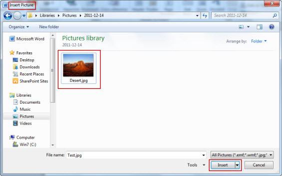

# How to scan and insert an image into a Word 2010 document

## Summary

This article describes how you can scan an image and insert it into a Microsoft Word 2010 document.

## Resolution

To insert a scanned image in a Word 2010 document, follow these steps:

1. Use the software that was included with your scanner to scan and save the image to your computer.   
2. Note the location of the saved image.   
3. Open Word 2010.   
4. Click **Insert**, and then select **Picture**.

   
5. In the **Insert Picture** box, browse to the folder that contains the saved image.   
6. Select the image and then click **Insert**.

   

## References

If the information in this knowledge base article did not help resolve the problem, select one of the following options:

- More Microsoft online articles:
[Perform a search to find more online articles about this problem.](https://support.microsoft.com/search)
- Help from the Microsoft Communityonline community:
[Visit the Answers community and post your question about this error.](https://answers.microsoft.com/)
- Contact Microsoft support:
[Find the phone number to contact Microsoft Support.](https://support.microsoft.com/contactus/)   
