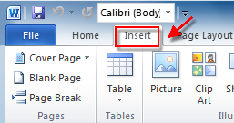
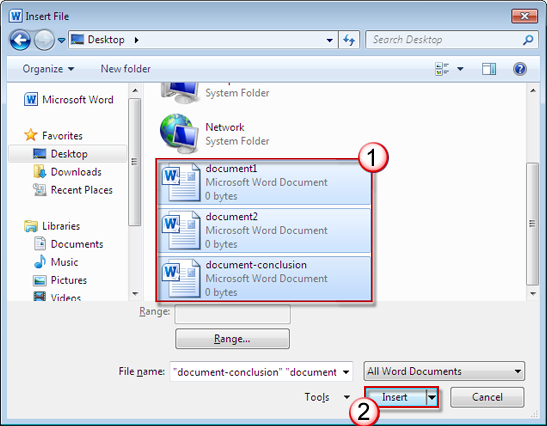

# How to merge Word documents

[!INCLUDE [Branding name note](../../../includes/branding-name-note.md)]

If you have to combine separate Microsoft Word documents, you can copy and paste them together if they're short, or merge them if they're long.

> [!NOTE]
> The following method applies to both Word 2010 and Word 2007. The format might not stay the same when you merge documents.

1. Select the **Insert** tab.

   

2. Select **Object**, and then select **Text from File** from the drop-down menu.

   :::image type="content" source="./media/merge-word-documents/text-from-file.png" alt-text="Screenshot of the Text from File option.":::

3. Select the files to be merged into the current document. Press and hold **Ctrl** to select more than one document.

    > [!NOTE]
    > Documents will be merged in the order in which they appear in the file list. To use a different order, select and insert each file individually in the desired order.

   

For more information, see the [Forum](https://answers.microsoft.com/default.aspx).
